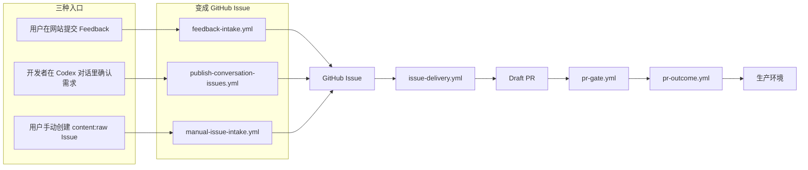
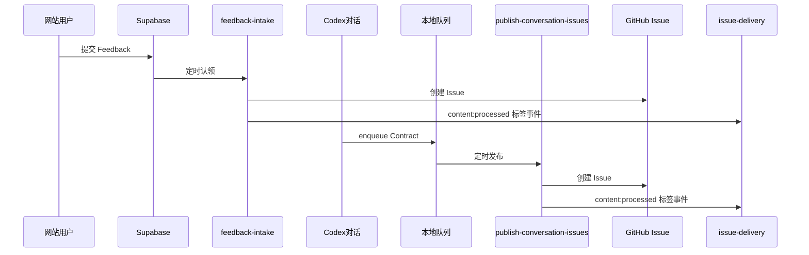

# GitHub Actions 自动化说明

SignalPatch 的目标：**把用户反馈或已确认的需求，自动变成代码修改，经 PR 验收后发布到生产环境**。

本目录下的 6 个 YAML 文件组成这条流程。当前 `main` 没有 Ruleset 或 Branch Protection，不要求 Pull Request 或 Required status checks；配置见 [docs/setup.md](../../docs/setup.md)。

**GitHub Actions 结构架构图（Archify，用浏览器打开 HTML，可切换主题/导出 PNG）**

| 文件                                                                          | 说明                                                                        |
| ----------------------------------------------------------------------------- | --------------------------------------------------------------------------- |
| [github-actions-structure.html](html/github-actions-structure.html)           | **业务流程**：三个入口 → 同一 Issue → PR 验收 → 发布或重复关闭              |
| [github-actions-yaml-structure.html](html/github-actions-yaml-structure.html) | **YAML 层级**：`.yml` 内 on、permissions、jobs、steps、outputs 的嵌套与引用 |

源 JSON：`html/github-actions-structure.workflow.json`、`html/github-actions-yaml-structure.architecture.json`（可用 Archify 重新渲染）。

---

## 先读这个：整条链路长什么样



| 阶段      | 对应文件                                                                              | 用人话说                                                                                                                            |
| --------- | ------------------------------------------------------------------------------------- | ----------------------------------------------------------------------------------------------------------------------------------- |
| 1. 收需求 | `feedback-intake.yml`、`publish-conversation-issues.yml` 或 `manual-issue-intake.yml` | 前两者创建 `content:raw` Issue；手动入口扫描已有 `content:raw` Issue；信息不足时在原 Issue 评论，足够时原地晋升 `content:processed` |
| 2. 写代码 | `issue-delivery.yml`                                                                  | 让 Codex **改仓库代码**，推一个分支，**开 Draft PR**                                                                                |
| 3. 验 PR  | `pr-gate.yml`                                                                         | 跑测试、构建、AI 审查、部署预览环境并做 Smoke Test；检查结果供自动化验收，不是仓库合并门禁                                          |
| 4. 收尾   | `pr-outcome.yml`                                                                      | Gate **过了**就合并 PR、上生产；Gate **挂了**就尝试自动修代码（最多 3 次），还不行就转人工                                          |

**Issue Contract** 是什么？  
Problem 达到自动开发条件后写入 GitHub Issue 的**结构化 JSON 契约**（来源、证据、验收标准、允许修改路径、风险等级等）。后续 Delivery / Gate / Repair **只认** `signalpatch-contract` 标记块里的 JSON，不认 Issue 其它自由文字。详见 [feedback-intake.yml.md § Issue Contract](feedback-intake.yml.md#issue-contract-是什么)。

**Codex** 是什么？  
本仓库在自托管 Mac Runner 上运行的 AI 编程工具。Workflow 只让它改本地文件或做只读分析，**不**把 GitHub Token、数据库密钥交给它。

**Problem** 是什么？  
一个或多个 Feedback 归类后的**同一可修问题**（Supabase `problems` 表）；承载用户可见的 **Repair Status**，并在 Intake 成功时关联 GitHub Issue。Intake 证据不足时只有「Problem 候选」（Feedback 行），**不会**插入 `problems` 表。详见 [feedback-intake.yml.md § Problem](feedback-intake.yml.md#problem-是什么)。

**R0–R3** 是什么？  
Issue Contract 的**风险等级**：R0/R1 文档与应用小改可自动合并，R2 改系统边界须人工批合并，R3 只分析不改码。详见 [issue-delivery.yml.md § R0–R3](issue-delivery.yml.md#r0r3-是什么意思)。

**Draft PR** 是什么？  
Issue Delivery 创建的**草稿**拉取请求：AI 已推分支，但尚未表示「可合并」；验收由 pr-gate 跑完，合并由 pr-outcome 负责。详见 [issue-delivery.yml.md § Draft PR](issue-delivery.yml.md#draft-pr-与普通-pr-的区别)。

---

## 六个文件分别做什么

### `feedback-intake.yml` — 网站 Feedback → GitHub Issue

**一句话**：每隔几分钟从数据库里取一条用户 Feedback，让 AI 判断能不能做成开发任务；能的话就在 GitHub 创建 Issue。

| 项目           | 说明                                                                                                              |
| -------------- | ----------------------------------------------------------------------------------------------------------------- |
| **什么时候跑** | 每 5 分钟定时；也可在 Actions 页手动点「Run workflow」                                                            |
| **从哪来**     | 用户在 SignalPatch 网站提交的 Feedback（存在 Supabase）                                                           |
| **产出什么**   | 一个带 Issue Contract 的 GitHub Issue；并自动启动下一步 `issue-delivery.yml`                                      |
| **跑不起来时** | AI 认为信息不够 → Issue 保持 `content:raw` + `ai:needs-input`，Feedback 等待补证据                                |
| **详细文档**   | [feedback-intake.yml.md](feedback-intake.yml.md)（各 Job 输入/输出；含 **Tracking ID**、**Issue Contract** 说明） |

三个 Job 一览：

| Job         | 用途                                   | 主要输入                                              | 主要输出                                                                |
| ----------- | -------------------------------------- | ----------------------------------------------------- | ----------------------------------------------------------------------- |
| **collect** | 认领一条 Supabase Feedback，写脱敏证据 | Supabase `PENDING` 记录                               | Job output `has_feedback`；Artifacts `intake-evidence`、`intake-state`  |
| **qualify** | Codex 只读判断，生成 `result.json`     | Artifact `intake-evidence`                            | Artifact `intake-result`（`NEEDS_EVIDENCE` 或 `SPEC_READY` + Contract） |
| **publish** | 创建 Issue、写 Problem、晋升 processed | Artifacts `intake-result` + `intake-state`；App Token | GitHub Issue；Supabase 更新；标签事件触发 `issue-delivery.yml`          |

```text
Supabase → collect → qualify → publish → GitHub Issue → issue-delivery.yml
              │          │         │
              │          │         └── intake-state（含 feedbackId，qualify 不读）
              │          └── intake-evidence → intake-result
              └── has_feedback
```

**Tracking ID**：用户提交 Feedback 后 API 返回的 UUID，用于匿名查 Repair Status；Intake 证据里以 `feedback:<tracking_id>` 引用，**不**把数据库主键 `id` 交给 AI。详见 [feedback-intake.yml.md § tracking_id](feedback-intake.yml.md#tracking_id-是什么)。

更完整的字段说明、JSON 示例与凭据边界见 [feedback-intake.yml.md](feedback-intake.yml.md)。

---

### `manual-issue-intake.yml` — 手动 Issue → 原地补充或晋升

**一句话**：每 5 分钟扫描最早的 `content:raw` Issue；信息不足就在原 Issue 评论，信息足够就在原 Issue 写入 Contract 并改为 `content:processed`，不创建新 Issue。

- 用户可以只提交一句话，例如“增加关于我们页面”。
- 用户补充的非机器人评论会随下一轮定时扫描一起作为上下文。
- 达到 `SPEC_READY` 后，`content:processed` 标签事件才会启动 `issue-delivery.yml`。
- 也可以通过 `workflow_dispatch` 指定 Issue 编号立即处理。

---

### `publish-conversation-issues.yml` — Codex 对话确认的需求 → GitHub Issue

**一句话**：把开发者在 Codex 里确认好的需求，从 Mac 本地队列里取出来，创建成 GitHub Issue。

| 项目                      | 说明                                                                                                                      |
| ------------------------- | ------------------------------------------------------------------------------------------------------------------------- |
| **什么时候跑**            | 每 5 分钟定时；也可手动触发                                                                                               |
| **从哪来**                | Codex 在 Intake 阶段把确认后的 Contract **写入 Mac 本地文件夹**（不直接调 GitHub API）                                    |
| **产出什么**              | 一个 GitHub Issue（和 Feedback 入口最终形态一样，都带 Contract）                                                          |
| **为什么必须 Mac Runner** | 队列文件在自托管机器磁盘上，云 Runner 读不到                                                                              |
| **详细文档**              | [publish-conversation-issues.yml.md](publish-conversation-issues.yml.md)（本地队列、enqueue/publish 拆分、UUID 防重详述） |

**和 Feedback 入口的区别**

|                              | Feedback 入口                | 对话入口                     |
| ---------------------------- | ---------------------------- | ---------------------------- |
| 文件                         | `feedback-intake.yml`        | 本文件 + 本地 enqueue        |
| 需求来源                     | 网站表单                     | Codex 对话里用户确认         |
| 创建 Issue 后谁启动 Delivery | `content:processed` 标签事件 | `content:processed` 标签事件 |

更完整的队列目录、`publisher.lock` 与 `conversation:explicit-user-confirmation` 见 [publish-conversation-issues.yml.md](publish-conversation-issues.yml.md)。

---

### `issue-delivery.yml` — Issue → 改代码 → Draft PR

**一句话**：读取 Issue 里的 Contract，让 Codex 改代码，机器人推分支并开一个 **Draft PR**。

| 项目            | 说明                                                                                                                                                                |
| --------------- | ------------------------------------------------------------------------------------------------------------------------------------------------------------------- |
| **什么时候跑**  | Issue 被添加 `content:processed` 标签；`workflow_dispatch` 仅用于运维补跑                                                                                           |
| **从哪来**      | 已有 GitHub Issue + 正文中的 Issue Contract                                                                                                                         |
| **产出什么**    | 分支 `ai/issue-{编号}-delivery` + **Draft PR**（非 Ready PR；见 [详述 § Draft PR](issue-delivery.yml.md#draft-pr-与普通-pr-的区别)）；PR 创建后会触发 `pr-gate.yml` |
| **特殊情况 R3** | 风险太高 → **不改代码**，Issue 评论 + 转 `ai:human-required`                                                                                                        |
| **详细文档**    | [issue-delivery.yml.md](issue-delivery.yml.md)（5 Job、proceed 防双跑、prepare/record-run/validate-diff 脚本详述）                                                  |

五个 Job 一览：

| Job            | 用途                                       | 主要输入                   | 主要输出                                   |
| -------------- | ------------------------------------------ | -------------------------- | ------------------------------------------ |
| **prepare**    | 提取 Contract、算 `proceed` / `risk_level` | GitHub Issue               | Job outputs；Artifact `issue-{n}-contract` |
| **build**      | Codex 改码 + policy 校验 + patch           | Contract Artifact          | Artifact `issue-{n}-build`                 |
| **analyze-r3** | R3 只读分析                                | Contract Artifact          | Artifact `issue-{n}-r3-analysis`           |
| **publish**    | 推分支、Draft PR、record-run               | contract + build Artifacts | PR；Supabase Automation Run                |
| **publish-r3** | R3 结论写 Issue                            | r3-analysis Artifact       | Issue 评论；标签转人工                     |

```text
Issue → prepare → build → publish → Draft PR → pr-gate.yml
              │      └── analyze-r3 → publish-r3（R3，无 PR）
              └── 仅接受 content:processed Issue
```

**proceed**：Delivery 只接受 `content:processed` Issue。raw Issue 不会启动 Builder；带有效 Contract 的手动 Issue 添加该标签后也可进入。

更完整的脚本步骤、validate-diff 双跑原因与 R3 分支见 [issue-delivery.yml.md](issue-delivery.yml.md)。

---

### `pr-gate.yml` — 每次 PR 更新的自动化验收

**一句话**：只要 AI（或你）往 PR 里推了新 commit，就自动跑测试、构建、独立审查、预览部署 + 冒烟测试。

| 项目                | 说明                                                                                                     |
| ------------------- | -------------------------------------------------------------------------------------------------------- |
| **什么时候跑**      | PR **打开 / 重新打开 / 有新 push** 时                                                                    |
| **认哪些 PR**       | 本仓库、非 Fork；自动化 PR 须是机器人开的 `ai/issue-*` 分支；或你本人开的 `codex/*` 手工 PR              |
| **PR 上会看到什么** | 四个检查：`verify`、`build`、`independent-review`、`preview-smoke`；用于自动化判定，不是 Required Checks |
| **产出什么**        | staged 预览 URL + `deployment.json` Artifact，供 pr-outcome promote                                      |
| **详细文档**        | [pr-gate.yml.md](pr-gate.yml.md)（6 Job、`mode` 双路径、preview-smoke / record-run 详述）                |

六个 Job 一览：

| Job                           | 用途                                                | 主要输入           | 主要输出                                              |
| ----------------------------- | --------------------------------------------------- | ------------------ | ----------------------------------------------------- |
| **trust**                     | 校验 PR 来源、定 `mode` / `risk_level`、拉 Contract | PR 元数据          | Job outputs；Artifact `pr-{n}-contract`（automation） |
| **verify**                    | `pnpm verify`                                       | `head_sha`         | PR 检查 verify                                        |
| **build**                     | `pnpm build`                                        | `head_sha`         | PR 检查 build                                         |
| **independent-review**        | Codex 只读审查（automation）                        | Contract + pr.diff | PR 检查 independent-review                            |
| **manual-independent-review** | `r2-approval` 人工批（manual）                      | —                  | 同名检查 independent-review                           |
| **preview-smoke**             | Vercel staged 部署 + Smoke                          | 前置全过           | PR 检查 preview-smoke；Artifact `pr-{n}-deployment`   |

```text
Draft PR → trust → verify ∥ build → independent-review（二选一）→ preview-smoke → pr-outcome.yml
              └── mode=automation|manual；新 push 取消旧 Gate
```

**mode**：`ai/issue-*` + App Bot → **automation**（Codex 审查）；`codex/*` + 仓库 owner → **manual**（R2 人工环境）。详见 [pr-gate.yml.md § mode](pr-gate.yml.md#mode-逻辑)。

更完整的 trust 规则、preview-smoke 条件与 staged deployment 见 [pr-gate.yml.md](pr-gate.yml.md)。

---

### `pr-outcome.yml` — Gate 跑完之后：合并或自动修

**一句话**：等 `pr-gate.yml` **整轮跑完**后触发；全绿就合并上生产，红了就试着让 AI 修（有次数上限）。

| 项目            | 说明                                                                                                         |
| --------------- | ------------------------------------------------------------------------------------------------------------ |
| **什么时候跑**  | `PR Gate` 这一 workflow **结束**时（成功或失败都会触发，内部再分支）                                         |
| **Gate 成功时** | 合并 PR → 把 Gate 里测过的那个预览部署**提升为生产** → 再跑一遍生产 Smoke → **关闭 Issue**                   |
| **Gate 失败时** | 若是 Runner/网络问题 → 自动重跑 Gate；若是测试/代码问题 → AI 修一次 PR，再触发新一轮 Gate（**最多约 3 轮**） |
| **修不动了**    | 给 Issue 打 `ai:human-required`，等人接手                                                                    |
| **详细文档**    | [pr-outcome.yml.md](pr-outcome.yml.md)（6 Job、Repair 边界、finalize / promote 详述）                        |

六个 Job 一览：

| Job                     | 用途                                           | 主要输入         | 主要输出                                               |
| ----------------------- | ---------------------------------------------- | ---------------- | ------------------------------------------------------ |
| **trust**               | 重验 PR、定 `mode` / `conclusion`、拉 Contract | `workflow_run`   | Job outputs；Artifact `outcome-contract`（automation） |
| **collect-failure**     | 失败日志、指纹、基础设施/应用分类              | Gate 失败        | Artifact `failure-evidence`；可能 `gh run rerun`       |
| **repair**              | Codex 有界 Repair                              | application 失败 | Artifact `repair-patch`                                |
| **publish-repair**      | 应用 patch、push 分支                          | repair 成功      | 新 commit → 新一轮 PR Gate                             |
| **mark-human-required** | Repair 失败转人工                              | repair 失败      | Issue `ai:human-required`                              |
| **finalize**            | 合并、promote、Production Smoke、关 Issue      | Gate 成功        | 生产验收、Issue 关闭                                   |

```text
PR Gate completed (workflow_run)
  → trust
  → automation + success → finalize（R2 须 r2-approval）
  → automation + failure → collect-failure → infrastructure 重跑 Gate 或 application → repair → publish-repair
  → manual codex/* → trust 成功即结束（不合并、不 Repair）
```

**为什么单独一个文件？**  
合并 PR、推生产、写 GitHub 评论需要写权限；和 Gate 拆开，Gate 里跑 Codex 的步骤**碰不到**这些密钥。

**finalize（成功路径）要点**

- R2 风险要先等人批准（`r2-approval` 环境）。
- 生产 Smoke 失败 → 回滚 Vercel、**不**关 Issue，转人工。

更完整的 Failure Fingerprint、Repair 预算与 promote 策略见 [pr-outcome.yml.md](pr-outcome.yml.md)。

---

## 两条入口对照（避免搞混）



---

## 常见问题

### 文件名和 `name` 会显示在 GitHub 上吗？可以用中文吗？

| 层级                 | 示例                  | 在哪看到                    | 可否中文                                       |
| -------------------- | --------------------- | --------------------------- | ---------------------------------------------- |
| **文件名**           | `feedback-intake.yml` | 仓库文件树、部分 Actions UI | 不推荐；脚本和 CLI 依赖英文路径                |
| **Workflow `name:`** | `Feedback Intake`     | Actions 列表、Run 标题      | 可以                                           |
| **Job `name:`**      | `preview-smoke`       | PR 上的检查名               | 可以；改名时同步更新依赖该名称的文档和诊断脚本 |

注意：`pr-outcome.yml` 监听的是名为 **`PR Gate`** 的 workflow（`name:` 字段），不是文件名 `pr-gate.yml`。

### 这些 yml 符合 GitHub 规范吗？

**符合** GitHub Actions 官方 YAML 结构（`name` / `on` / `jobs` 等）。

本仓库还在 `pnpm verify` 里额外检查：Codex 步骤不能碰密钥、Action 必须 pin 到 commit SHA 等。详见 [`scripts/ai/validate-workflows.mjs`](../../scripts/ai/validate-workflows.mjs)。

---

## 附录 A：Workflow 对照表（给维护者）

| 文件                              | Workflow 名称               | 触发                           | Jobs                                        | PR 检查                                          |
| --------------------------------- | --------------------------- | ------------------------------ | ------------------------------------------- | ------------------------------------------------ |
| `feedback-intake.yml`             | Feedback Intake             | cron + 手动                    | collect → qualify → publish                 | 无                                               |
| `manual-issue-intake.yml`         | Manual Issue Intake         | cron + 手动                    | collect → qualify → publish                 | 无                                               |
| `publish-conversation-issues.yml` | Publish Conversation Issues | cron + 手动                    | publish                                     | 无                                               |
| `issue-delivery.yml`              | Issue Delivery              | issues.labeled + 补跑 dispatch | prepare → build/analyze-r3 → publish*       | 无                                               |
| `pr-gate.yml`                     | PR Gate                     | PR 打开/同步/重开              | trust → verify/build/review → preview-smoke | verify, build, independent-review, preview-smoke |
| `pr-outcome.yml`                  | PR Outcome                  | PR Gate 完成后                 | trust → 失败修复链 或 finalize              | 无                                               |

## 附录 B：Runner 与凭据（为什么有的步骤在 Mac 上跑）

| 步骤                             | 跑在哪           | 原因                                                               |
| -------------------------------- | ---------------- | ------------------------------------------------------------------ |
| Codex 改代码 / 只读分析          | 自托管 Mac       | 本机安装了 Codex CLI                                               |
| 读本地对话队列                   | 自托管 Mac       | 队列在磁盘上                                                       |
| 创建 Issue、合并 PR、调 Supabase | GitHub 云 Runner | 由 Workflow 注入 App Token / Service Role，且与 Codex Job **隔离** |

## 附录 C：Job 明细

需要逐步对照 yml 时，见 [`scripts/README.md`](../../scripts/README.md) 中的「Workflow → Job → 脚本」矩阵；脚本职责见同文件第 2 节清单。

---

## 相关文档

| 文档                                           | 说明                                         |
| ---------------------------------------------- | -------------------------------------------- |
| [`scripts/README.md`](../../scripts/README.md) | 每个 Job 调了哪些脚本                        |
| [`.ai/policy.yaml`](../../.ai/policy.yaml)     | 风险等级、Repair 次数与 Codex Sandbox        |
| [`docs/setup.md`](../../docs/setup.md)         | `main` 写入策略、Secrets、自托管 Runner 安装 |
| [`CONTEXT.md`](../../CONTEXT.md)               | Feedback、Issue Contract 等领域术语          |
