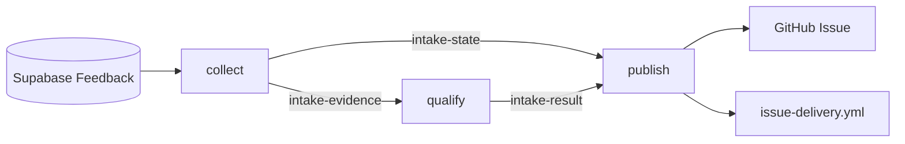
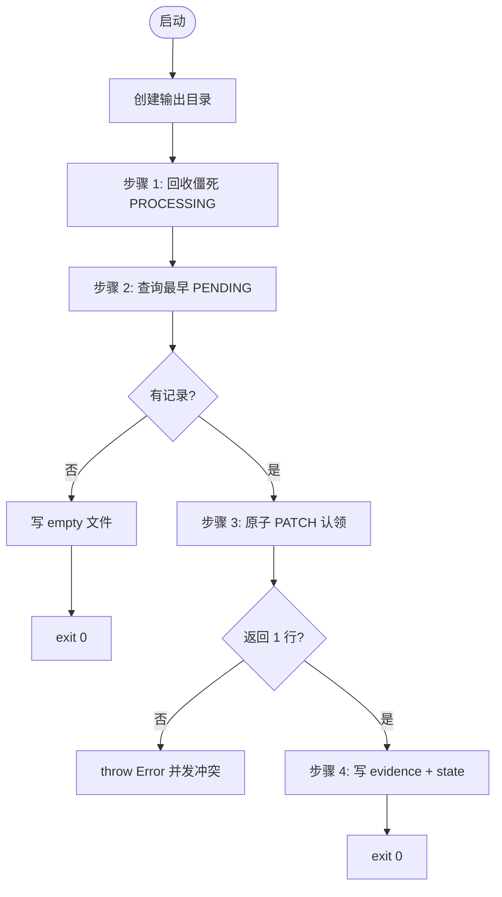
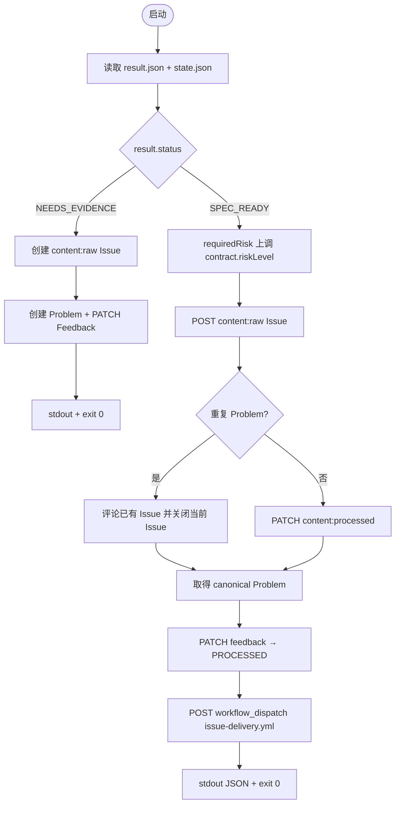
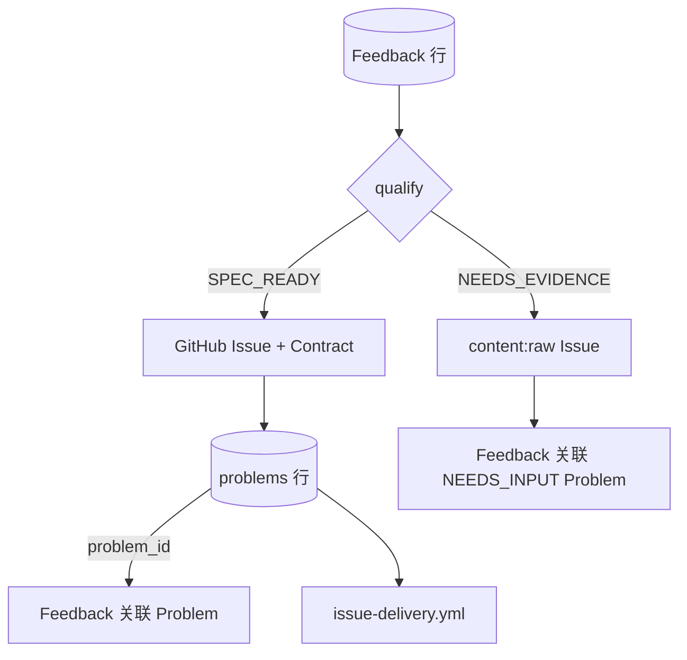
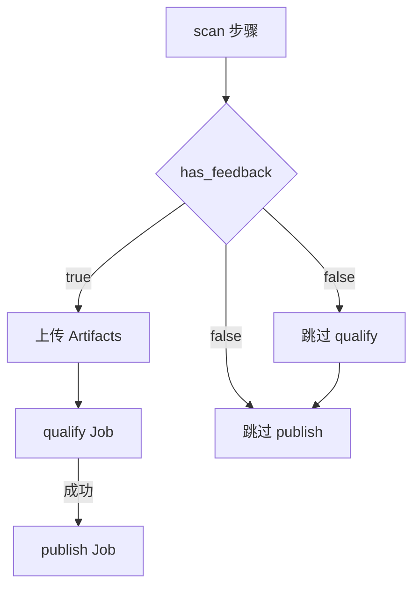

# feedback-intake.yml 说明

[feedback-intake.yml](feedback-intake.yml) 把**网站用户提交的 Feedback** 变成 **GitHub Issue + Issue Contract**，并在成功时 **dispatch** [issue-delivery.yml](issue-delivery.yml)（写代码、开 PR）。Delivery 详解见 [issue-delivery.yml.md](issue-delivery.yml.md)。

**文档结构**：[一、总体](#一总体) → [二、细节（各 Job）](#二细节) → [三、答疑（术语与开关）](#三答疑)

---

## 一、总体

### 这份 Workflow 做什么

Workflow 拆成三个 Job，按顺序执行：**collect → qualify → publish**。凭据按 Job 隔离：只有 `collect` / `publish` 接触 Supabase 与 GitHub 写操作；`qualify` 里的 Codex **只读**，且**不下载** `state.json`（避免模型看到数据库主键）。



### Job 总览

| Job | Runner | 用途（一句话） | 何时跳过 |
|-----|--------|----------------|----------|
| **collect** | `ubuntu-latest` | 从 Supabase **认领一条** `PENDING` Feedback，写出脱敏证据 | 从不跳过 |
| **qualify** | 自托管 macOS | Codex **只读**判断：证据够不够、能否生成 Issue Contract | `has_feedback != true` |
| **publish** | `ubuntu-latest` | 校验通过后 **创建 Issue**、写 Problem、**dispatch Delivery** | `qualify` 未运行或失败 |

### Job 之间如何传参

| 从 | 到 | 机制 | 传递内容 |
|----|-----|------|----------|
| collect | qualify | `needs` + `if: has_feedback` | 是否继续 |
| collect | qualify | Artifact `intake-evidence` | 脱敏 Feedback |
| collect | publish | Artifact `intake-state` | `feedbackId` |
| qualify | publish | Artifact `intake-result` | Intake 判定与 Contract |
| publish | issue-delivery | `workflow_dispatch` | `issue_number` |

---

## 二、细节

### collect

#### 用途

在 GitHub 云 Runner 上运行 [`intake-collect.mjs`](../../scripts/controllers/intake-collect.mjs)：

1. 将超过 30 分钟仍为 `PROCESSING` 的记录重置为 `PENDING`（防止中断任务占坑）。
2. 查询最早一条 `intake_status=PENDING` 且非 synthetic 的 Feedback。
3. **原子认领**：`PATCH` 时要求当前仍为 `PENDING`，成功则改为 `PROCESSING`。
4. 写出脱敏文件供下游使用；**本 Job 不运行 Codex**。

#### 脚本执行流程（intake-collect.mjs）

**调用方式**

```bash
node scripts/controllers/intake-collect.mjs .ai/runs/intake
```

第二个参数为输出目录（默认 `.ai/runs/intake`）；脚本会先 `mkdir -p` 该目录。

**必需环境变量**

| 变量 | 用途 |
|------|------|
| `SUPABASE_URL` | PostgREST 根地址 |
| `SUPABASE_SERVICE_ROLE_KEY` | Service Role，读写 `signalpatch` schema |

**Supabase 请求头**（所有 REST 调用共用）

| Header | 值 |
|--------|-----|
| `apikey` | Service Role Key |
| `authorization` | `Bearer <Service Role Key>` |
| `content-type` | `application/json` |
| `accept-profile` | `signalpatch` |
| `content-profile` | `signalpatch` |

HTTP 封装见 [`lib/http.mjs`](../../scripts/controllers/lib/http.mjs)：默认 30 秒超时；失败时只记录状态码与 `x-github-request-id` / `sb-request-id`，**不**把响应正文写入日志。



**步骤 1：回收僵死认领**

**目的**：上次 Intake Run 在认领后崩溃、超时或被取消时，Feedback 可能一直停在 `PROCESSING`，后续 Run 永远领不到。超过 **30 分钟**仍 `PROCESSING` 的视为僵死，重置为可再次领取。

| 项目 | 值 |
|------|-----|
| **方法** | `PATCH /rest/v1/feedback` |
| **过滤** | `intake_status=eq.PROCESSING` **且** `processing_started_at < now()-30min` |
| **写入** | `intake_status: "PENDING"`，`processing_started_at: null` |

不检查 PATCH 影响行数；无僵死记录时等价于空操作。

**步骤 2：查询候选 Feedback**

| 项目 | 值 |
|------|-----|
| **方法** | `GET /rest/v1/feedback` |
| **select** | `id,tracking_id,message,context,created_at,intake_status` |
| **过滤** | `intake_status=eq.PENDING`，`synthetic=eq.false` |
| **排序** | `created_at.asc`（最早优先） |
| **limit** | `1`（每轮 Automation Run **最多处理一条**） |

**无记录时**：写入 `${outputDirectory}/empty`（内容为 `true\n`），stdout 打印 `No pending Feedback.`，**exit 0**。Workflow 据此得到 `has_feedback=false`（见 [has_feedback 逻辑](#has_feedback-逻辑)）。

**步骤 3：原子认领**

**目的**：两个 Intake Run 可能几乎同时查到同一条 PENDING；认领 PATCH 带 **乐观锁**，只有仍为 PENDING 的那次 PATCH 能成功。

| 项目 | 值 |
|------|-----|
| **方法** | `PATCH /rest/v1/feedback` |
| **过滤** | `id=eq.<feedback.id>` **且** `intake_status=eq.PENDING` |
| **Header** | 额外 `prefer: return=representation`（返回更新后的行） |
| **写入** | `intake_status: "PROCESSING"`，`processing_started_at: <ISO8601 当前时间>` |

| PATCH 结果 | 行为 |
|------------|------|
| 返回 **恰好 1 行** | 认领成功，继续步骤 4 |
| 返回 **0 行** | 已被并发 Run 抢先 → `throw new Error("Feedback was claimed by another Automation Run")` → **collect Job 失败** |

**步骤 4：写出脱敏文件**

构造引用字符串 `reference = "feedback:" + tracking_id`（**不用**数据库主键 `id`）。

**`evidence.json`**（交给 Codex / qualify）

```json
{
  "source": { "kind": "feedback", "reference": "feedback:<tracking_id>" },
  "message": "<feedback.message>",
  "context": "<feedback.context>",
  "receivedAt": "<feedback.created_at>"
}
```

**`state.json`**（**仅**给 publish 控制器）

```json
{
  "feedbackId": "<feedback.id>",
  "reference": "feedback:<tracking_id>"
}
```

| 文件 | 读者 | 含 `feedback.id`? |
|------|------|-------------------|
| `evidence.json` | qualify（Codex） | **否** |
| `state.json` | publish | **是**（字段名 `feedbackId`） |

脚本 **exit 0**；Workflow `scan` 步骤因不存在 `empty` 文件而设置 `has_feedback=true`，并上传两个 Artifact。

**脚本侧错误与退出**

| 情况 | 退出 |
|------|------|
| 缺少 `SUPABASE_*` 环境变量 | throw，`collect` 失败 |
| Supabase / 网络非 2xx | throw（含 request-id），`collect` 失败 |
| 并发认领冲突 | throw，`collect` 失败 |
| 无 PENDING Feedback | 写 `empty`，exit 0 |
| 认领成功并写文件 | exit 0 |

**注意**：脚本本身**不**上传 Artifact、**不**写 `has_feedback`；这两项由 [feedback-intake.yml](feedback-intake.yml) 的 `scan` 步骤与后续 `upload-artifact` 步骤完成。

#### 输入

| 来源 | 内容 |
|------|------|
| **Supabase** | `SUPABASE_URL` + `SUPABASE_SERVICE_ROLE_KEY`；读取/更新 `signalpatch.feedback` |
| **仓库** | checkout 后的 `scripts/controllers/intake-collect.mjs` |
| **触发** | 定时 cron 或 `workflow_dispatch`（无额外 workflow 输入参数） |

#### 输出

| 类型 | 名称 | 内容 |
|------|------|------|
| **Job output** | `has_feedback` | `true`：认领成功；`false`：无待处理 Feedback（存在 `.ai/runs/intake/empty`） |
| **Artifact** | `intake-evidence` | `evidence.json`（**唯一**交给 Codex 的材料） |
| **Artifact** | `intake-state` | `state.json`（**仅**给 `publish`；`qualify` 不下载） |
| **Supabase 副作用** | — | 认领成功：`intake_status` → `PROCESSING`，写入 `processing_started_at` |

**`evidence.json` 示例结构**

```json
{
  "source": { "kind": "feedback", "reference": "feedback:<tracking_id>" },
  "message": "用户反馈正文",
  "context": { "feature": "...", "route": "...", "commitSha": "...", "occurredAt": "..." },
  "receivedAt": "2026-07-14T06:00:00.000Z"
}
```

不含数据库 `id`、用户身份或完整会话。其中的 `reference` 使用 **Tracking ID**（见 [tracking_id 是什么](#tracking_id-是什么)），格式为 `feedback:<tracking_id>`。

**`state.json` 示例结构**

```json
{
  "feedbackId": "<uuid>",
  "reference": "feedback:<tracking_id>"
}
```

---

### qualify

#### 用途

在自托管 Mac Runner 上，用 **Codex read-only** 做 Intake 语义判断：

1. 下载 `intake-evidence`，组装 Prompt（[`render-prompt.mjs`](../../scripts/ai/render-prompt.mjs) `--stage intake`）。
2. 合并 JSON Schema（[`bundle-schema.mjs`](../../scripts/ai/bundle-schema.mjs)），约束 Codex 输出形状。
3. `env -i` 下运行 Codex，**不**继承 Runner 上的 GitHub / Supabase / Vercel 环境变量。
4. [`validate-json.mjs`](../../scripts/ai/validate-json.mjs) 校验 `result.json`。

结果只能是两种之一：

- **`NEEDS_EVIDENCE`**：信息不足，不生成 Contract。
- **`SPEC_READY`**：附带完整 **Issue Contract** JSON。

#### 输入

| 来源 | 内容 |
|------|------|
| **上游 Job** | `needs.collect.outputs.has_feedback == 'true'` |
| **Artifact** | `intake-evidence` → `.ai/runs/intake/evidence.json` |
| **仓库** | `AGENTS.md`、issue-intake Skill、`.ai/schemas/*`、脚本与依赖（`pnpm install`） |
| **不读取** | `intake-state`（数据库主键仅留给 `publish`） |

#### 输出

| 类型 | 名称 | 内容 |
|------|------|------|
| **Artifact** | `intake-result` | `result.json`（Codex 结构化输出，已 Schema 校验） |
| **Job output** | — | 本 Job **未**定义 `jobs.qualify.outputs` |
| **外部写操作** | — | **无**（只读沙箱） |

**`result.json` 结构（`result` 字段）**

证据不足：

```json
{
  "result": {
    "status": "NEEDS_EVIDENCE",
    "reason": "…",
    "feedbackReferences": ["feedback:<tracking_id>"],
    "missingEvidence": ["…"]
  }
}
```

可以开工：

```json
{
  "result": {
    "status": "SPEC_READY",
    "reason": "…",
    "feedbackReferences": ["feedback:<tracking_id>"],
    "contract": { "...": "Issue Contract，见 issue-contract.schema.json" }
  }
}
```

---

### publish

#### 用途

在 GitHub 云 Runner 上运行 [`intake-publish.mjs`](../../scripts/controllers/intake-publish.mjs)，持有 **GitHub App Token** 与 **Supabase Service Role**：

| `result.status` | 行为 |
|-----------------|------|
| **`NEEDS_EVIDENCE`** | 创建 `content:raw` + `ai:needs-input` Issue；创建 Problem；Feedback 标为 `NEEDS_EVIDENCE`；不 dispatch Delivery |
| **`SPEC_READY`** | 按 policy **上调**风险 → 创建 `content:raw` Issue → 重复则评论并关闭；否则原地晋升 `content:processed` → 创建 Problem → Feedback 标为 `PROCESSED` → dispatch Delivery |

使用 **显式 dispatch** 启动 Delivery。Issue Delivery 不监听 `issues.opened`，只接受 `content:processed` Issue。

#### 脚本执行流程（intake-publish.mjs）

**调用方式**

```bash
node scripts/controllers/intake-publish.mjs \
  .ai/runs/intake/result.json \
  .ai/runs/intake/state.json
```

**必需环境变量**

| 变量 | 用途 |
|------|------|
| `GH_TOKEN` | GitHub App Installation Token（创建 Issue、dispatch Workflow） |
| `GITHUB_REPOSITORY` | 形如 `owner/repo` |
| `SUPABASE_URL` | PostgREST 根地址 |
| `SUPABASE_SERVICE_ROLE_KEY` | 更新 `feedback`、插入 `problems` |

**读入文件**

| 文件 | 解析 |
|------|------|
| `result.json` | `const { result } = JSON.parse(...)` — qualify 产出，已 Schema 校验 |
| `state.json` | `const state = JSON.parse(...)` — collect 产出，含 `feedbackId`、`reference` |

Supabase 写请求使用 `content-profile: signalpatch`（无 `accept-profile`）。



**分支 A：`NEEDS_EVIDENCE`**

**条件**：`result.status === "NEEDS_EVIDENCE"`（Codex 判定证据不足，无 `contract`）。

| 步骤 | API | 说明 |
|------|-----|------|
| 1 | `POST /repos/{repository}/issues` | 写入脱敏 Intake 结论，标签为 `content:raw`、`ai:needs-input` |
| 2 | `POST /rest/v1/problems` | `spec_ready: false`，`repair_status: "NEEDS_INPUT"` |
| 3 | `PATCH /rest/v1/feedback?id=eq.<state.feedbackId>` | 关联 Problem，设置 `intake_status: "NEEDS_EVIDENCE"` |

**不做的事**：不生成 Issue Contract，不 dispatch `issue-delivery.yml`。

**分支 B：`SPEC_READY`**

**条件**：`result.status === "SPEC_READY"`，且 `result.contract` 为完整 Issue Contract。

**B1. 风险等级上调（确定性，非模型）**

```javascript
contract.riskLevel = requiredRisk(policy, contract.allowedPaths, contract.riskLevel);
```

- 从 [`.ai/policy.yaml`](../../.ai/policy.yaml) 加载规则（[`loadPolicy`](../../scripts/ai/lib/policy.mjs)）。
- 以 Codex 给出的 `contract.riskLevel` 为**下限**，按 `allowedPaths` 匹配 `risk_rules`；**只能上调，不能下调**。
- 后续 Issue 标签 `risk:r0` / `risk:r1` 等使用**上调后**的等级。R0–R3 含义见 [issue-delivery.yml.md § R0–R3](issue-delivery.yml.md#r0r3-是什么意思)。

**B2. 创建并晋升 GitHub Issue**

| 项目 | 值 |
|------|-----|
| **API** | `POST https://api.github.com/repos/{GITHUB_REPOSITORY}/issues` |
| **认证** | `Authorization: Bearer {GH_TOKEN}` |
| **title** | `[SignalPatch] {contract.problemSummary}` |
| **初始 labels** | `content:raw` |
| **晋升后 labels** | `content:processed`、`ai:ready`、`risk:{contract.riskLevel.toLowerCase()}` |

**body 结构**（Markdown 段落拼接）：

1. `## Problem` + `problemSummary`
2. `## Actual behavior` + `actualBehavior`
3. `## Expected behavior` + `expectedBehavior`
4. HTML 注释边界 `<!-- signalpatch-contract:start/end -->` 包裹 fenced JSON 块（完整 **Issue Contract**）
5. 脚注：`_This Issue contains redacted evidence only. Raw conversations are not included._`

Controller 使用 Problem 指纹查找 processed Issue；旧 Issue 会从正文 Contract 重新计算指纹。命中重复时，当前 Issue 评论 canonical Issue、添加 `duplicate` 并关闭；非重复时在同一个 Issue 上替换为 processed 标签。Delivery 阶段**只认** Contract JSON 块，不认 Issue 正文里的自由文字。

**B3. 创建 Problem 并关联 Feedback**

即 [Problem 是什么 § 创建 Problem](#problem-候选vs创建-problem) 中的 Supabase 写入。

**顺序**：**先** Issue 成功，**再**写 Supabase——Issue 创建失败则不会留下孤儿 Problem。

| 步骤 | API | 写入字段 |
|------|-----|----------|
| 1 | `POST /rest/v1/problems`（`prefer: return=representation`） | `summary: contract.problemSummary`，`issue_number: issue.number`，`spec_ready: true`，`repair_status: "QUALIFYING"` |
| 2 | `PATCH /rest/v1/feedback?id=eq.<state.feedbackId>` | `problem_id: problem.id`，`intake_status: "PROCESSED"`，`processing_started_at: null`，`processed_at: <ISO8601>` |

**B4. 显式 dispatch Delivery**

| 项目 | 值 |
|------|-----|
| **API** | `POST .../actions/workflows/issue-delivery.yml/dispatches` |
| **ref** | `"main"` |
| **inputs** | `{ "issue_number": "<issue.number 字符串>" }` |

**为何显式 dispatch**：raw Issue 创建时不能进入 Builder。publish 只在同一个 Issue 晋升为 `content:processed` 后 dispatch Delivery。

stdout（JSON 一行）：

```json
{ "issueNumber": 42, "problemId": "<uuid>" }
```

**exit 0**。

**脚本侧错误与退出**

| 情况 | 退出 |
|------|------|
| 缺少 CLI 参数或环境变量 | throw，publish 失败 |
| `result.json` / `state.json` 无法解析 | throw |
| GitHub Issue 创建失败 | throw（不创建 Problem） |
| Supabase PATCH/POST 失败 | throw（Issue 可能已存在，需人工核对） |
| `NEEDS_EVIDENCE` 或 `SPEC_READY` 全流程成功 | exit 0 |

**注意**：脚本**不**校验 `result.json` Schema——该校验在 qualify Job 的 `validate-json.mjs` 步骤已完成。publish 信任已通过校验的 Artifact。

#### 输入

| 来源 | 内容 |
|------|------|
| **上游 Job** | `needs.qualify` 成功完成 |
| **Artifact** | `intake-result` → `result.json` |
| **Artifact** | `intake-state` → `state.json`（含 `feedbackId`） |
| **Secrets / Vars** | `SIGNALPATCH_APP_*` → `GH_TOKEN`；`SUPABASE_*` |
| **权限** | `issues: write`、`actions: write`（仅本 Job） |

#### 输出

| 类型 | 名称 | 内容 |
|------|------|------|
| **GitHub** | 新建或更新 Issue | raw 保留待补证据；SPEC_READY 晋升 processed；重复 Issue 评论后关闭 |
| **Supabase** | `problems` 行 | `issue_number`、`spec_ready`、对应 Repair Status |
| **Supabase** | `feedback` 更新 | `PROCESSED` + `problem_id`；或 `NEEDS_EVIDENCE` |
| **Workflow** | dispatch | `issue-delivery.yml`，输入 `issue_number` |
| **Artifact** | — | 本 Job **不上传** Artifact |
| **Job output** | — | 本 Job **未**定义 `jobs.publish.outputs` |

脚本 stdout（`SPEC_READY` 路径）示例：

```json
{ "issueNumber": 42, "problemId": "<uuid>" }
```

---

## 三、答疑

本节集中回答：**领域术语**、**Workflow 开关**（如 `has_feedback`）、**Intake 与下游的关系**。各 Job 逐步操作见 [二、细节](#二细节)。

### tracking_id 是什么

**Tracking ID**（数据库字段 `tracking_id`）是用户提交 Feedback 成功后拿到的一串 **UUID**，用来**匿名查询 Repair Status**，不是登录账号，也**不是** GitHub Issue 编号。

| 项目 | 说明 |
|------|------|
| **何时产生** | 用户调用 `POST /api/feedback` 时，Supabase RPC `submit_feedback` 插入一行并 `default gen_random_uuid()` 生成 |
| **返回给用户** | API JSON 字段 `trackingId`（与库中 `tracking_id` 同值） |
| **用户怎么用** | 在网站「查询 Repair Status」输入框填入，对应 `GET /api/status/:trackingId` |
| **不可预测** | 客户端无法自己指定；避免被遍历猜测他人 Feedback |
| **与内部主键区别** | 表内还有 `id`（UUID 主键）；Intake 的 `state.json` 存的是 **`feedbackId`（`id`）**，**不**交给 Codex；`evidence.json` 里只出现 **`feedback:<tracking_id>`** 形式的引用 |

在 Feedback Intake 链路中的位置：

```text
用户提交 Feedback
  → API 返回 trackingId
  → 用户凭 trackingId 查 Repair Status
  → collect 认领该条 Feedback
  → evidence.json 含 reference: "feedback:<tracking_id>"
  → qualify / Issue Contract 的 feedbackReferences 沿用同一引用
  → 全程不把 feedback.id 暴露给 AI
```

示例：

- **Tracking ID**（给用户、给 Contract 引用）：`a1b2c3d4-e5f6-7890-abcd-ef1234567890`
- **引用字符串**（Intake 证据里）：`feedback:a1b2c3d4-e5f6-7890-abcd-ef1234567890`
- **数据库主键 `id`**：另一个 UUID，仅出现在 `state.json` 的 `feedbackId`，供 `publish` 更新 Supabase

领域定义见 [CONTEXT.md](../../CONTEXT.md) 中的 **Tracking ID** 词条。

### Problem 是什么

**Problem**（可处理问题）是一个或多个 **Feedback** 经脱敏、去重、归类后指向的**同一**可修复问题。它是 SignalPatch 在 Supabase 里维护的**领域对象**，用来关联用户反馈、GitHub Issue 和自动化进度——**不是** Feedback 原文，**也不是** GitHub Issue 本身。

| 概念 | 区别 |
|------|------|
| **Feedback** | 用户提交的一条原话 + 脱敏 Context；很多条 Feedback 可能指向同一个 Problem |
| **Problem** | 系统认定「这是同一个要修的问题」；承载 **Repair Status**，并可选关联 **Issue 编号** |
| **GitHub Issue** | 给开发者和 Codex 用的工单；正文里嵌 **Issue Contract** |
| **Issue Contract** | Issue 里的 JSON 执行契约；Problem 达到 **SPEC_READY** 后才写入 Issue |

#### 在数据库里

表：`signalpatch.problems`（仅 Service Role / Controller 可写；匿名用户**不能**直接查表）。

| 字段 | 含义 |
|------|------|
| `id` | Problem 主键（UUID） |
| `summary` | 问题摘要（通常来自 Contract 的 `problemSummary`） |
| `issue_number` | 关联的 GitHub Issue 编号（唯一；无 Issue 时为空） |
| `spec_ready` | 是否已具备 Issue Contract、可进入自动开发 |
| `repair_status` | 面向用户的 **Repair Status**（见下表） |
| `fingerprint` | 可选去重指纹（未来聚合多条 Feedback 时用） |

`signalpatch.feedback.problem_id` 外键指向 Problem；`signalpatch.automation_runs.problem_id` 记录每次 Automation Run 归属哪个 Problem。

用户用 **Tracking ID** 查状态时，RPC `get_repair_status` 会 `LEFT JOIN problems`：若 Feedback 尚未关联 Problem，返回 **`RECEIVED`**；关联后返回 Problem 上的 `repair_status`。

#### Repair Status（Problem 上的字段）

| 值 | 面向用户的大意 |
|----|----------------|
| `RECEIVED` | 已收到 Feedback，尚未进入自动开发 |
| `QUALIFYING` | 已建 Issue / Contract，Delivery 评估或准备中 |
| `BUILDING` | Builder 正在改代码 |
| `VERIFYING` | PR Gate / 预览环境验收中 |
| `REPAIRING` | 自动修复尝试中 |
| `OBSERVING` | 发布后观察期（若启用） |
| `RELEASED` | 已发布到生产 |
| `NEEDS_INPUT` | 需要补充信息 |
| `HUMAN_REQUIRED` | 自动化停止，需人工介入 |

后续阶段由 [`record-run.mjs`](../../scripts/controllers/record-run.mjs) 按 Automation Run 结果更新 Problem 的 `repair_status`（映射见 [`run-status.mjs`](../../scripts/controllers/lib/run-status.mjs)）。

#### 创建 Problem

```text
Feedback 提交
  → repair_status 对用户显示 RECEIVED（尚无 Problem 行）
  → collect + qualify
      NEEDS_EVIDENCE → Feedback.intake_status = NEEDS_EVIDENCE
                       创建 spec_ready=false / NEEDS_INPUT Problem
      SPEC_READY     → 创建或复用 spec_ready=true / QUALIFYING Problem
```

[`intake-publish.mjs`](../../scripts/controllers/intake-publish.mjs) 在 GitHub Issue 创建后创建或复用 `problems` 行，并把原 Feedback 关联到该 Problem。

| 步骤 | 操作 |
|------|------|
| 1 | `POST /rest/v1/problems` → 写入 `summary`、`issue_number`、`spec_ready: true`、`repair_status: "QUALIFYING"` |
| 2 | `PATCH /rest/v1/feedback` → 设置 `problem_id`，`intake_status: "PROCESSED"` |

此后用户用 Tracking ID 查询，会看到 **`QUALIFYING`**（而不再是 `RECEIVED`）。

qualify 失败或 publish 在 Issue 创建前失败时不会创建 Problem。

#### 在 Feedback Intake 链路中的位置



领域定义见 [CONTEXT.md](../../CONTEXT.md) 中的 **Problem** 词条；数据模型见 [ADR 0017](../../docs/adr/0017-minimal-supabase-domain-model.md)。

### Issue Contract 是什么

**Issue Contract**（Issue 执行契约）是 Problem 达到自动开发条件后，写入 GitHub Issue 正文的一段**结构化 JSON**。它规定：问题是什么、证据有哪些、验收标准怎么验、允许改哪些路径、风险等级多高、运行时如何验收。**后续 Delivery、PR Gate、Repair 只认这份 Contract**，不认 Issue 标题或正文里的自由文字。

| 项目 | 说明 |
|------|------|
| **不是什么** | 不是原始 Feedback 全文，不是 Codex 对话摘要，不是开发者随手写的 Issue 描述 |
| **何时产生** | Intake 判定 **`SPEC_READY`** 时，由 qualify 的 Codex 输出嵌在 `result.json` 的 `contract` 字段；publish 将其写入 GitHub Issue |
| **何时不产生** | **`NEEDS_EVIDENCE`** 时没有 Contract；Issue 保持 `content:raw` + `ai:needs-input` |
| **存放位置** | Issue Body 中 `<!-- signalpatch-contract:start -->` … `<!-- signalpatch-contract:end -->` 之间的 fenced JSON 块 |
| **Schema** | [`.ai/schemas/issue-contract.schema.json`](../../.ai/schemas/issue-contract.schema.json) |
| **领域定义** | [CONTEXT.md](../../CONTEXT.md)、[ADR 0008](../../docs/adr/0008-unified-issue-contract.md) |

#### 与 Feedback、Problem、SPEC_READY 的关系

完整 **Problem** 定义与「创建 Problem」含义见 [Problem 是什么](#problem-是什么)。

```text
Feedback（用户原话 + 脱敏 Context）
  → Intake qualify：证据够不够？
      NEEDS_EVIDENCE → 创建 content:raw Issue，等待补证据
      SPEC_READY     → 生成 Issue Contract
  → publish：Contract 写入 GitHub Issue + 创建 Problem（spec_ready: true）
  → issue-delivery.yml：prepare-issue 从 Issue 提取 Contract → Builder 改代码
  → pr-gate / pr-outcome：按 Contract 的 acceptanceCriteria、allowedPaths、riskLevel 验收
```

**SPEC_READY** 是 Intake 的**判定结果**（可以开工）；Issue Contract 里的 `"status": "SPEC_READY"` 是 JSON 字段，表示这份契约本身处于可执行状态。两者同名但层次不同：前者在 `result.json`，后者在 Contract 内。

Feedback Intake 路径下，Contract 的 `source.kind` 为 `"feedback"`，`source.references` 含 `feedback:<tracking_id>`（与 [tracking_id](#tracking_id-是什么) 一致）。

#### 必填字段一览

| 字段 | 含义 |
|------|------|
| `status` | 固定 `"SPEC_READY"` |
| `source` | 来源类型（`feedback` / `codex-conversation`）与引用列表 |
| `problemSummary` | 一句话问题摘要（Issue 标题也用它） |
| `actualBehavior` / `expectedBehavior` | 实际行为 vs 预期行为 |
| `evidence` | 脱敏证据条目（`kind`、`value`、`redacted`） |
| `reproductionSteps` | 复现步骤 |
| `acceptanceCriteria` | 验收标准（`id` 如 `AC-1`，`statement`，`validator` 命令或检查名） |
| `nonGoals` | 明确不做的事 |
| `allowedPaths` | Builder/Repair **允许修改**的仓库路径（glob） |
| `riskLevel` | `R0`–`R3`；含义见 [issue-delivery.yml.md § R0–R3](issue-delivery.yml.md#r0r3-是什么意思)；Intake publish 会用 [policy](../../.ai/policy.yaml) **上调**，不能下调 |
| `runtimeAcceptance` | 合并/发布后要跑的运行时验收（如 Smoke Test） |
| `privacy` | `rawConversationIncluded: false` + 脱敏说明 |

#### 在 GitHub Issue 里长什么样

publish（[`intake-publish.mjs`](../../scripts/controllers/intake-publish.mjs)）把 Contract 嵌进 Issue Body：

```markdown
## Problem

按钮点击无响应

## Actual behavior

…

## Expected behavior

…

<!-- signalpatch-contract:start -->
```json
{
  "status": "SPEC_READY",
  "source": {
    "kind": "feedback",
    "references": ["feedback:a1b2c3d4-e5f6-7890-abcd-ef1234567890"]
  },
  "problemSummary": "提交按钮点击无响应",
  "actualBehavior": "…",
  "expectedBehavior": "…",
  "evidence": [{ "kind": "user-message", "value": "…", "redacted": true }],
  "reproductionSteps": ["打开 /feedback", "填写并提交"],
  "acceptanceCriteria": [
    {
      "id": "AC-1",
      "statement": "提交成功后显示 Tracking ID",
      "validator": "pnpm test:smoke -- --base-url=…"
    }
  ],
  "nonGoals": ["不改登录流程"],
  "allowedPaths": ["src/app/api/feedback/**"],
  "riskLevel": "R0",
  "runtimeAcceptance": ["pnpm test:smoke"],
  "privacy": {
    "rawConversationIncluded": false,
    "redactionSummary": "仅含用户消息与脱敏 route/feature"
  }
}
```
<!-- signalpatch-contract:end -->

_This Issue contains redacted evidence only. Raw conversations are not included._
```

Issue 晋升后会打标签 **`content:processed`**、**`ai:ready`** 和 **`risk:r0`**（等级来自上调后的 `riskLevel`）。

#### 下游如何读取

| 阶段 | 脚本 / Workflow | 行为 |
|------|-----------------|------|
| Delivery 准备 | [`prepare-issue.mjs`](../../scripts/controllers/prepare-issue.mjs) | 正则提取 `signalpatch-contract` 块 → `contract.json` |
| 写代码 | `issue-delivery.yml` qualify/build | Builder 只改 `allowedPaths` 内文件 |
| 验 PR | [pr-gate.yml](pr-gate.yml) / [pr-gate.yml.md](pr-gate.yml.md) | 跑 `acceptanceCriteria` 中的 validator |
| 自动修复 | `pr-outcome.yml` | Repair 同样受 Contract 路径与风险约束 |

Automation **不会**把 Issue 正文里 Contract 块以外的 Markdown 当作执行依据——避免 Issue 评论或人工编辑的自由文字被误当成指令。

### has_feedback 逻辑

`has_feedback` 是 **`collect` Job 的唯一 Job 级输出**，用来告诉下游：**这一轮是否成功认领到一条待处理 Feedback**。它不是 Supabase 字段，而是 Workflow 在 `scan` 步骤里根据脚本落盘结果**推断**出来的开关。

#### 在 yml 里如何产生

`collect` Job 声明：

```yaml
outputs:
  has_feedback: ${{ steps.scan.outputs.has_feedback }}
```

`scan` 步骤先跑 `intake-collect.mjs`，再根据目录里**有没有**标记文件 `empty` 写入 step output：

```yaml
- id: scan
  run: |
    node scripts/controllers/intake-collect.mjs .ai/runs/intake
    if [[ -f .ai/runs/intake/empty ]]; then
      echo "has_feedback=false" >> "$GITHUB_OUTPUT"
    else
      echo "has_feedback=true" >> "$GITHUB_OUTPUT"
    fi
```

| 磁盘状态 | `has_feedback` | 含义 |
|----------|----------------|------|
| 存在 `.ai/runs/intake/empty` | **`false`** | 当前没有可认领的 Feedback |
| 不存在 `empty`，且已写出 `evidence.json` / `state.json` | **`true`** | 已认领一条，进入 Intake |

GitHub Actions 里 Job output 都是**字符串**。下游条件必须写 `== 'true'`，不能写布尔 `true`。

#### `intake-collect.mjs` 如何决定写 `empty` 还是证据文件

完整 API 步骤、请求头与 PATCH 字段见 [collect § 脚本执行流程](#脚本执行流程intake-collectmjs)。此处只保留与 Workflow 开关相关的摘要。

脚本在查询 Supabase 时过滤：

- `intake_status = PENDING`
- `synthetic = false`（排除 Smoke Test 合成数据）
- 按 `created_at` 升序，**只取 1 条**

**路径 A：没有符合条件的记录**

```text
查询结果为空 → 写入 empty 文件 → 脚本 exit 0
→ scan 步骤 → has_feedback=false
```

此时**不会**改任何 Feedback 行，也**不会**上传 Artifact。

**路径 B：查到一条 PENDING 记录**

```text
PATCH 认领（WHERE id=? AND intake_status=PENDING）
  → 成功：intake_status=PROCESSING，写 evidence.json + state.json
  → scan 步骤 → has_feedback=true
  → 上传 intake-evidence、intake-state
```

**路径 C：认领冲突（并发）**

若 PATCH 返回 0 行（已被另一个 Intake Run 抢先认领），脚本 **throw Error**，`collect` Job **失败**，**不会**产出 `has_feedback`（Workflow 在该 Job 上失败退出）。

认领前还会把「`PROCESSING` 且已超过 30 分钟」的记录重置为 `PENDING`，避免僵死占用。

#### 下游如何使用



| 位置 | 条件 | 行为 |
|------|------|------|
| `upload-artifact`（evidence / state） | `steps.scan.outputs.has_feedback == 'true'` | 仅在有 Feedback 时上传 |
| **`qualify` Job** | `needs.collect.outputs.has_feedback == 'true'` | 为 `false` 时**整 Job 跳过**（不跑 Codex、不耗 Mac Runner） |
| **`publish` Job** | `needs: qualify` | `qualify` 被跳过时 publish **也不会运行** |

因此：**定时触发但库里没有 PENDING Feedback 时**，一次 Run 通常只有 `collect` 成功结束，`has_feedback=false`，`qualify` / `publish` 显示 **Skipped**——这是正常空跑，不是失败。

#### 与 `result.status` 的区别

| 信号 | 阶段 | 含义 |
|------|------|------|
| **`has_feedback`** | collect 之后 | 「有没有东西需要 Intake」——队列是否非空且认领成功 |
| **`result.status`**（`NEEDS_EVIDENCE` / `SPEC_READY`） | qualify 之后 | 「这条 Feedback 信息够不够写成 Issue Contract」——语义判定结果 |

`has_feedback=true` 时 publish 会创建或复用 Issue；只有 qualify 产出 `SPEC_READY` 且未命中重复 Problem 时才 dispatch Delivery。

### 相关文件

| 文件 | 说明 |
|------|------|
| [README.md](README.md) | 全仓库 Workflow 总览 |
| [issue-delivery.yml.md](issue-delivery.yml.md) | 下游 Delivery：prepare / build / publish、proceed 防双跑 |
| [scripts/README.md](../../scripts/README.md) | `intake-collect.mjs`、`intake-publish.mjs` 触发说明 |
| [.ai/schemas/intake-output.schema.json](../../.ai/schemas/intake-output.schema.json) | `result.json` Schema |
| [.ai/schemas/issue-contract.schema.json](../../.ai/schemas/issue-contract.schema.json) | Issue Contract Schema |
| [CONTEXT.md](../../CONTEXT.md) | Tracking ID、Feedback、Problem、Issue Contract 等领域术语 |
| [ADR 0017：最小 Supabase 领域模型](../../docs/adr/0017-minimal-supabase-domain-model.md) | `feedback` / `problems` / `automation_runs` 三表与匿名 RPC |
| [ADR 0008：统一 Issue Contract](../../docs/adr/0008-unified-issue-contract.md) | 两类 Intake 来源共用同一 Contract 形状 |
