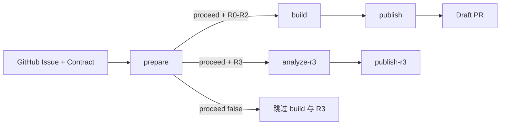
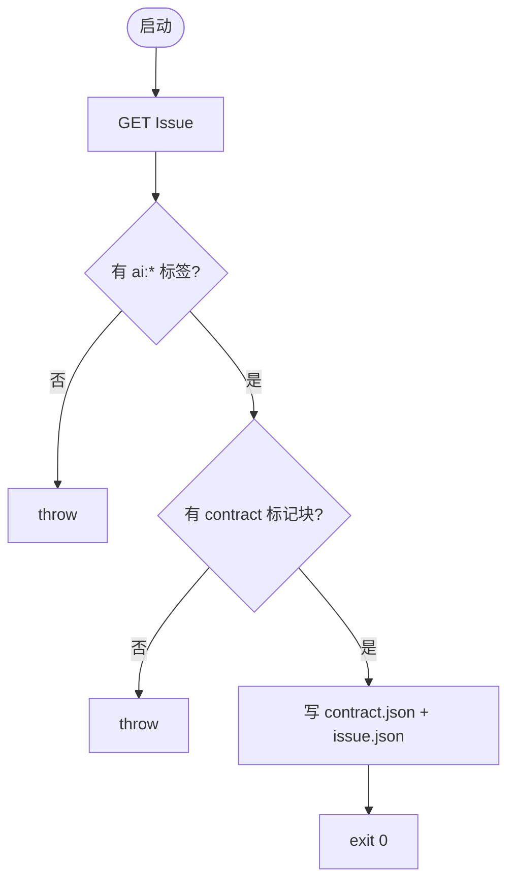
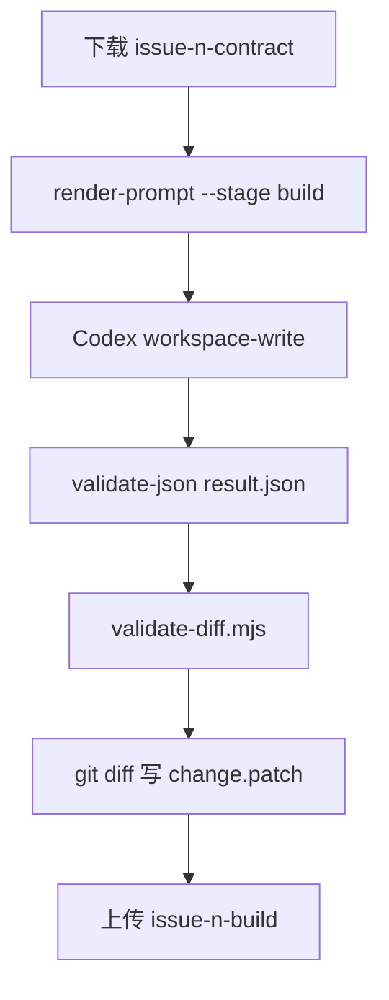
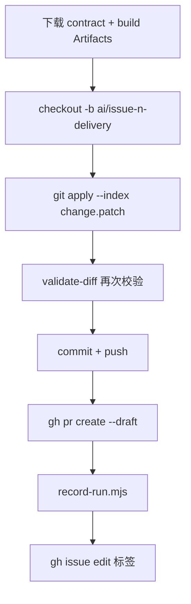
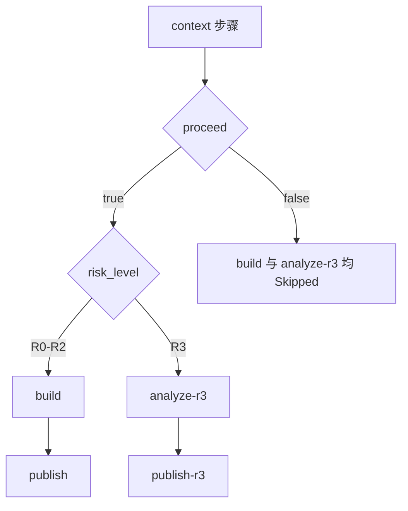
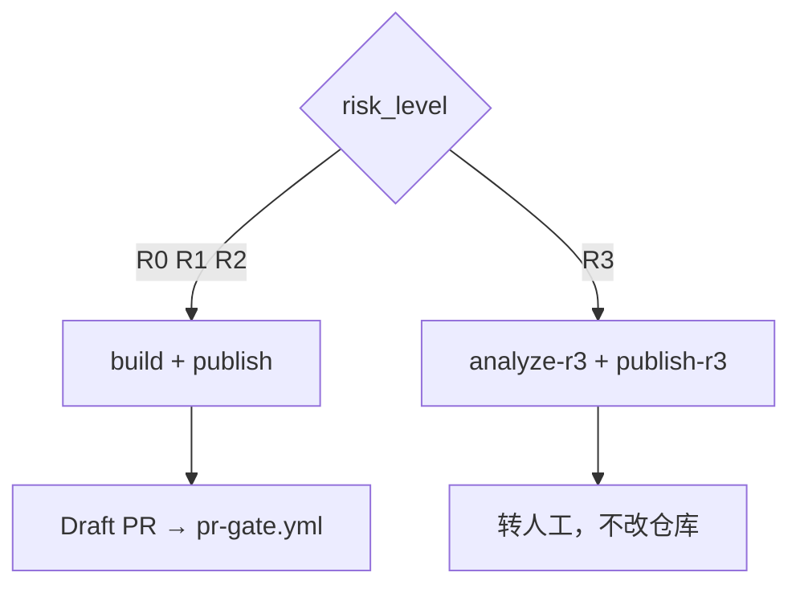

# issue-delivery.yml 说明

[issue-delivery.yml](issue-delivery.yml) 读取 GitHub Issue 正文里的 **Issue Contract**，让 Codex **改代码**（R0–R2）或 **只读分析**（R3），再由 Controller 推分支、开 **Draft PR**（或 R3 时写 Issue 评论转人工）。成功后 PR 会触发 [pr-gate.yml](pr-gate.yml)（详见 [pr-gate.yml.md](pr-gate.yml.md)）。

**文档结构**：[一、总体](#一总体) → [二、细节（各 Job）](#二细节) → [三、答疑（术语与开关）](#三答疑)

---

## 一、总体

### 这份 Workflow 做什么

Workflow 拆成五个 Job：**prepare → build / analyze-r3 → publish / publish-r3**。凭据按 Job 隔离：Codex 在 Mac 上只有 `workspace-write` 或 `read-only`；GitHub App Token、Supabase Service Role 只在云 Runner 的 publish 类 Job 出现。



### 上游入口

| 来源          | Workflow / 脚本                                                                                                         | 如何进入 Delivery                        |
| ------------- | ----------------------------------------------------------------------------------------------------------------------- | ---------------------------------------- |
| 网站 Feedback | [feedback-intake.yml.md](feedback-intake.yml.md) → [`intake-publish.mjs`](../../scripts/controllers/intake-publish.mjs) | **`workflow_dispatch`** + `issue_number` |
| Codex 对话    | [publish-conversation-issues.yml.md](publish-conversation-issues.yml.md)                                                | **`workflow_dispatch`** + `issue_number` |

### 触发方式摘要

两个入口都先把同一个 Issue 从 `content:raw` 晋升为 `content:processed`，再显式 dispatch。本 Workflow 不监听 `issues.opened`。

### Job 总览

| Job            | Runner          | 用途（一句话）                                                     | 何时跳过                                |
| -------------- | --------------- | ------------------------------------------------------------------ | --------------------------------------- |
| **prepare**    | `ubuntu-latest` | 验证 processed 标签、提取 Contract、计算 `risk_level`、Schema 校验 | 从不跳过                                |
| **build**      | 自托管 macOS    | Codex **改代码**，policy 校验，生成 patch                          | `proceed != true` 或 `risk_level == R3` |
| **analyze-r3** | 自托管 macOS    | Codex **只读**分析 R3 Issue                                        | `proceed != true` 或 `risk_level != R3` |
| **publish**    | `ubuntu-latest` | 应用 patch、推分支、开 Draft PR、`record-run`                      | `build` 未运行或失败                    |
| **publish-r3** | `ubuntu-latest` | Issue 评论 + 转人工标签                                            | `analyze-r3` 未运行或失败               |

### Job 之间如何传参

| 从                      | 到                 | 机制                               | 传递内容                                       |
| ----------------------- | ------------------ | ---------------------------------- | ---------------------------------------------- |
| prepare                 | build / analyze-r3 | `needs` + `proceed` + `risk_level` | 是否继续、走哪条路径                           |
| prepare                 | 下游               | Artifact `issue-{n}-contract`      | Contract + issue 快照                          |
| build                   | publish            | Artifact `issue-{n}-build`         | patch + result.json                            |
| analyze-r3              | publish-r3         | Artifact `issue-{n}-r3-analysis`   | R3 JSON                                        |
| publish                 | pr-gate            | Draft PR 创建                      | PR 事件；详见 [pr-gate.yml.md](pr-gate.yml.md) |
| feedback-intake publish | prepare            | `workflow_dispatch`                | `issue_number`                                 |

---

## 二、细节

### prepare

#### 用途

在 GitHub 云 Runner 上：

1. 运行 [`prepare-issue.mjs`](../../scripts/controllers/prepare-issue.mjs) 验证 `content:processed` 并从 Issue 提取 Contract。
2. 计算 **`risk_level`**。
3. Schema 校验 Contract。
4. 上传 Artifact 供下游 Job 使用；**本 Job 不运行 Codex**。

#### 脚本执行流程（prepare-issue.mjs）

**调用方式**

```bash
node scripts/controllers/prepare-issue.mjs <issue-number> .ai/runs/delivery
```

**必需环境变量**

| 变量                | 用途                                  |
| ------------------- | ------------------------------------- |
| `GH_TOKEN`          | 读 Issue（prepare 用 `github.token`） |
| `GITHUB_REPOSITORY` | `owner/repo`                          |



**步骤 1：读取 Issue**

| 项目       | 值                                                                          |
| ---------- | --------------------------------------------------------------------------- |
| **API**    | `GET https://api.github.com/repos/{GITHUB_REPOSITORY}/issues/{issueNumber}` |
| **Header** | `Authorization: Bearer {GH_TOKEN}`，`Accept: application/vnd.github+json`   |

**步骤 2：校验自动化标签**

Issue 的 `labels` 中须至少有一个 `name` 以 **`ai:`** 开头。否则：

```text
throw new Error("Issue does not have a SignalPatch automation label")
```

**步骤 3：提取 Issue Contract**

对 `issue.body` 做正则匹配：

````text
<!-- signalpatch-contract:start -->
```json
{ ... }
````

<!-- signalpatch-contract:end -->

````

无匹配则 `throw new Error("Issue does not contain a SignalPatch Issue Contract")`。

**步骤 4：写出运行目录文件**

| 文件 | 内容 |
|------|------|
| `contract.json` | 标记块内 JSON（trim 后） |
| `issue.json` | `{ number, title, url }` — **最小** Issue 快照，供 Prompt 引用 |

**刻意不传**整段 Issue body 给 Codex，避免不可信 Markdown 变成指令。

**步骤 5：Workflow `context` 步骤（yml 内，非 mjs）**

在 `prepare-issue.mjs` 成功后，shell 读取 `contract.json` 写入 Job outputs（见 [proceed 逻辑](#proceed-逻辑)）。

**步骤 6：Schema 校验**

```bash
node scripts/ai/validate-json.mjs \
  .ai/schemas/issue-contract.schema.json \
  .ai/runs/delivery/contract.json
````

**脚本侧错误与退出**

| 情况                            | 结果                |
| ------------------------------- | ------------------- |
| 缺少环境变量 / Issue 不存在     | throw，prepare 失败 |
| 无 `ai:*` 标签 / 无 Contract 块 | throw               |
| 成功                            | exit 0              |

#### 输入

| 来源       | 内容                                                            |
| ---------- | --------------------------------------------------------------- |
| **触发**   | `workflow_dispatch.issue_number` 或 `github.event.issue.number` |
| **GitHub** | Issue 正文 + 标签                                               |
| **仓库**   | `prepare-issue.mjs`、`validate-json.mjs`、Schema                |

#### 输出

| 类型           | 名称                 | 内容                                                                    |
| -------------- | -------------------- | ----------------------------------------------------------------------- |
| **Job output** | `issue_number`       | Issue 编号字符串                                                        |
| **Job output** | `proceed`            | `true` / `false`                                                        |
| **Job output** | `risk_level`         | `R0`–`R3`                                                               |
| **Artifact**   | `issue-{n}-contract` | 目录 `.ai/runs/delivery`（含 `contract.json`、`issue.json`），保留 7 天 |

---

### build

#### 用途

在自托管 Mac Runner 上，Codex **workspace-write** 按 Contract 改代码，经 policy 校验后生成 **patch**；**不**接触 GitHub Token 或 Supabase。

#### 执行流程



**1. 渲染 Builder Prompt**

```bash
node scripts/ai/render-prompt.mjs \
  --stage build \
  --contract .ai/runs/delivery/contract.json \
  --evidence .ai/runs/delivery/issue.json \
  > .ai/runs/delivery/prompt.md
```

合并 [issue-delivery Skill](../../.agents/skills/issue-delivery/SKILL.md)、`AGENTS.md`、Contract 与 evidence；Issue 正文视为不可信输入。

**2. Codex Builder**

| 项目            | 值                                                                           |
| --------------- | ---------------------------------------------------------------------------- |
| **沙箱**        | `workspace-write`（可改工作区文件）                                          |
| **环境**        | `env -i` + `HOME` / `PATH`（无 GitHub、Supabase、Vercel 变量）               |
| **输出 Schema** | [delivery-output.schema.json](../../.ai/schemas/delivery-output.schema.json) |
| **输出文件**    | `.ai/runs/delivery/result.json`                                              |

**3. 策略 enforcement（Enforce paths and risk）**

```bash
git add --intent-to-add -- .
node scripts/ai/validate-json.mjs \
  .ai/schemas/delivery-output.schema.json \
  .ai/runs/delivery/result.json
node scripts/ai/validate-diff.mjs \
  --base HEAD \
  --contract .ai/runs/delivery/contract.json
git diff --binary HEAD -- > .ai/runs/delivery/change.patch
test -s .ai/runs/delivery/change.patch
```

- **`git add --intent-to-add`**：让**新文件**出现在 diff 中，避免绕过 `allowedPaths` 检查。
- **`test -s change.patch`**：patch 必须非空，否则 build 失败。

#### validate-diff.mjs 说明

**调用方式**

```bash
node scripts/ai/validate-diff.mjs --base HEAD --contract .ai/runs/delivery/contract.json
```

| 步骤 | 行为                                                                                                             |
| ---- | ---------------------------------------------------------------------------------------------------------------- |
| 1    | `git diff --name-only {base}` 列出变更路径                                                                       |
| 2    | [`requiredRisk`](../../scripts/ai/lib/policy.mjs) 按实际路径与 [policy.yaml](../../.ai/policy.yaml) **上调**风险 |
| 3    | [`policyViolations`](../../scripts/ai/lib/policy.mjs)：路径是否在 `allowedPaths` 内、R0/R1 是否触碰保护路径等    |
| 4    | 若实际上调高于 Contract 声明 → `risk-escalation-required` 违规                                                   |
| 5    | stdout JSON `{ valid, paths, riskLevel, violations }`；`valid=false` 时 **exit 1**                               |

**为何 build 与 publish 各跑一次**：Artifact 跨 Job 传递 patch，publish 在 `git apply` 后**再次**校验，防止信任边界被绕过。路径规则与 R0–R3 含义见 [R0–R3 是什么意思](#r0r3-是什么意思)。

#### delivery-output.schema.json（build 的 result.json）

| 字段           | 含义                                             |
| -------------- | ------------------------------------------------ |
| `stage`        | `build` / `review` / `repair`                    |
| `summary`      | 本轮工作摘要                                     |
| `changedPaths` | 声称修改的路径                                   |
| `verification` | `{ command, status, detail }[]`                  |
| `riskLevel`    | `R0`–`R3`                                        |
| `decision`     | `APPROVE` / `REQUEST_CHANGES` / `HUMAN_REQUIRED` |
| `findings`     | `{ severity, title, evidence }[]`                |

#### 输入

| 来源         | 内容                                                            |
| ------------ | --------------------------------------------------------------- |
| **上游**     | `needs.prepare.outputs.proceed == 'true'`，`risk_level != 'R3'` |
| **Artifact** | `issue-{n}-contract`                                            |
| **仓库**     | `main` 全历史 checkout                                          |

#### 输出

| 类型           | 名称              | 内容                                     |
| -------------- | ----------------- | ---------------------------------------- |
| **Artifact**   | `issue-{n}-build` | `change.patch`、`result.json`，保留 7 天 |
| **外部写操作** | —                 | **无**（不改 remote、不开 PR）           |

---

### analyze-r3

> **命名**：Job 名中的 **`r3` 表示风险等级 R3**；仅当 `risk_level == 'R3'` 时运行。见 [答疑 § 为什么 Job 名叫 analyze-r3 / publish-r3](#为什么-job-名叫-analyze-r3--publish-r3)。

#### 用途

Contract 为 **R3** 时，Codex **只读**分析 Issue，输出结构化 JSON；**不产生** patch、**不**改仓库。

#### 执行流程

与 build 类似，差异如下：

| 项目          | build             | analyze-r3         |
| ------------- | ----------------- | ------------------ |
| Prompt        | `--stage build`   | `--stage review`   |
| Codex 沙箱    | `workspace-write` | `read-only`        |
| 输出文件      | `result.json`     | `r3-analysis.json` |
| validate-diff | **有**            | **无**             |
| change.patch  | **有**            | **无**             |

步骤概要：

1. 下载 `issue-{n}-contract`
2. `render-prompt.mjs --stage review` → `r3-prompt.md`
3. Codex read-only → `r3-analysis.json`
4. `validate-json.mjs` 对照 `delivery-output.schema.json`
5. 上传 Artifact `issue-{n}-r3-analysis`

#### 输入 / 输出

|                          | 内容                                    |
| ------------------------ | --------------------------------------- |
| **跳过条件**             | `proceed != true` 或 `risk_level != R3` |
| **Artifact 出**          | `r3-analysis.json`（7 天）              |
| **Supabase / GitHub 写** | 本 Job **无**                           |

---

### publish-r3

> **命名**：与 **analyze-r3** 成对，只处理 **R3 只分析**路径；**不开 PR、不调 record-run**。见 [答疑 § 为什么 Job 名叫 analyze-r3 / publish-r3](#为什么-job-名叫-analyze-r3--publish-r3)。

#### 用途

R3 分析完成后，用 **GitHub App Token** 把结论写回 Issue，并标记需人工处理。

#### 执行流程

1. 下载 `issue-{n}-r3-analysis`
2. 创建 App Installation Token
3. `gh issue comment {n} --body-file .ai/runs/delivery/r3-analysis.json`
4. `gh issue edit {n} --remove-label ai:ready --add-label ai:human-required`

| 项目     | 说明                                            |
| -------- | ----------------------------------------------- |
| **不做** | 不 `git push`、不开 PR、不调用 `record-run.mjs` |
| **权限** | 仅 `issues: write`                              |

---

### publish

#### 用途

在干净 `main` 上应用已验证 patch，推 AI 分支、开 **Draft PR**（见 [Draft PR 与普通 PR 的区别](#draft-pr-与普通-pr-的区别)），写入 **Automation Run**，更新 Issue 标签与 Problem **Repair Status**。

#### 执行流程（Validate and publish AI branch）



| 步骤 | 命令 / 行为                                                                     |
| ---- | ------------------------------------------------------------------------------- |
| 1    | 分支名 `ai/issue-{ISSUE_NUMBER}-delivery`                                       |
| 2    | `git apply --index .ai/runs/delivery/change.patch`                              |
| 3    | `validate-diff.mjs --base HEAD --contract contract.json`                        |
| 4    | Bot 身份 commit：`fix: deliver SignalPatch issue #{n}`                          |
| 5    | `git push`（remote URL 嵌入 App Token）                                         |
| 6    | `gh pr create --draft --base main --head {branch}`（**Draft PR**，非 Ready PR） |
| 7    | `record-run.mjs`（见下）                                                        |
| 8    | Issue 标签：`ai:ready` → `ai:building`                                          |

Draft PR 创建后会触发 **pr-gate.yml**（详见 [Draft PR 与普通 PR 的区别](#draft-pr-与普通-pr-的区别)）。

#### 脚本执行流程（record-run.mjs）

**调用方式**（publish Job 内）

```bash
node scripts/controllers/record-run.mjs \
  --issue "$ISSUE_NUMBER" \
  --stage build \
  --state SUCCEEDED \
  --head-sha "$(git rev-parse HEAD)" \
  --pr "$pr_number" \
  --contract .ai/runs/delivery/contract.json
```

**必需环境变量**：`GITHUB_REPOSITORY`、`SUPABASE_URL`、`SUPABASE_SERVICE_ROLE_KEY`

**步骤 1：解析 Problem**

```text
GET /rest/v1/problems?issue_number=eq.{n}&limit=1
```

| 结果                | 行为                                                                        |
| ------------------- | --------------------------------------------------------------------------- |
| 找到 Problem        | 使用该 `problem.id`（Feedback Intake 已创建）                               |
| 未找到              | 若提供 `--contract`：读 `contract.json`，**POST problems** 补建（对话来源） |
| 未找到且无 contract | throw `Problem not found for Issue #N`                                      |

补建 Problem 写入：`summary`、`issue_number`、`spec_ready: true`、`repair_status: "BUILDING"`。

**步骤 2：幂等写入 automation_runs**

**idempotency_key**：

```text
{GITHUB_REPOSITORY}:{issueNumber}:{stage}:{headSha}:{attempt}
```

```text
POST /rest/v1/automation_runs?on_conflict=idempotency_key
prefer: resolution=merge-duplicates,return=minimal
```

写入：`problem_id`、`issue_number`、`pull_request_number`、`stage`、`state`、`head_sha`、`attempt` 等。Automation Run 字段说明见 [Automation Run 是什么](#automation-run-是什么)。

**步骤 3：更新 Repair Status**

[`repairStatusForRun(stage, state)`](../../scripts/controllers/lib/run-status.mjs)：

| stage          | state            | Problem.repair_status   |
| -------------- | ---------------- | ----------------------- |
| `build`        | `SUCCEEDED`      | `BUILDING`              |
| `build`        | `HUMAN_REQUIRED` | `HUMAN_REQUIRED`        |
| 其它失败中间态 | 非 SUCCEEDED     | **不更新**（返回 null） |

stdout：`{"idempotencyKey":"..."}`，exit 0。

#### 输入

| 来源         | 内容                                                       |
| ------------ | ---------------------------------------------------------- |
| **上游**     | `needs.build` 成功                                         |
| **Artifact** | `issue-{n}-contract`、`issue-{n}-build`                    |
| **Secrets**  | `SIGNALPATCH_APP_*` → `GH_TOKEN`；`SUPABASE_*`             |
| **权限**     | `contents: write`、`issues: write`、`pull-requests: write` |

#### 输出

| 类型         | 内容                                                                         |
| ------------ | ---------------------------------------------------------------------------- |
| **Git**      | 分支 `ai/issue-{n}-delivery`、Draft PR                                       |
| **Supabase** | `automation_runs` 行；Problem `repair_status` → `BUILDING`（或补建 Problem） |
| **GitHub**   | Issue 标签 `ai:building`                                                     |
| **Artifact** | 本 Job **不上传**                                                            |

---

## 三、答疑

本节集中回答：**领域术语**、**Workflow 开关**（如 `proceed`）、**跨阶段概念**（R0–R3、Draft PR）。各 Job 逐步操作见 [二、细节](#二细节)。

### Issue Contract（Delivery 视角）

Delivery **只认** Issue 正文中 `<!-- signalpatch-contract:start/end -->` 标记块里的 JSON，不认标题或其它 Markdown 自由文字。完整定义、字段表与 Intake 产出方式见 [feedback-intake.yml.md § Issue Contract](feedback-intake.yml.md#issue-contract-是什么)。

| 项目           | Delivery 侧要点                                                                                                                           |
| -------------- | ----------------------------------------------------------------------------------------------------------------------------------------- |
| **提取**       | [`prepare-issue.mjs`](../../scripts/controllers/prepare-issue.mjs) 正则抠出 JSON → `contract.json`                                        |
| **校验**       | [`validate-json.mjs`](../../scripts/ai/validate-json.mjs) 对照 [issue-contract.schema.json](../../.ai/schemas/issue-contract.schema.json) |
| **前置条件**   | Issue 须带 `content:processed` 标签并包含有效 Issue Contract                                                                              |
| **传给 Codex** | 仅 `contract.json` + 最小 `issue.json`（number/title/url），**不传**整段 Issue body                                                       |

### proceed 逻辑

`proceed` 是 prepare Job 输出的固定字符串 `true`，供现有 build / analyze-r3 条件复用。两个入口只通过 `workflow_dispatch` 启动 Delivery，因此不再根据事件来源跳过重复 Run。

#### 在 yml 里如何产生

prepare 声明：

```yaml
outputs:
  issue_number: ${{ steps.context.outputs.issue_number }}
  proceed: ${{ steps.context.outputs.proceed }}
  risk_level: ${{ steps.context.outputs.risk_level }}
```

`context` 步骤先跑 `prepare-issue.mjs`，再读 `contract.json`：

```yaml
- id: context
  run: |
    node scripts/controllers/prepare-issue.mjs "$ISSUE_NUMBER" .ai/runs/delivery
    proceed=true
    risk_level=$(node -e 'const c=require("./.ai/runs/delivery/contract.json"); process.stdout.write(c.riskLevel)')
    echo "proceed=$proceed" >> "$GITHUB_OUTPUT"
    # ...
```

GitHub Actions Job output 都是**字符串**；下游须写 `== 'true'`，不能写布尔 `true`。

#### 下游如何使用



| Job            | 条件                                            |
| -------------- | ----------------------------------------------- |
| **build**      | `proceed == 'true'` **且** `risk_level != 'R3'` |
| **analyze-r3** | `proceed == 'true'` **且** `risk_level == 'R3'` |
| **publish**    | `needs: build` 成功                             |
| **publish-r3** | `needs: analyze-r3` 成功                        |

raw Issue 不会触发本 Workflow；`prepare-issue.mjs` 仍会拒绝任何缺少 `content:processed` 或 Contract 标记块的手动 dispatch。

### Automation Run 是什么

**Automation Run** 是一次 Issue 从 Delivery、PR Gate、Repair 到发布终态在 Supabase 里的**执行记录**（表 `signalpatch.automation_runs`）。领域定义见 [CONTEXT.md](../../CONTEXT.md)。

| 字段                  | 含义                                                             |
| --------------------- | ---------------------------------------------------------------- |
| `problem_id`          | 归属的 Problem                                                   |
| `issue_number`        | GitHub Issue 编号                                                |
| `pull_request_number` | 关联 PR（Delivery 成功后写入）                                   |
| `stage`               | 阶段名，如 `build`、`preview`、`repair`、`production`            |
| `state`               | `QUEUED` / `RUNNING` / `SUCCEEDED` / `FAILED` / `HUMAN_REQUIRED` |
| `idempotency_key`     | 幂等键，重复事件 upsert 而非重复插入                             |
| `head_sha`            | 该次提交 SHA                                                     |
| `attempt`             | Repair 尝试次数（0–3）                                           |

Issue Delivery 的 **publish** Job 在 Draft PR 创建成功后调用 [`record-run.mjs`](../../scripts/controllers/record-run.mjs)（`--stage build --state SUCCEEDED`），并可能把 Problem 的 **Repair Status** 更新为 **`BUILDING`**。Problem 与 Repair Status 详见 [feedback-intake.yml.md § Problem](feedback-intake.yml.md#problem-是什么)。

### R0–R3 是什么意思

**R0–R3** 是 Issue Contract 字段 **`riskLevel`** 的四个等级，表示这次自动化修改的**风险边界**：能改哪些路径、能否自动合并、Delivery 走改码还是只分析。权威定义在 [`.ai/policy.yaml`](../../.ai/policy.yaml)；[AGENTS.md](../../AGENTS.md) 规定模型**只能被 Controller 上调、不能下调**。

等级从低到高：**R0 < R1 < R2 < R3**。实际 diff 若命中多条 `risk_rules`，取**最高**一级（[`requiredRisk`](../../scripts/ai/lib/policy.mjs)）。

#### 各等级含义与自动化行为

| 等级   | 典型变更范围                        | 能否改代码       | PR Gate 通过后         | Delivery 路径           |
| ------ | ----------------------------------- | ---------------- | ---------------------- | ----------------------- |
| **R0** | 纯文档，不改变运行时行为            | 是               | **可自动合并**、发布   | build → publish         |
| **R1** | 应用代码与测试（局部行为变更）      | 是               | **可自动合并**、发布   | build → publish         |
| **R2** | 工作流、Skill、迁移、依赖等系统边界 | 是               | **须人工批准**后才合并 | build → publish         |
| **R3** | 密钥、认证、IAM 等敏感边界          | **否**（只分析） | 不适用（无 PR）        | analyze-r3 → publish-r3 |

对应 [policy.yaml `automation`](../../.ai/policy.yaml)：

| 配置项                 | 等级   |
| ---------------------- | ------ |
| `auto_merge_risks`     | R0、R1 |
| `human_approval_risks` | R2     |
| `analysis_only_risks`  | R3     |

#### policy.yaml 中的路径规则（摘要）

`validate-diff.mjs` 根据**实际修改路径**与 Contract 的 `allowedPaths` 计算最低风险；Intake publish 时也会对 Contract 做一次 [`requiredRisk`](../../scripts/ai/lib/policy.mjs) 上调。

| 等级   | `risk_rules` 示例路径（glob）                                                                                                      |
| ------ | ---------------------------------------------------------------------------------------------------------------------------------- |
| **R3** | `**/*secret*`、`**/*private-key*`、`**/iam/**`、`**/auth/**`                                                                       |
| **R2** | `.github/workflows/**`、`.agents/skills/**`、`.ai/**`、`supabase/migrations/**`、`package.json`、`pnpm-lock.yaml`、`next.config.*` |
| **R1** | `src/**`、`tests/**`                                                                                                               |
| **R0** | `README.md`、`docs/**`、`**/*.md`                                                                                                  |

**protected_paths**（R0/R1 **禁止**修改，即使写进 `allowedPaths` 也会被拒绝；仅 **R2** Contract 可改这些治理文件，且仍须人工批准合并）：

- `.github/workflows/**`、`.agents/skills/**`、`.ai/policy.yaml`
- `supabase/migrations/**`、`package.json`、`pnpm-lock.yaml`

#### 风险如何确定（Intake → Delivery）

```text
Intake qualify：Codex 在 Contract 里提议 riskLevel
  → Intake publish：requiredRisk(allowedPaths) 上调，写入 Issue 标签 risk:r0 等
  → Delivery prepare：读出 risk_level Job output
  → Delivery build：validate-diff 对实际 git diff 再次 requiredRisk + policyViolations
  → 若实际上调高于 Contract 声明 → 违规，build/publish 失败
```

| 阶段                     | 谁写 / 谁读 `riskLevel`                                                                               |
| ------------------------ | ----------------------------------------------------------------------------------------------------- |
| Intake qualify           | Codex 提议                                                                                            |
| Intake publish           | [`intake-publish.mjs`](../../scripts/controllers/intake-publish.mjs) 上调后写入 Issue Contract 与标签 |
| Delivery prepare         | 读 Contract → `risk_level` output                                                                     |
| Delivery build / publish | [`validate-diff.mjs`](../../scripts/ai/validate-diff.mjs) 按真实 diff 校验                            |

Issue 标签示例：`ai:ready` + **`risk:r1`**（小写，来自上调后的 `riskLevel`）。

#### R0–R3 与 Delivery 双路径

Contract 的 `riskLevel` 在 prepare 时读出为 Job output **`risk_level`**：

| 等级             | Delivery 路径                                                              |
| ---------------- | -------------------------------------------------------------------------- |
| **R0 / R1 / R2** | **build → publish**（开 Draft PR）                                         |
| **R3**           | **analyze-r3 → publish-r3**（Issue 评论 + `ai:human-required`，**无** PR） |

R3 路径：**无** patch、**无** Draft PR、**无** `record-run`。



合并与发布细节见 [pr-gate.yml.md](pr-gate.yml.md)、[pr-outcome.yml.md](pr-outcome.yml.md)（R0/R1 自动合并；R2 等人批）。

#### 为什么 Job 名叫 analyze-r3 / publish-r3

名称里的 **`r3` 就是风险等级 R3**，不是泛指「第 3 步」或「第三个 publish Job」。这两个 Job **只在** Contract 的 `riskLevel` 为 **R3** 时运行；R0–R2 走 **`build` → `publish`**，**不会**进入带 `-r3` 后缀的 Job。

| Job 名         | 何时跑（yml `if`）       | 含义                                                     |
| -------------- | ------------------------ | -------------------------------------------------------- |
| **build**      | `risk_level != 'R3'`     | R0/R1/R2：**改代码**                                     |
| **publish**    | `needs: build` 成功      | 应用 patch、开 **Draft PR**                              |
| **analyze-r3** | `risk_level == 'R3'`     | R3：**只读分析**，不出 patch                             |
| **publish-r3** | `needs: analyze-r3` 成功 | 把 R3 分析 JSON **评论到 Issue**，转 `ai:human-required` |

prepare 从 Contract 读取 `riskLevel` 写入 Job output **`risk_level`**（见 [issue-delivery.yml](issue-delivery.yml) 的 `context` 步骤）。R3 在 [policy.yaml `analysis_only_risks`](../../.ai/policy.yaml) 中定义为 **只分析、不改仓库**（典型路径含 `**/auth/**`、密钥相关 glob），因此需要与「改码 + 开 PR」的 **`publish`** 分开命名，避免混淆两套交付路径。

```text
risk_level = R0 / R1 / R2  →  build  →  publish（Draft PR）
risk_level = R3            →  analyze-r3  →  publish-r3（Issue 评论，无 PR）
```

逐步操作见 [二、细节 § analyze-r3 / publish-r3](#analyze-r3)。

### Draft PR 与普通 PR 的区别

SignalPatch 的 Issue Delivery **刻意**创建 **Draft PR**（`gh pr create --draft`），而不是一上线就是 **Ready for review** 的普通 PR。两者在 GitHub 上都是 Pull Request，差别在于**状态**与**流程含义**。

#### GitHub 平台层面

|            | **Draft PR（草稿）**                                                | **普通 PR（Ready）**                   |
| ---------- | ------------------------------------------------------------------- | -------------------------------------- |
| **状态**   | 标记为 **Draft**                                                    | 默认 **Open**，且 **Ready for review** |
| **含义**   | 「改动已提交，但尚未作为正式评审/合并对象」                         | 「可以评审、讨论、在满足规则后合并」   |
| **合并**   | 通常需先 **Mark ready for review** 才能合并（仍受分支保护约束）     | 检查通过且规则允许时可直接合并         |
| **共同点** | 都有分支、diff、Checks、评论；都会触发本仓库配置的 PR 相关 Workflow | 同左                                   |

#### 在 SignalPatch 链路里

```text
issue-delivery publish → 创建 Draft PR（AI 刚交卷）
       ↓
pr-gate.yml（PR opened / synchronize / reopened 时跑 verify、build、审查、preview-smoke）
       ↓
pr-outcome.yml（Gate 全过 → R0/R1 自动合并；R2 等人批；失败 → Repair）
       ↓
Production 验收成功后关 Issue（Draft PR 正文用 Refs #N，不会自动关 Issue）
```

| 项目              | 说明                                                                                                                                                                                                                   |
| ----------------- | ---------------------------------------------------------------------------------------------------------------------------------------------------------------------------------------------------------------------- |
| **为何用 Draft**  | Delivery 只负责推分支、开 PR；**验收在 pr-gate**；Draft 表示「尚未通过 Gate，不能当可合并终态」                                                                                                                        |
| **谁合并**        | **不是** Delivery；R0/R1 由 **pr-outcome** 在 Gate 与运行时验收通过后自动合并；R2 须人工批准                                                                                                                           |
| **Draft → Ready** | 可在 GitHub 上手动标为 Ready；当前 **pr-gate** 主要响应 `opened` / `synchronize` / `reopened`，**Draft 转 Ready 不保证再跑一整轮 Gate**（见 [docs/codex-manual-operations.md](../../docs/codex-manual-operations.md)） |
| **R3**            | **不创建** Draft PR，也不创建普通 PR                                                                                                                                                                                   |

publish Job 创建 Draft PR 时的典型形态：

| 字段     | 值                                                 |
| -------- | -------------------------------------------------- |
| **分支** | `ai/issue-{编号}-delivery`                         |
| **命令** | `gh pr create --draft --base main --head {branch}` |
| **标题** | `AI delivery for #{编号}`                          |
| **正文** | `Refs #{编号}`（关联 Issue，**不**自动关闭）       |

Draft PR 创建后会触发 [pr-gate.yml](pr-gate.yml)（详见 [pr-gate.yml.md](pr-gate.yml.md)）；下游合并与发布见 [pr-outcome.yml.md](pr-outcome.yml.md)。

### 相关文件

| 文件                                                                                     | 说明                                                         |
| ---------------------------------------------------------------------------------------- | ------------------------------------------------------------ |
| [README.md](README.md)                                                                   | 全仓库 Workflow 总览                                         |
| [feedback-intake.yml.md](feedback-intake.yml.md)                                         | 上游 Intake、Issue Contract、Problem、dispatch               |
| [pr-gate.yml.md](pr-gate.yml.md)                                                         | 下游 PR 验收：verify / build / 独立审查 / preview-smoke      |
| [scripts/README.md](../../scripts/README.md)                                             | 脚本触发矩阵                                                 |
| [prepare-issue.mjs](../../scripts/controllers/prepare-issue.mjs)                         | 提取 Contract                                                |
| [record-run.mjs](../../scripts/controllers/record-run.mjs)                               | Automation Run + Repair Status                               |
| [validate-diff.mjs](../../scripts/ai/validate-diff.mjs)                                  | 路径与风险策略校验                                           |
| [.ai/schemas/issue-contract.schema.json](../../.ai/schemas/issue-contract.schema.json)   | Contract Schema                                              |
| [.ai/schemas/delivery-output.schema.json](../../.ai/schemas/delivery-output.schema.json) | Codex Delivery 输出 Schema                                   |
| [.ai/policy.yaml](../../.ai/policy.yaml)                                                 | R0–R3 路径规则与 auto_merge / human_approval / analysis_only |
| [CONTEXT.md](../../CONTEXT.md)                                                           | Automation Run、Issue Contract 等领域术语                    |
