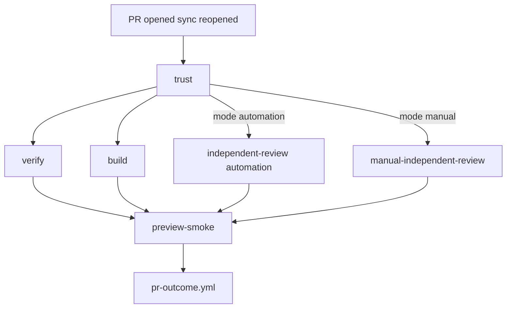
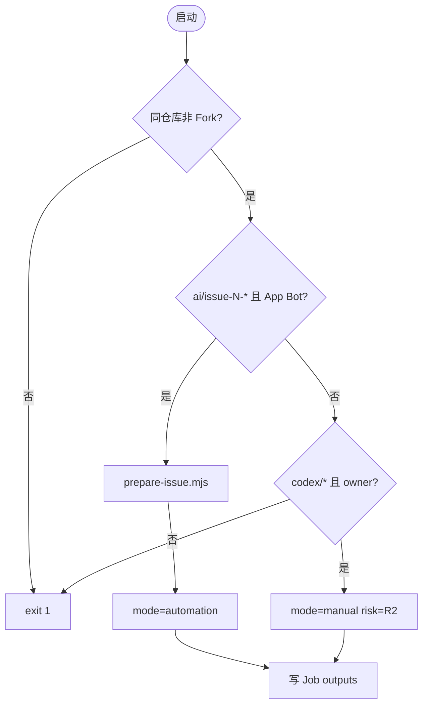
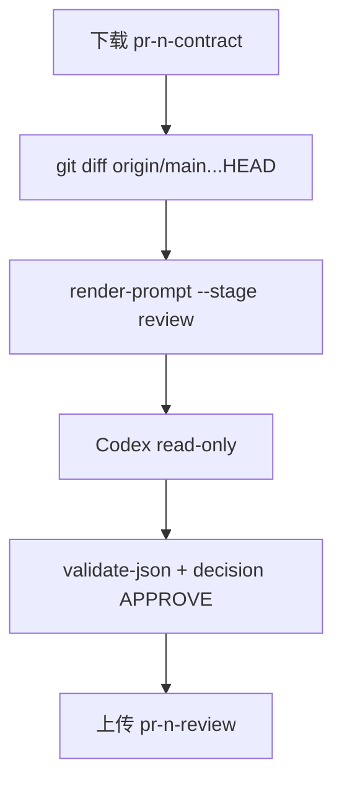
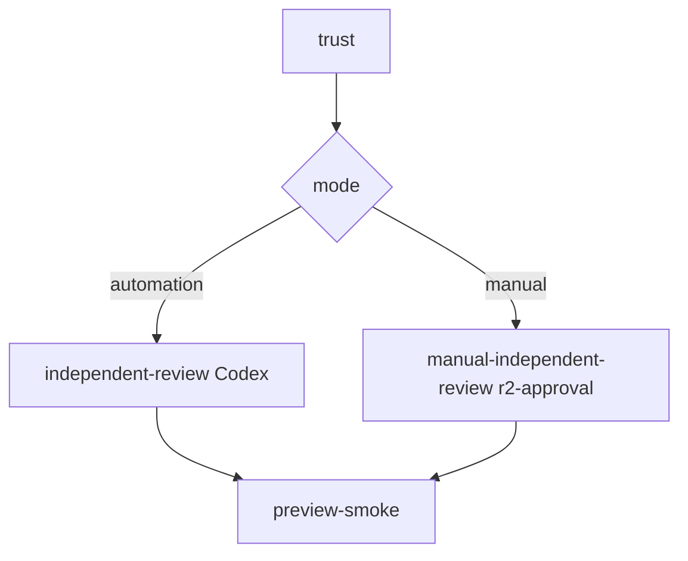

# pr-gate.yml 说明

[pr-gate.yml](pr-gate.yml) 在 PR 每次更新时跑 **verify**、**build**、**独立审查**、**预览部署 + Smoke Test**。4 个检查供自动化验收使用，不是 Required Checks；整轮结束后触发 [pr-outcome.yml](pr-outcome.yml)（Workflow 名为 **`PR Gate`**）。

上游通常为 [issue-delivery.yml.md](issue-delivery.yml.md) 创建的 **Draft PR**。

**文档结构**：[一、总体](#一总体) → [二、细节（各 Job）](#二细节) → [三、答疑（术语与开关）](#三答疑)

---

## 一、总体

### 这份 Workflow 做什么

Workflow 拆成六个 Job：**trust** 先行校验 PR 来源并固定 **Head SHA**；**verify** 与 **build** 并行跑静态/构建检查；**independent-review**（自动化或人工二选一）做独立审查；**preview-smoke** 部署 staged 环境并跑 Playwright Smoke。

凭据按 Job 隔离：Codex 只在 Mac 的 `independent-review` 以 **read-only** 运行；**Vercel Token**、**Supabase Service Role** 仅在 `preview-smoke` 步骤环境出现，Reviewer **无法继承**。



### 触发与并发

| 项目       | 说明                                                                                        |
| ---------- | ------------------------------------------------------------------------------------------- |
| **触发**   | `pull_request`：`opened`、`synchronize`、`reopened`                                         |
| **不触发** | 无 `workflow_dispatch`；**不**监听 `ready_for_review`（Draft 转 Ready 不保证再跑一轮 Gate） |
| **并发**   | `group: pr-gate-${{ pull_request.number }}`，`cancel-in-progress: true`                     |
| **含义**   | 同一 PR 有新 push 时**取消**旧 Gate Run，只认最新 Head SHA 的结果                           |

Draft PR 创建（`opened`）会触发 Gate；详见 [issue-delivery.yml.md § Draft PR](issue-delivery.yml.md#draft-pr-与普通-pr-的区别)。

### PR 上的检查

以下 **4 个**检查会显示在 PR 上；自动化 PR 只有在本轮全部成功后才进入 PR Outcome 的合并和发布步骤：

| 检查名（Job `name:`）  | 对应 Job id                                         | 做什么                                   |
| ---------------------- | --------------------------------------------------- | ---------------------------------------- |
| **verify**             | `verify`                                            | `pnpm verify`                            |
| **build**              | `build`                                             | `pnpm build`                             |
| **independent-review** | `independent-review` 或 `manual-independent-review` | Codex 审查 **或** `r2-approval` 人工环境 |
| **preview-smoke**      | `preview-smoke`                                     | Vercel staged 部署 + Smoke Test          |

**`trust` 不属于这 4 个检查**：它是安全前置与证据准备；失败时后续 Job 不运行。

### Job 总览

| Job                           | Runner                          | 用途（一句话）                                                    | 何时跳过                                           |
| ----------------------------- | ------------------------------- | ----------------------------------------------------------------- | -------------------------------------------------- |
| **trust**                     | `ubuntu-latest`                 | 校验 PR 来源、定 `mode` / `risk_level`、拉 Contract（automation） | 从不跳过                                           |
| **verify**                    | `ubuntu-latest`                 | 格式、Lint、类型、单测、SQL/Workflow 校验                         | `trust` 失败                                       |
| **build**                     | `ubuntu-latest`                 | 独立生产构建                                                      | `trust` 失败                                       |
| **independent-review**        | 自托管 macOS                    | 独立 Codex 只读审查 diff                                          | `mode != automation`                               |
| **manual-independent-review** | `ubuntu-latest` + `r2-approval` | 人工批准（`codex/*` PR）                                          | `mode != manual`                                   |
| **preview-smoke**             | `ubuntu-latest`                 | staged 部署 + Smoke + 记 Preview Run                              | 见 [preview-smoke 条件](#preview-smoke-的-if-条件) |

### Job 之间如何传参

| 从                     | 到                                 | 机制                                 | 传递内容                                    |
| ---------------------- | ---------------------------------- | ------------------------------------ | ------------------------------------------- |
| trust                  | verify / build / review            | `needs.trust.outputs.head_sha`       | checkout 固定 SHA                           |
| trust                  | review / preview-smoke             | `mode`、`issue_number`、`risk_level` | 自动化 vs 人工路径                          |
| trust                  | independent-review / preview-smoke | Artifact `pr-{n}-contract`           | Contract（仅 automation）                   |
| independent-review     | （留存）                           | Artifact `pr-{n}-review`             | Reviewer JSON                               |
| preview-smoke          | pr-outcome                         | Artifact `pr-{n}-deployment`         | `deployment.json`、`smoke-tracking-ids.txt` |
| issue-delivery publish | pr-gate                            | `pull_request` 事件                  | Draft PR                                    |

| Artifact            | 产出 Job            | 保留 | 消费者                                             |
| ------------------- | ------------------- | ---- | -------------------------------------------------- |
| `pr-{n}-contract`   | trust（automation） | 7 天 | independent-review、preview-smoke                  |
| `pr-{n}-review`     | independent-review  | 7 天 | 审计留存                                           |
| `pr-{n}-deployment` | preview-smoke       | 7 天 | pr-outcome **finalize**（promote 同一 Deployment） |

---

## 二、细节

### trust

#### 用途

在任何构建、Secret 或 Codex 之前：

1. 验证 PR **来源可信**（非 Fork、分支/作者符合规则）。
2. 判定 **`mode`**（`automation` / `manual`）与 **`risk_level`**。
3. automation 路径：从 Issue 编号拉 **Issue Contract**。
4. 输出 **`head_sha`**，下游全部 checkout 该 SHA。

#### 执行流程（verify 步骤，内联 shell）

**环境变量**

| 变量                                        | 来源                          |
| ------------------------------------------- | ----------------------------- |
| `APP_BOT`                                   | `vars.SIGNALPATCH_APP_BOT`    |
| `HEAD_REF` / `HEAD_SHA` / `HEAD_REPOSITORY` | `github.event.pull_request.*` |
| `PR_AUTHOR`                                 | PR 作者 login                 |
| `GH_TOKEN`                                  | `github.token`（读 Issue）    |



**步骤 1：拒绝 Fork**

```bash
[[ "$HEAD_REPOSITORY" == "$GITHUB_REPOSITORY" ]]
```

**步骤 2a：automation 路径**

条件：`HEAD_REF` 匹配 `^ai/issue-([0-9]+)-` **且** `PR_AUTHOR == APP_BOT`

```bash
node scripts/controllers/prepare-issue.mjs "$issue_number" .ai/runs/gate
risk_level=$(node -e 'const c=require("./.ai/runs/gate/contract.json"); process.stdout.write(c.riskLevel)')
```

从分支名解析 **Issue 编号**，再按编号读 GitHub Issue 中的 Contract（[`prepare-issue.mjs`](../../scripts/controllers/prepare-issue.mjs) 步骤同 [issue-delivery prepare](issue-delivery.yml.md#prepare)，输出目录为 `.ai/runs/gate`）。

**步骤 2b：manual 路径**

条件：`HEAD_REF` 匹配 `^codex/` **且** `PR_AUTHOR == REPOSITORY_OWNER`

```text
mode=manual
risk_level=R2
```

**不**调用 `prepare-issue.mjs`；固定按 **R2** 人工路径，不伪造自动化 Contract。

**步骤 2c：其它来源**

```text
PR source is not trusted for this gate → exit 1
```

**步骤 3：写出 Job outputs**

| Output         | 值                                       |
| -------------- | ---------------------------------------- |
| `issue_number` | automation 时从分支解析；manual 时**无** |
| `head_sha`     | `github.event.pull_request.head.sha`     |
| `mode`         | `automation` / `manual`                  |
| `risk_level`   | Contract 的 `riskLevel` 或 `R2`          |

automation 时上传 Artifact `pr-{n}-contract`（路径 `.ai/runs/gate`）。

#### 输入 / 输出

| 输入 | PR 事件元数据、GitHub Issue（automation） |
| 输出 | Job outputs；可选 Artifact `pr-{n}-contract` |

---

### verify

#### 用途

**Required Check 之一**：统一质量入口，证明 PR Head 通过格式、Lint、类型、单测、SQL 与 Workflow 结构校验。

#### 执行流程

1. checkout `ref: ${{ needs.trust.outputs.head_sha }}`
2. `pnpm install --frozen-lockfile`
3. `pnpm verify`（即 `format:check` + `lint` + `typecheck` + `test` + `validate:sql` + `validate:workflows`）

无 Codex、无 Vercel/Supabase 写凭据。

#### 输入 / 输出

| 输入 | `needs.trust` 成功、`head_sha` |
| 输出 | 通过/失败（PR 检查 **verify**） |

---

### build

#### 用途

**Required Check 之二**：**独立**执行生产构建；不能用 verify 里的测试成功替代「能打出可部署产物」。

#### 执行流程

与 verify 相同 checkout 与 install，运行 `pnpm build`。与 verify **并行**（均只 `needs: trust`）。

#### 输入 / 输出

| 输入 | `needs.trust` 成功、`head_sha` |
| 输出 | 通过/失败（PR 检查 **build**） |

---

### independent-review

> **命名**：PR 上显示的检查名是 **`independent-review`**。自动化路径跑本 Job；manual 路径跑 [manual-independent-review](#manual-independent-review)（同名检查）。见 [答疑 § mode 逻辑](#mode-逻辑)。

#### 用途

**自动化验收之三**（automation）：与 Builder **不同会话**的 Codex **只读**审查 PR diff + Issue Contract；`decision` 必须为 **`APPROVE`**。

#### 执行流程



**1. 准备 bounded review evidence**

```bash
git diff --binary origin/main...HEAD -- > .ai/runs/gate/pr.diff
node scripts/ai/render-prompt.mjs \
  --stage review \
  --contract .ai/runs/gate/contract.json \
  --evidence .ai/runs/gate/pr.diff \
  > .ai/runs/gate/review-prompt.md
```

使用 **三点 diff**（`main...HEAD`），只含 PR 净变化，不把完整 Git 历史塞进 Prompt。

**2. Codex Reviewer**

| 项目     | 值                                                                                                          |
| -------- | ----------------------------------------------------------------------------------------------------------- |
| **沙箱** | `read-only`                                                                                                 |
| **环境** | `env -i` + `HOME` / `PATH`                                                                                  |
| **输出** | `.ai/runs/gate/review.json`（[delivery-output.schema.json](../../.ai/schemas/delivery-output.schema.json)） |

**3. Require approval**

```bash
node scripts/ai/validate-json.mjs \
  .ai/schemas/delivery-output.schema.json \
  .ai/runs/gate/review.json
node -e 'const r=require("./.ai/runs/gate/review.json"); if(r.decision!=="APPROVE") process.exit(1)'
```

`REQUEST_CHANGES` 或 `HUMAN_REQUIRED` → Job 失败。

#### 输入 / 输出

| 输入 | `mode == automation`；Artifact `pr-{n}-contract`；`head_sha` |
| 输出 | Artifact `pr-{n}-review`；PR 检查 **independent-review** |

---

### manual-independent-review

#### 用途

**Required Check 之三**（manual）：仓库所有者提交的 `codex/*` PR 走 **GitHub Environment `r2-approval`** 人工批准，不跑 Codex 审查。

#### 执行流程

```yaml
name: independent-review # 与 automation Job 同名，PR 上只显示一个检查
environment: r2-approval
steps:
  - run: true
```

须有人在 GitHub Environment 中批准；`risk_level` 在 trust 已固定为 **R2**。

#### 输入 / 输出

| 输入 | `mode == manual` |
| 输出 | PR 检查 **independent-review**（人工批准记录） |

---

### preview-smoke

#### 用途

**Required Check 之四**：用 **production 配置**构建并部署一次 **staged** Deployment（**不切生产域名**），对部署 URL 跑 Smoke Test；automation 路径记录 Preview **Automation Run**；产出 Artifact 供 **pr-outcome** promote **同一** Deployment。

#### 执行流程

**前置条件**（`if` 表达式见 [答疑](#preview-smoke-的-if-条件)）：`trust`、`verify`、`build` 成功，且对应路径的 independent-review 成功。

**1. Build staged production artifact once**

```bash
pnpm exec vercel pull --yes --environment=production --token="$VERCEL_TOKEN"
pnpm exec vercel build --prod --token="$VERCEL_TOKEN"
deployment_url=$(pnpm exec vercel deploy --prebuilt --prod --skip-domain --yes --token="$VERCEL_TOKEN")
```

写入 `.ai/runs/gate/deployment.json`：`{ deploymentUrl, headSha }`。

| 标志            | 含义                                         |
| --------------- | -------------------------------------------- |
| `--prod`        | 使用 production 构建配置                     |
| `--skip-domain` | **暂不**绑定生产域名 → **staged** deployment |

**2. Smoke test staged deployment**

```bash
pnpm test:smoke -- --base-url="<deploymentUrl>"
```

经 [`run-smoke.mjs`](../../scripts/run-smoke.mjs) 启动 Playwright；`SMOKE_TRACKING_IDS_FILE=.ai/runs/gate/smoke-tracking-ids.txt` 记录测试写入的 synthetic Feedback，供 Outcome 清理。

**3. Record accepted staged deployment**（仅 automation）

```bash
node scripts/controllers/record-run.mjs \
  --issue "${{ needs.trust.outputs.issue_number }}" \
  --stage preview \
  --state SUCCEEDED \
  --head-sha "${{ needs.trust.outputs.head_sha }}" \
  --pr "${{ github.event.pull_request.number }}" \
  --preview-url "<deploymentUrl>" \
  --contract .ai/runs/gate/contract.json
```

[`repairStatusForRun`](../../scripts/controllers/lib/run-status.mjs)：`preview` + `SUCCEEDED` → Problem **`VERIFYING`**。

与 issue-delivery `build` 阶段对比：

| 阶段                  | `record-run` `--stage` | Repair Status |
| --------------------- | ---------------------- | ------------- |
| Delivery publish      | `build`                | `BUILDING`    |
| PR Gate preview-smoke | `preview`              | `VERIFYING`   |

**4. 上传 Artifact**

```text
pr-{n}-deployment/
  deployment.json
  smoke-tracking-ids.txt
```

Outcome **finalize** 下载后 **promote** 此 Deployment，**不**重新 `vercel build`。

#### 输入 / 输出

| 输入 | 前置 Job 全成功；`head_sha`；automation 时 Contract Artifact |
| Secrets | `VERCEL_*`（仅本 Job 步骤）；`SUPABASE_*`（record-run） |
| 输出 | PR 检查 **preview-smoke**；Artifact `pr-{n}-deployment` |

---

## 三、答疑

本节集中回答：**Workflow 开关**（`mode`）、**PR 检查**、**双路径审查**、**staged deployment** 与下游 Outcome。各 Job 逐步操作见 [二、细节](#二细节)。

### mode 逻辑

`mode` 是 **trust Job 的 Job 级输出**，决定 PR 走 **自动化** 还是 **手工** 审查路径（类比 Intake 的 [`has_feedback`](feedback-intake.yml.md#has_feedback-逻辑)、Delivery 的 [`proceed`](issue-delivery.yml.md#proceed-逻辑)）。

| `mode`           | 如何产生                               | `risk_level`            | 审查 Job                                   |
| ---------------- | -------------------------------------- | ----------------------- | ------------------------------------------ |
| **`automation`** | 分支 `ai/issue-{n}-*` 且作者为 App Bot | Contract 的 `riskLevel` | `independent-review`（Codex）              |
| **`manual`**     | 分支 `codex/*` 且作者为仓库 owner      | 固定 **R2**             | `manual-independent-review`（Environment） |



| Job                           | 条件                                       |
| ----------------------------- | ------------------------------------------ |
| **independent-review**        | `needs.trust.outputs.mode == 'automation'` |
| **manual-independent-review** | `needs.trust.outputs.mode == 'manual'`     |
| **preview-smoke**             | 见下节（被跳过的审查 Job 不阻塞）          |

Fork PR、陌生分支、非 Bot 的 `ai/issue-*` 等：`trust` **失败**，整轮 Gate 失败。

### trust 为什么不是 Required Check

|                   | **trust**                                | **verify / build / independent-review / preview-smoke** |
| ----------------- | ---------------------------------------- | ------------------------------------------------------- |
| **PR 上是否显示** | **否**                                   | **是**（4 个检查）                                      |
| **作用**          | 来源安全、固定 SHA、拉 Contract、定 mode | 可合并门闩                                              |
| **失败后果**      | 后续 Job 不跑或跳过                      | 自动化不会进入合并和发布步骤                            |

设计意图：`trust` 是控制器内部安全层，不需要与 `pnpm verify` 并列成第五个检查名。

### 为什么有两个 Job 都叫 independent-review

GitHub PR Checks 显示的是 Job 的 **`name:`**，不是 job id：

| job id                      | `name:`                  | 何时跑               |
| --------------------------- | ------------------------ | -------------------- |
| `independent-review`        | `independent-review`     | `mode == automation` |
| `manual-independent-review` | **`independent-review`** | `mode == manual`     |

同一 PR **只会跑其中一个**（另一个 Skipped），PR 上始终只看到 **一个** `independent-review` 检查。

### preview-smoke 的 if 条件

```yaml
if: >-
  always() && needs.trust.result == 'success' && needs.verify.result == 'success' && needs.build.result == 'success' && ((needs.trust.outputs.mode == 'automation' && needs.independent-review.result == 'success') || (needs.trust.outputs.mode == 'manual' && needs.manual-independent-review.result == 'success'))
```

拆解：

| 子条件                                        | 含义                                                                       |
| --------------------------------------------- | -------------------------------------------------------------------------- |
| `always()`                                    | 即使某 `needs` Job 被跳过，仍评估表达式（否则跳过审查会导致 smoke 不评估） |
| `trust/verify/build == success`               | 前三道基础门通过                                                           |
| `automation && independent-review.success`    | 自动化路径：Codex 审查通过                                                 |
| `manual && manual-independent-review.success` | 手工路径：Environment 批准通过                                             |

被跳过的审查 Job 结果为 `skipped`，**不**当作失败。

### staged deployment 是什么

PR Gate 在 `preview-smoke` 用 **production 配置**构建一次，但 `vercel deploy --skip-domain` **不接管生产域名**，得到可访问的 **staged URL**：

```text
preview-smoke 构建并部署（skip-domain）
  → Smoke Test 打 staged URL
  → 上传 deployment.json
  → pr-outcome finalize promote 同一 Deployment 到生产域名
  → 再跑 Production Smoke
```

**不**在 Outcome 里重新 `vercel build`，避免「Gate 测的」与「上线的」不是同一份产物。

### PR 检查与风险等级

- 4 个检查对 **R0/R1/R2** automation PR **都要过**；合并策略差异在 **pr-outcome**（R0/R1 自动合并，R2 须人批）。
- **manual** `codex/*` 路径 trust 固定 **R2**；`manual-independent-review` 使用 **`r2-approval`** Environment。
- R3 Issue **不会**产生 automation PR（Delivery 走 analyze-r3）；故 Gate 通常不见 R3 PR。

风险等级含义见 [issue-delivery.yml.md § R0–R3](issue-delivery.yml.md#r0r3-是什么意思)。

### 与 pr-outcome.yml 的衔接

| PR Gate 结束状态 | pr-outcome 行为（概要）                                                 |
| ---------------- | ----------------------------------------------------------------------- |
| **成功**         | `finalize`：合并、promote `deployment.json`、Production Smoke、关 Issue |
| **失败**         | `repair` 或基础设施重试（见 [pr-outcome.yml.md](pr-outcome.yml.md)）    |

触发方式：

```yaml
on:
  workflow_run:
    workflows: [PR Gate] # 注意：是 workflow name，不是 pr-gate.yml 文件名
    types: [completed]
```

Gate **成功或失败**都会触发 Outcome；取消的 Gate 也会产生 Outcome Run。

### 相关文件

| 文件                                                                     | 说明                                |
| ------------------------------------------------------------------------ | ----------------------------------- |
| [README.md](README.md)                                                   | 全仓库 Workflow 总览                |
| [issue-delivery.yml.md](issue-delivery.yml.md)                           | 上游 Draft PR                       |
| [pr-outcome.yml.md](pr-outcome.yml.md)                                   | 下游合并 / Repair / 发布            |
| [scripts/README.md](../../scripts/README.md)                             | 脚本触发矩阵                        |
| [prepare-issue.mjs](../../scripts/controllers/prepare-issue.mjs)         | trust 拉 Contract                   |
| [record-run.mjs](../../scripts/controllers/record-run.mjs)               | preview Automation Run              |
| [run-smoke.mjs](../../scripts/run-smoke.mjs)                             | Playwright Smoke 入口               |
| [.ai/policy.yaml](../../.ai/policy.yaml)                                 | 风险、保护路径与 Codex Sandbox 规则 |
| [docs/codex-manual-operations.md](../../docs/codex-manual-operations.md) | Gate 运维与历史 Run 说明            |
