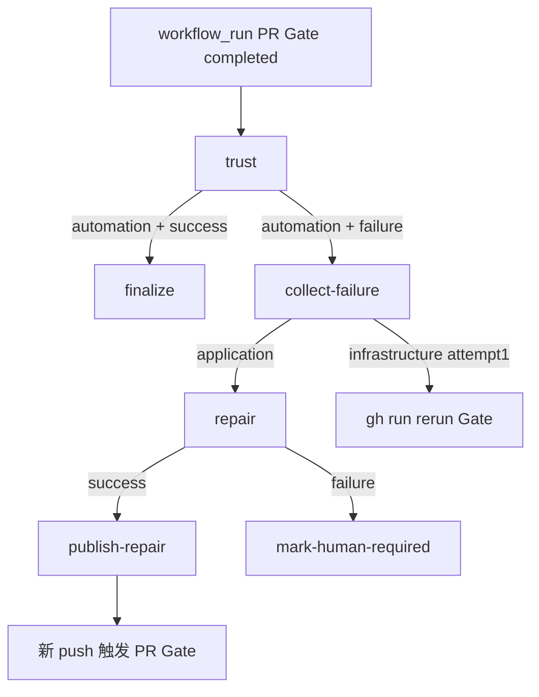

# pr-outcome.yml 说明

[pr-outcome.yml](pr-outcome.yml) 在 **PR Gate**（workflow 名 **`PR Gate`**，非文件名）**整轮结束**后触发：Gate **全绿**则 **合并 PR、promote 预览部署、跑 Production Smoke、关闭 Issue**；Gate **失败**则 **分类失败 → 自动 Repair（有上限）或重跑 Gate**，修不动则 **转人工**。

上游为 [pr-gate.yml.md](pr-gate.yml.md) 的一次完整 Run；**仅 automation PR**（`ai/issue-*` + App Bot）走合并/发布/Repair 链。**manual** `codex/*` PR 只过 Gate，Outcome **不**自动合并或发布。

**文档结构**：[一、总体](#一总体) → [二、细节（各 Job）](#二细节) → [三、答疑（术语与开关）](#三答疑)

---

## 一、总体

### 这份 Workflow 做什么

Workflow 拆成 **trust** 与两条互斥主路径：

| Gate 结论   | automation PR                                                        | manual `codex/*` PR                 |
| ----------- | -------------------------------------------------------------------- | ----------------------------------- |
| **success** | **finalize**：合并、promote、Production Smoke、关 Issue              | trust 成功即结束（**不** finalize） |
| **failure** | **collect-failure → repair → publish-repair**（或基础设施重跑 Gate） | trust 成功即结束（**不** Repair）   |

凭据按 Job 隔离：Repair 的 Codex 在 Mac 上 **workspace-write** 且无外部写凭据；**App Token**、**Vercel**、**Supabase** 仅在 `publish-repair` / `finalize` 等 Ubuntu Job 出现。



### 触发与并发

| 项目         | 说明                                                                    |
| ------------ | ----------------------------------------------------------------------- |
| **触发**     | `workflow_run`：`workflows: [PR Gate]`，`types: [completed]`            |
| **注意**     | 监听的是 workflow **`name:`** `PR Gate`，不是文件 `pr-gate.yml`         |
| **何时触发** | Gate **成功、失败或取消** 都会触发；Outcome 内再分支                    |
| **并发**     | `group: pr-outcome-${{ workflow_run.id }}`，`cancel-in-progress: false` |
| **含义**     | 一次 Gate Run 对应一次 Outcome；Repair push 后产生**新** Gate Run       |

### 为什么单独一个 Workflow

|            | **pr-gate.yml**                    | **pr-outcome.yml**                     |
| ---------- | ---------------------------------- | -------------------------------------- |
| **Codex**  | 只读 Reviewer                      | workspace-write Repair                 |
| **写操作** | 无合并/无 promote                  | 合并 PR、push Repair、Issue 评论/关闭  |
| **凭据**   | Vercel/Supabase 仅在 preview-smoke | App Token、Vercel promote、Supabase 写 |

Gate 与 Outcome 拆分，避免 Reviewer/Repair 步骤继承合并与部署密钥。

### Job 总览

| Job                     | Runner                        | 用途（一句话）                               | 何时跳过                             |
| ----------------------- | ----------------------------- | -------------------------------------------- | ------------------------------------ |
| **trust**               | `ubuntu-latest`               | 重验 PR、定 `mode`/`conclusion`、拉 Contract | 从不跳过                             |
| **collect-failure**     | `ubuntu-latest`               | 失败日志、指纹、分类；基础设施可重跑 Gate    | 非 automation 或 Gate 成功           |
| **repair**              | 自托管 macOS                  | Codex 修代码，生成 repair.patch              | 非 application 失败                  |
| **publish-repair**      | `ubuntu-latest`               | 应用 patch、push 原分支、record-run          | repair 未成功                        |
| **mark-human-required** | `ubuntu-latest`               | Repair 失败 → Issue 转人工                   | repair 成功或未跑 application Repair |
| **finalize**            | `ubuntu-latest` + Environment | 合并、promote、Production Smoke、关 Issue    | 非 automation 或 Gate 未成功         |

### Job 之间如何传参

| 从                    | 到                   | 机制                                        | 传递内容                                                                              |
| --------------------- | -------------------- | ------------------------------------------- | ------------------------------------------------------------------------------------- |
| PR Gate Run           | trust                | `github.event.workflow_run`                 | `conclusion`、`head_sha`、`pull_requests`                                             |
| trust                 | finalize / repair 链 | Job outputs                                 | `mode`、`conclusion`、`pr_number`、`issue_number`、`head_sha`、`branch`、`risk_level` |
| trust                 | 下游                 | Artifact `outcome-contract`                 | Contract（automation）                                                                |
| PR Gate preview-smoke | finalize             | Artifact `pr-{n}-deployment`（跨 run 下载） | `deployment.json`、`smoke-tracking-ids.txt`                                           |
| collect-failure       | repair               | Artifact `failure-evidence`                 | `failure.log`、`failure.json`、`classification.json`                                  |
| repair                | publish-repair       | Artifact `repair-patch`                     | `repair.patch`、`repair.json`                                                         |

| Artifact           | 产出 Job            | 保留 |
| ------------------ | ------------------- | ---- |
| `outcome-contract` | trust（automation） | 7 天 |
| `failure-evidence` | collect-failure     | 7 天 |
| `repair-patch`     | repair              | 7 天 |

---

## 二、细节

### trust

#### 用途

**不信任** `workflow_run` 附带的 PR 摘要：重新查询**唯一** PR，确认 Head SHA 与 Gate Run 一致，复用与 [pr-gate trust](pr-gate.yml.md#trust) 相同的来源规则，并读取 **`conclusion`**（Gate 成败）。

#### 执行流程（verify 步骤）

**步骤 1：唯一 PR**

```bash
# workflow_run.pull_requests 长度必须为 1
pr_number=...
pr=$(gh api "repos/${GITHUB_REPOSITORY}/pulls/${pr_number}")
```

**步骤 2：与 Gate Run 对齐**

| 检查     | 条件                                       |
| -------- | ------------------------------------------ |
| 非 Fork  | `head.repo.full_name == GITHUB_REPOSITORY` |
| SHA 一致 | `pr.head.sha == workflow_run.head_sha`     |

**步骤 3：mode 判定**（同 pr-gate）

| 条件                       | `mode`       | 后续                                      |
| -------------------------- | ------------ | ----------------------------------------- |
| `ai/issue-{n}-*` + App Bot | `automation` | `prepare-issue.mjs` → `risk_level`        |
| `codex/*` + owner          | `manual`     | `risk_level=R2`，**无** Contract Artifact |
| 其它                       | —            | `exit 1`                                  |

**步骤 4：Job outputs**

| Output                              | 含义                                               |
| ----------------------------------- | -------------------------------------------------- |
| `conclusion`                        | Gate Run 的 `success` / `failure` / `cancelled` 等 |
| `head_sha` / `branch` / `pr_number` | 当前 PR 状态                                       |
| `issue_number`                      | automation 时从分支解析                            |
| `mode` / `risk_level`               | 路径与合并策略                                     |

automation 时上传 Artifact **`outcome-contract`**（`.ai/runs/outcome`）。

#### 输入 / 输出

| 输入 | `workflow_run` 事件、GitHub API |
| 输出 | Job outputs；可选 `outcome-contract` |

---

### collect-failure

#### 用途

**仅 automation 且 Gate 非 success**：拉失败日志 → **Failure Fingerprint** → **基础设施 / 应用** 分类；基础设施且首次 attempt 时 **重跑 Gate**（不修代码）。

#### 脚本执行流程

**1. 拉失败日志**

```bash
gh run view "$RUN_ID" --log-failed > .ai/runs/outcome/failure.log
```

**2. [`failure-fingerprint.mjs`](../../scripts/ai/failure-fingerprint.mjs)**

从 stdin 读日志，规范化（去 ANSI、SHA、时间戳、路径、凭据）后 SHA256 → **`fingerprint`**；输出 JSON `{ fingerprint, summary, truncated }` → `failure.json`。

**3. [`classify-failure.mjs`](../../scripts/ai/classify-failure.mjs)**

| `kind`               | 含义                         | 典型匹配                                                            |
| -------------------- | ---------------------------- | ------------------------------------------------------------------- |
| **`infrastructure`** | Runner/网络/Actions 临时故障 | `runner lost communication`、`econnreset`、`service unavailable` 等 |
| **`application`**    | 测试/代码/审查失败           | 无基础设施模式命中                                                  |

**4. 基础设施重跑**（仅 `kind==infrastructure` 且 `run_attempt==1`）

```bash
gh run rerun "$RUN_ID" --failed
```

**不做** Codex Repair，避免用改代码掩盖 Runner 问题。

#### Job outputs

| Output         | 值                               |
| -------------- | -------------------------------- |
| `failure_kind` | `infrastructure` / `application` |
| `fingerprint`  | 稳定哈希                         |

上传 Artifact **`failure-evidence`**。

---

### repair

#### 用途

**application** 失败时，Codex **workspace-write** 在当前 PR Head 上做一次**有界**修复；生成 `repair.patch`；**不** push（由 publish-repair 推）。

#### 执行流程

**1. Enforce bounded Repair**

```bash
repair_count=$(($(git rev-list --count origin/main..HEAD) - 1))
next_attempt=$((repair_count + 1))
node scripts/ai/check-repair-budget.mjs "$next_attempt" "$FINGERPRINT"
! git log --format=%B origin/main..HEAD | grep -Fq "failure:${FINGERPRINT}"
```

[`check-repair-budget.mjs`](../../scripts/ai/check-repair-budget.mjs) 规则：

| 条件                          | 结果                                 |
| ----------------------------- | ------------------------------------ |
| `attempt` 不在 1–3            | 拒绝，`repair-attempt-out-of-range`  |
| 与 `previousFingerprint` 相同 | 拒绝，`repeated-failure-fingerprint` |
| 无有效改动且 attempt>1        | 拒绝，`no-effective-change`          |

提交历史里已有 `failure:{fingerprint}` 则**不再**调用 Codex（重复指纹停止）。

**2. Codex Repair**

```bash
node scripts/ai/render-prompt.mjs --stage repair \
  --contract .ai/runs/outcome/contract.json \
  --evidence .ai/runs/outcome/failure.json \
  > .ai/runs/outcome/repair-prompt.md
# Codex workspace-write → repair.json
```

**3. Validate Repair patch**

同 issue-delivery build：`validate-json`、`validate-diff`、`git diff` → `repair.patch`，`test -s` 非空。

#### 输入 / 输出

| 输入 | `failure_kind == application`；Artifacts `outcome-contract`、`failure-evidence` |
| 输出 | Artifact `repair-patch` |

---

### publish-repair

#### 用途

在 Ubuntu Job 应用已验证 patch，**push 到原 PR 分支**，触发**新一轮 PR Gate**；记录 Repair **Automation Run**。

#### 执行流程

```bash
git apply --index .ai/runs/outcome/repair.patch
node scripts/ai/validate-diff.mjs --base HEAD --contract .ai/runs/outcome/contract.json
git commit -m "fix: bounded AI repair

failure:${FINGERPRINT}"
git push origin "HEAD:${branch}"
node scripts/controllers/record-run.mjs \
  --issue ... --stage repair --state SUCCEEDED \
  --attempt "$attempt" --failure-fingerprint "$FINGERPRINT" ...
gh issue edit ... --add-label "ai:repairing"
```

[`record-run.mjs`](../../scripts/controllers/record-run.mjs)：`repair` + `SUCCEEDED` → Repair Status **`REPAIRING`**。

push 后 PR 的 `synchronize` 事件触发新的 **PR Gate**。

---

### mark-human-required

#### 用途

Repair Job **失败**时（预算用尽、重复指纹、策略违规等），给 Issue 打 **`ai:human-required`** 并评论，**停止**自动 Repair 循环。

#### 条件

```yaml
if: always() && mode == automation && failure_kind == application && needs.repair.result == 'failure'
```

---

### finalize

#### 用途

**automation 且 Gate success**：合并 PR → **promote** Gate 里测过的 Deployment → Production Smoke → 清理 synthetic Feedback → 记录 Production Run → **关闭 Issue**。

#### Environment

```yaml
environment: ${{ risk_level == 'R2' && 'r2-approval' || 'production' }}
```

| `risk_level` | Environment                                           |
| ------------ | ----------------------------------------------------- |
| **R0 / R1**  | `production`                                          |
| **R2**       | **`r2-approval`**（须人工批准后才继续 merge/promote） |

#### 执行流程

**1. 下载 Gate 产物**

从**同一** `workflow_run.id` 下载 `pr-{n}-deployment`（Gate preview-smoke 上传），**不**重新 vercel build。

**2. Revalidate PR head**

```bash
current=$(gh api .../pulls/{pr} --jq .head.sha)
[[ "$current" == "$head_sha" ]]
```

若 PR 在 Gate 后又有了新 commit，**不**继续写操作。

**3. Merge accepted PR**

```bash
gh pr ready ...
gh pr merge ... --squash --match-head-commit "$head_sha"
```

**4. Promote the exact accepted deployment**

```bash
deployment_url=$(node -p 'require("./.ai/runs/outcome/deployment.json").deploymentUrl')
pnpm exec vercel promote "$deployment_url" --yes
pnpm test:smoke -- --base-url="$PRODUCTION_URL"
```

| 结果                      | 行为                                                                                                                 |
| ------------------------- | -------------------------------------------------------------------------------------------------------------------- |
| **Production Smoke 失败** | `vercel rollback`；`cleanup-smoke.mjs`；`record-run` `HUMAN_REQUIRED`；Issue **`ai:human-required`**；**不关** Issue |
| **成功**                  | `cleanup-smoke.mjs`；`record-run` `production` `SUCCEEDED`（Repair Status **`RELEASED`**）                           |

**5. 关闭 Issue**

```bash
node scripts/controllers/final-comment.mjs ... > final-comment.md
gh issue comment ... --body-file final-comment.md
gh issue edit ... --add-label ai:done --remove-label ai:building ...
gh issue close ... --reason completed
```

[`final-comment.mjs`](../../scripts/controllers/final-comment.mjs) 汇总 PR、Commit、Preview/Production URL、各 **Acceptance Criterion** 与 validator。

[`cleanup-smoke.mjs`](../../scripts/controllers/cleanup-smoke.mjs) 按 `smoke-tracking-ids.txt` 删除 Smoke 写入的 synthetic Feedback。

#### 输入 / 输出

| 输入 | Gate success；Artifacts `outcome-contract`、`pr-{n}-deployment` |
| Secrets | App Token、Vercel、Supabase、`PRODUCTION_URL` |
| 输出 | 合并后的 `main`、生产域名验收、Issue 关闭 |

---

## 三、答疑

本节集中回答：**workflow_run 触发**、**mode 与双路径**、**Repair 边界**、**promote 策略**。各 Job 逐步操作见 [二、细节](#二细节)。

### workflow_run 为什么监听 PR Gate

| 项目              | 说明                                                              |
| ----------------- | ----------------------------------------------------------------- |
| **不是 PR 事件**  | Outcome 在 **整轮 Gate 结束** 后统一决策，而非每个 check 单独触发 |
| **workflow 名称** | 必须是 `workflows: [PR Gate]`（yml 顶部 `name: PR Gate`）         |
| **成功也触发**    | 需要 finalize；**失败也触发** — 需要 collect-failure / Repair     |
| **取消也触发**    | 会产生 Outcome Run，但 trust 后多数 Job 跳过                      |

### mode 与 Outcome 双路径

与 [pr-gate § mode](pr-gate.yml.md#mode-逻辑) 一致；Outcome **行为差异**：

| `mode`           | Gate **success**            | Gate **failure**                         |
| ---------------- | --------------------------- | ---------------------------------------- |
| **`automation`** | **finalize**（合并+发布）   | **collect-failure** → Repair 或重跑 Gate |
| **`manual`**     | trust 成功，**无** finalize | trust 成功，**无** Repair                |

**manual** `codex/*` PR 设计为：人自己合并发布；Outcome **不**替其自动 squash merge 或 promote。

### Failure Fingerprint 是什么

**Failure Fingerprint** 是对 Gate 失败日志规范化后的 **SHA256**，用于：

1. 写入 Repair commit message（`failure:{fingerprint}`）
2. 检测**同一根因**重复失败 → 停止 Repair 循环
3. 传给 `record-run.mjs` 的 `--failure-fingerprint`

生成脚本：[`failure-fingerprint.mjs`](../../scripts/ai/failure-fingerprint.mjs)。

### Repair 边界（三轮与停止条件）

与 [`.ai/policy.yaml`](../../.ai/policy.yaml) `max_repair_attempts: 3` 及 [AGENTS.md](../../AGENTS.md) 一致：

| 停止原因                         | 含义                           |
| -------------------------------- | ------------------------------ |
| **repair-attempt-out-of-range**  | 已有 3 次 Repair 尝试          |
| **repeated-failure-fingerprint** | 同一指纹已在 commit 历史中出现 |
| **no-effective-change**          | 上一轮 Repair 无有效 diff      |
| **validate-diff / policy**       | patch 越界或风险上调           |
| **mark-human-required**          | repair Job 失败后的显式转人工  |

基础设施失败：**不**进 Repair，首次 attempt 时 **`gh run rerun`** 重跑 Gate。

### promote 为什么不重新 build

Gate **preview-smoke** 已用 production 配置构建并 Smoke 测过 staged URL。finalize 执行：

```text
vercel promote <Gate 的 deploymentUrl>  →  Production Smoke  →  成功则 RELEASED
```

避免「Gate 测 A、上线 B」不一致。详见 [pr-gate § staged deployment](pr-gate.yml.md#staged-deployment-是什么)。

### conclusion 与下游 Job

| `trust.outputs.conclusion` | 主要下游                                      |
| -------------------------- | --------------------------------------------- |
| **`success`**              | **finalize**（仅 automation）                 |
| **非 success**             | **collect-failure**（仅 automation）          |
| **`cancelled`** 等         | collect-failure 可能仍跑；Repair 链视分类而定 |

### 与 Issue / Repair Status 的终态

| 阶段                  | record-run stage                | 用户可见 Repair Status（成功时） |
| --------------------- | ------------------------------- | -------------------------------- |
| Repair push           | `repair`                        | `REPAIRING`                      |
| Production 成功       | `production`                    | **`RELEASED`**                   |
| Production Smoke 失败 | `production` + `HUMAN_REQUIRED` | **`HUMAN_REQUIRED`**             |

Issue 仅在 Production Smoke **成功**后 **`ai:done` + close**。

### 相关文件

| 文件                                                                     | 说明                    |
| ------------------------------------------------------------------------ | ----------------------- |
| [README.md](README.md)                                                   | 全仓库 Workflow 总览    |
| [pr-gate.yml.md](pr-gate.yml.md)                                         | 上游 Gate               |
| [issue-delivery.yml.md](issue-delivery.yml.md)                           | 更上游 Delivery         |
| [scripts/README.md](../../scripts/README.md)                             | 脚本触发矩阵            |
| [prepare-issue.mjs](../../scripts/controllers/prepare-issue.mjs)         | trust 拉 Contract       |
| [record-run.mjs](../../scripts/controllers/record-run.mjs)               | repair / production Run |
| [failure-fingerprint.mjs](../../scripts/ai/failure-fingerprint.mjs)      | 失败指纹                |
| [classify-failure.mjs](../../scripts/ai/classify-failure.mjs)            | 基础设施 vs 应用        |
| [check-repair-budget.mjs](../../scripts/ai/check-repair-budget.mjs)      | Repair 次数上限         |
| [final-comment.mjs](../../scripts/controllers/final-comment.mjs)         | 关 Issue 前验收评论     |
| [cleanup-smoke.mjs](../../scripts/controllers/cleanup-smoke.mjs)         | 清理 synthetic Feedback |
| [docs/codex-manual-operations.md](../../docs/codex-manual-operations.md) | Outcome 运维说明        |
