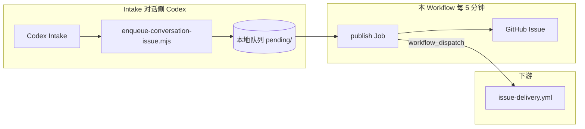
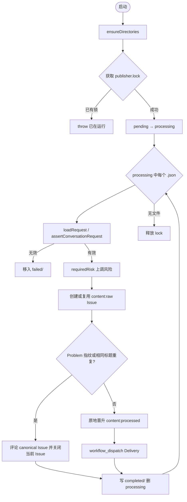

# publish-conversation-issues.yml 说明

[publish-conversation-issues.yml](publish-conversation-issues.yml) 是 **Codex 对话入口**的兜底发布阶段：读取 **Mac 本地队列**中未能用本机 `gh` 直接发布的 `codex-conversation` Issue Contract，创建 `content:raw` Issue。非重复时在同一个 Issue 上改为 `content:processed` 并显式 dispatch [issue-delivery.yml](issue-delivery.yml)；重复时评论 canonical Issue 并关闭当前 Issue。

网站 Feedback 入口见 [feedback-intake.yml.md](feedback-intake.yml.md)；Delivery 见 [issue-delivery.yml.md](issue-delivery.yml.md)。

**文档结构**：[一、总体](#一总体) → [二、细节（publish Job）](#二细节) → [三、答疑（术语与开关）](#三答疑)

---

## 一、总体

### 这份 Workflow 做什么

整条 **对话入口** 拆成两段，凭据隔离：

| 阶段                    | 谁跑                                            | 做什么                                                                                                                                                                    | 凭据                               |
| ----------------------- | ----------------------------------------------- | ------------------------------------------------------------------------------------------------------------------------------------------------------------------------- | ---------------------------------- |
| **Intake + 发布/入队**  | Codex（`read-only` → 确认后 `workspace-write`） | 生成 Issue Contract → 先尝试本机 `gh` 直接发布；无权限时由 [`enqueue-conversation-issue.mjs`](../../scripts/controllers/enqueue-conversation-issue.mjs) 写本地 `pending/` | 本机 `gh` 登录上下文（仅直接路径） |
| **发布**（本 Workflow） | 自托管 Mac + App Token                          | [`publish-conversation-issues.mjs`](../../scripts/controllers/publish-conversation-issues.mjs) 消费队列 → 创建 Issue                                                      | **GH_TOKEN**（GitHub App）         |



本 Workflow **只有 1 个 Job**（`publish`），**不运行 Codex**；只做确定性控制器 + GitHub 写操作。

### 触发与并发

| 项目       | 说明                                                                                           |
| ---------- | ---------------------------------------------------------------------------------------------- |
| **定时**   | `cron: "*/5 * * * *"`（每 5 分钟）                                                             |
| **手动**   | `workflow_dispatch`                                                                            |
| **Runner** | **`[self-hosted, macOS, ARM64, signalpatch]`**（队列在本地磁盘）                               |
| **并发**   | `group: conversation-issue-publisher`，`cancel-in-progress: false`                             |
| **含义**   | 同一队列目录同一时刻只应有一个发布器；Workflow 级 concurrency + 脚本内 `publisher.lock` 双保险 |

### 与 Feedback 入口对照

|                            | **Feedback**（[feedback-intake.yml.md](feedback-intake.yml.md)） | **Codex 对话**（本文件）                                         |
| -------------------------- | ---------------------------------------------------------------- | ---------------------------------------------------------------- |
| **需求来源**               | 网站 Supabase Feedback                                           | Codex 对话 + **显式用户确认**                                    |
| **Contract `source.kind`** | `feedback`                                                       | **`codex-conversation`**                                         |
| **Intake**                 | Workflow 内 Codex qualify                                        | 对话侧 Codex（Skill `$issue-intake`）                            |
| **创建 Issue**             | `intake-publish.mjs`（云 Runner）                                | Codex 有 `gh` 权限时直接发布；否则 **本 Workflow**（Mac Runner） |
| **启动 Delivery**          | publish 里 **`workflow_dispatch`**                               | publish 里 **`workflow_dispatch`**                               |

两条入口最终 Issue 正文格式相同（`signalpatch-contract` JSON 块），下游 Gate / Outcome **只认 Contract**。

### Job 总览

| Job         | Runner       | 用途（一句话）                          | 何时跳过                               |
| ----------- | ------------ | --------------------------------------- | -------------------------------------- |
| **publish** | 自托管 macOS | 消费本地队列 → 校验 → 创建 GitHub Issue | 从不跳过（无待处理文件时脚本空转成功） |

### 本地队列目录结构

默认路径：`~/.signalpatch/conversation-issue-queue`（可用 `SIGNALPATCH_CONVERSATION_QUEUE` 覆盖）。

| 子目录 / 文件        | 含义                                     |
| -------------------- | ---------------------------------------- |
| **`pending/`**       | Codex enqueue 写入的待发布 JSON          |
| **`processing/`**    | 发布器领取后正在处理                     |
| **`completed/`**     | 成功回执（含 `issueNumber`、`issueUrl`） |
| **`failed/`**        | Schema 无效或被篡改的请求                |
| **`publisher.lock`** | 进程级排他锁（防止并发发布）             |

---

## 二、细节

### publish

#### 用途

在 **自托管 Mac** 上安装依赖，注入 **GitHub App Token**，运行 [`publish-conversation-issues.mjs`](../../scripts/controllers/publish-conversation-issues.mjs)，批量处理 `processing/` 中的对话请求。

#### Workflow 步骤

| 步骤                                 | 说明                                                    |
| ------------------------------------ | ------------------------------------------------------- |
| `actions/checkout`                   | 拉仓库（读脚本与 Schema）；`persist-credentials: false` |
| `pnpm install --frozen-lockfile`     | 安装依赖（Ajv、policy 等）                              |
| `create-github-app-token`            | 短时 **App Installation Token** → `GH_TOKEN`            |
| `Publish queued conversation Issues` | 运行发布控制器                                          |

#### 环境变量

| 变量                             | 来源                | 用途                 |
| -------------------------------- | ------------------- | -------------------- |
| `GH_TOKEN`                       | App Token 步骤      | 创建 Issue、搜索防重 |
| `GITHUB_REPOSITORY`              | `github.repository` | 目标仓库             |
| `SIGNALPATCH_CONVERSATION_QUEUE` | 可选；Runner 环境   | 覆盖默认队列路径     |

Workflow 发布路径中的 `GH_TOKEN` 和 `GITHUB_REPOSITORY` 仍只注入发布 Job；直接路径使用本机 `gh` 的登录上下文，不读取这两个环境变量。

---

### 上游：enqueue-conversation-issue.mjs

Codex 在 Intake 确认 Contract 后执行（**唯一**授权 Codex 直接调用的 controller）：

```bash
node scripts/controllers/enqueue-conversation-issue.mjs .ai/runs/conversation/contract.json
```

[`enqueue-conversation-issue.mjs`](../../scripts/controllers/enqueue-conversation-issue.mjs) 流程：

1. 读取 Contract JSON。
2. 调用 [`newConversationRequest`](../../scripts/controllers/lib/conversation-issue.mjs) → 生成 `requestId`（UUID）、`submittedAt`、校验 Contract。
3. 用 `gh repo view` 检查仓库 `viewerPermission`；权限为 `WRITE`、`MAINTAIN` 或 `ADMIN` 时，使用本机 `gh auth token` 复用统一发布生命周期并直接启动 Delivery。`READ`/`TRIAGE` 仅具备部分 Issue 能力，统一走队列兜底。
4. `gh` 不可用、未登录或没有 Issue 写权限时，原子写入 `pending/{requestId}.json`（先 `.tmp` 再 `rename`）。

输出示例：`{ "requestId": "...", "state": "QUEUED" }`。

**不**调用任何外部 API；**不**读 GitHub / Supabase 凭据。

---

### 发布脚本：publish-conversation-issues.mjs

#### 总体流程



#### 1. 目录与锁

```javascript
// 默认 ~/.signalpatch/conversation-issue-queue
await ensureDirectories(); // pending / processing / completed / failed
lock = await open(lockPath, "wx"); // 排他创建 publisher.lock
await movePendingRequests(); // pending/*.json → processing/
```

若锁已存在 → `Conversation Issue publisher is already running`（与 Workflow `concurrency` 配合，避免双发布）。

#### 2. 加载与校验 Request

[`assertConversationRequest`](../../scripts/controllers/lib/conversation-issue.mjs) 重新校验（**不信任**队列文件）：

| 检查项          | 要求                                      |
| --------------- | ----------------------------------------- |
| `version`       | 必须为 `1`                                |
| `requestId`     | 合法 UUID                                 |
| `submittedAt`   | 合法 ISO 时间戳                           |
| 内层 `contract` | 通过 Issue Contract Schema + 对话来源规则 |

**对话来源额外规则**（`assertConversationContract`）：

| 字段                | 要求                                                    |
| ------------------- | ------------------------------------------------------- |
| `source.kind`       | **`codex-conversation`**                                |
| `source.references` | **恰好一条**：`conversation:explicit-user-confirmation` |

校验失败 → 文件移入 **`failed/`**，stderr 记录原因，**不阻塞**同批其它合法请求。

#### 3. 风险上调（只升不降）

```javascript
request.contract.riskLevel = requiredRisk(
  policy,
  request.contract.allowedPaths,
  request.contract.riskLevel,
);
```

与 Feedback [`intake-publish.mjs`](../../scripts/controllers/intake-publish.mjs) 相同：按 [`.ai/policy.yaml`](../../.ai/policy.yaml) 路径规则，模型提议的风险可被 **controller 上调**，不可下调。

#### 4. 请求幂等与 Problem 去重

发布前按请求标记查找已创建的 Issue：

```text
<!-- signalpatch-conversation-request:{requestId} -->
```

若 GitHub 上已有含该标记的 Issue，则复用该 Issue，避免同一队列请求重复创建。

创建 raw Issue 后，Controller 使用 Problem 指纹查找 processed Issue；旧 Issue 会从正文 Contract 重新计算指纹。命中时评论 canonical Issue、添加 `duplicate` 并关闭当前 Issue；未命中时原地晋升。

#### 5. 创建 Issue

| 字段              | 值                                                                                                                                                         |
| ----------------- | ---------------------------------------------------------------------------------------------------------------------------------------------------------- |
| **title**         | `[SignalPatch] {problemSummary}`                                                                                                                           |
| **body**          | [`issueBodyForRequest`](../../scripts/controllers/lib/conversation-issue.mjs)：Problem / Actual / Expected + `signalpatch-contract` JSON 块 + request 标记 |
| **初始 labels**   | `content:raw`                                                                                                                                              |
| **晋升后 labels** | `content:processed`、`ai:ready`、`risk:{r0                                                                                                                 | r1  | r2  | r3}` |

正文**不含**原始对话或用户标识；末尾注明仅含脱敏证据。

#### 6. 完成回执

原子写入 `completed/{requestId}.json`（含 `issueNumber`、`issueUrl`、`duplicateOf`），删除 `processing/` 中对应文件。

stdout 每成功一条输出一行 JSON：`{ requestId, issueNumber, issueUrl, duplicateOf }`。

#### 输入 / 输出小结

| 输入 | 本地队列 `processing/*.json`；`GH_TOKEN`；`GITHUB_REPOSITORY` |
| 输出 | GitHub Issue；`completed/` 回执；stdout 日志 |
| 失败隔离 | 非法文件 → `failed/`；GitHub API 错误 → 该 Run 失败，未处理文件留 `processing/` 待下次 cron |

---

## 三、答疑

本节集中回答：**为何 Mac Runner**、**enqueue 与 publish 拆分**、**与 Delivery 的衔接**、**队列运维**。逐步操作见 [二、细节](#二细节)。

### 为什么必须跑在自托管 Mac 上

| 原因                        | 说明                                                                             |
| --------------------------- | -------------------------------------------------------------------------------- |
| **队列在本地磁盘**          | `enqueue` 由 Codex 写在 Mac 的 `~/.signalpatch/...`；GitHub 云 Runner **看不到** |
| **与 Codex 同机**           | Intake 对话通常在开发者/Runner Mac 上；入队与消费共用目录                        |
| **labels 含 `signalpatch`** | Workflow `runs-on` 要求带 `signalpatch` 标签的自托管 Runner                      |

生产环境建议：队列放在 **专用共享组目录**，Codex 身份仅写 `pending/`，发布身份拥有完整队列与 `GH_TOKEN`。

### 为什么仍保留队列发布路径

队列是 `gh` 直接路径不可用时的兜底（见 [AGENTS.md](../../AGENTS.md)）：

1. 本机 `gh` 未登录或只有读取权限时，Codex 不能直接发布。
2. 队列把 Contract 交给独立发布身份，兜底路径不依赖 Codex 的 GitHub App Token。
3. 发布前 **重新校验** Schema、显式确认引用、**上调**风险，防止被篡改的队列文件直接进仓库。

Codex **唯一**例外：`enqueue-conversation-issue.mjs` 可使用本机 `gh` 登录上下文直接创建并推进 Issue；没有权限时只写本地文件，后续由本 Workflow 使用 GitHub App Token 发布。

### conversation:explicit-user-confirmation 是什么

对话来源在创建 Issue 前，用户须在 Codex 对话中 **明确确认**「可以按此 Contract 开 Issue」。Contract 里 `source.references` **只能**包含这一条固定字符串，**不能**嵌入整段对话或用户 ID。

规则来源：[`issue-intake` Skill](../../.agents/skills/issue-intake/SKILL.md) § Source rules。

### 创建 Issue 后谁启动 Delivery

| 入口                | Delivery 触发                                                                                  |
| ------------------- | ---------------------------------------------------------------------------------------------- |
| **本 Workflow**     | processed 后 **`workflow_dispatch`** → [issue-delivery prepare](issue-delivery.yml.md#prepare) |
| **Feedback Intake** | processed 后 **`workflow_dispatch`** → [issue-delivery prepare](issue-delivery.yml.md#prepare) |

两个入口不再依赖 `issues.opened`。

### Issue 内容阶段与自动化标签

| 标签                          | 含义                                          |
| ----------------------------- | --------------------------------------------- |
| **`content:raw`**             | 原始 Intake Issue，尚未晋升；重复时保留此标签 |
| **`content:processed`**       | 已生成有效 Issue Contract，可进入 Delivery    |
| **`ai:ready`**                | Contract 已 SPEC_READY，可进入 Delivery       |
| **`risk:r0`** … **`risk:r3`** | 发布时按（可能上调后的）`riskLevel` 打标      |

Delivery / Gate / Outcome 仍从正文 JSON 读 **`riskLevel`**，标签便于人眼筛选。

### 本地手动发布

开发与排障时可不用等 cron（需 App Token）：

```bash
export GH_TOKEN=...   # GitHub App Installation Token
export GITHUB_REPOSITORY=owner/repo
node scripts/controllers/publish-conversation-issues.mjs
```

见 [README.md § Codex 对话 Issue 上报](../../README.md#codex-对话-issue-上报)。

### 队列积压或 failed 文件怎么办

| 现象                      | 建议                                                                                                                                                |
| ------------------------- | --------------------------------------------------------------------------------------------------------------------------------------------------- |
| **`pending/` 长期不减少** | 检查 Workflow 是否在 Mac Runner 上成功；cron 是否启用                                                                                               |
| **`processing/` 有残留**  | 上次 Run 中途崩溃；修复后重跑，脚本会继续处理                                                                                                       |
| **`failed/` 有文件**      | Contract 不符合 Schema 或缺少显式确认；打开 JSON 对照 [issue-contract.schema.json](../../.ai/schemas/issue-contract.schema.json) 修正后重新 enqueue |
| **重复 Issue**            | 当前 Issue 会评论 canonical Issue、添加 `duplicate` 并关闭；`completed/` 回执记录 `duplicateOf`                                                     |

### 与 feedback-intake 的 Contract 是否相同

**Schema 相同**（`.ai/schemas/issue-contract.schema.json`），**来源规则不同**：

| `source.kind`        | 确认要求           | references 示例                           |
| -------------------- | ------------------ | ----------------------------------------- |
| `feedback`           | 不要求原提交者确认 | `feedback:<tracking_id>`                  |
| `codex-conversation` | 必须显式确认       | `conversation:explicit-user-confirmation` |

下游 Delivery 只读 `signalpatch-contract` 块，不区分入口。

### 相关文件

| 文件                                                                                         | 说明                    |
| -------------------------------------------------------------------------------------------- | ----------------------- |
| [README.md](README.md)                                                                       | 全仓库 Workflow 总览    |
| [feedback-intake.yml.md](feedback-intake.yml.md)                                             | Feedback 入口           |
| [issue-delivery.yml.md](issue-delivery.yml.md)                                               | Issue 打开后的 Delivery |
| [scripts/README.md](../../scripts/README.md)                                                 | 脚本触发矩阵            |
| [enqueue-conversation-issue.mjs](../../scripts/controllers/enqueue-conversation-issue.mjs)   | Codex 入队              |
| [publish-conversation-issues.mjs](../../scripts/controllers/publish-conversation-issues.mjs) | 本 Workflow 控制器      |
| [lib/conversation-issue.mjs](../../scripts/controllers/lib/conversation-issue.mjs)           | Schema / Body / 标签    |
| [AGENTS.md](../../AGENTS.md)                                                                 | Codex 硬约束            |
| [.agents/skills/issue-intake/SKILL.md](../../.agents/skills/issue-intake/SKILL.md)           | Intake 语义规则         |
