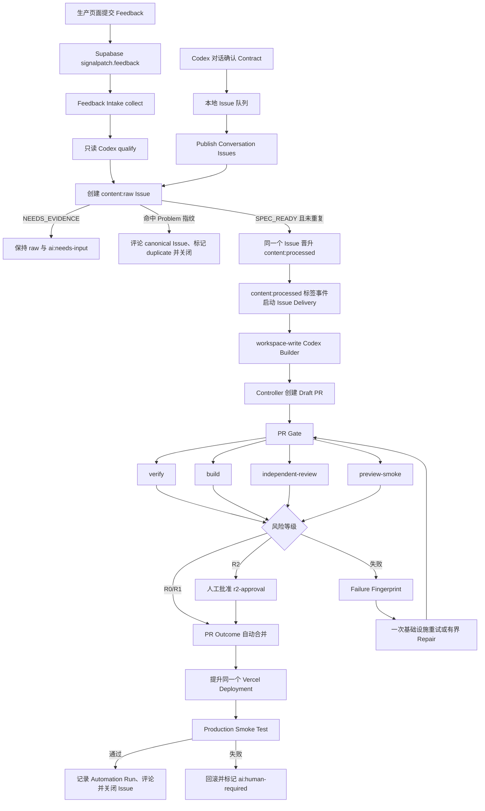
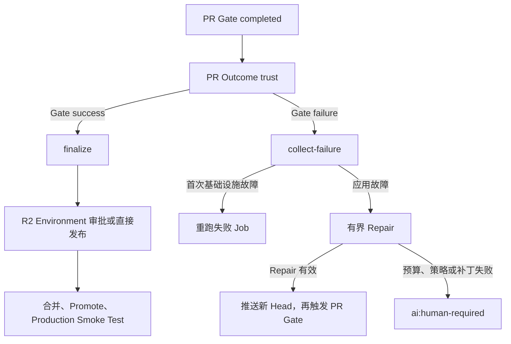

# SignalPatch Codex 自动化与人工复现手册

## 文档目的

本文记录 SignalPatch 从首次构建、外部服务配置、真实 Feedback 验证，到自动修复和生产验收的实际操作过程。内容适合以下用途：

- 理解 Codex、确定性 Controller、GitHub Actions 和人工审批之间的职责边界。
- 在相同仓库中再次手动触发完整流程。
- 根据 Issue、PR、Workflow Run、Preview 和 Production 证据定位失败阶段。
- 在不向 Codex 暴露凭据的前提下恢复失败任务。

目标不是让 Codex 直接操作所有系统，而是说明以下三类职责如何配合：

1. Codex：分析 Feedback、生成结构化结果、修改受限工作区或执行只读审查。
2. 确定性 Controller：读取外部数据、校验结果、创建 Issue、推送分支、合并、发布和记录证据。
3. 人工操作：提供 R2 审批，以及在策略要求时补充输入或处理 `ai:human-required`。

仓库根目录为 `/Users/liuzhuang/project/signalpatch`。本文中的命令默认从该目录执行。

本文的现行流程说明已更新到 2026 年 7 月 14 日。历史 Run 表仍保留 2026 年 7 月 13 日当时的配置和故障证据，并明确标注为历史记录。当前 `PR Gate` 只响应 `opened`、`synchronize` 和 `reopened`，不会因 Draft PR 转为 Ready 再触发一轮 Gate。

## 阅读顺序

| 目的                            | 建议章节   |
| ------------------------------- | ---------- |
| 快速了解系统                    | 第一、二节 |
| 从空环境重新配置                | 第三节     |
| 手动重跑真实 Feedback           | 第四至七节 |
| 处理失败                        | 第八节     |
| 核对是否真正完成                | 第九、十节 |
| 查看 Actions 运行记录           | 第十一节   |
| 理解 `gh`、GitHub App 和 Runner | 第十二节   |
| 对照本次真实实例                | 第十三节   |

## 本次 Codex 实际执行顺序

本次操作不是一次性生成全部代码，而是按证据逐段推进。后续 Issue 是首次真实运行发现的必要修复，不是无关重构。

### 阶段 1：读取约束并确认实施边界

先读取 `HANDOFF.md`、`CONTEXT.md`、`AGENTS.md` 和 `docs/`，确认以下决定：

- Supabase 使用独立的 `signalpatch` Schema，不把业务表放入 `public`。
- 暂不创建 `signalpatch-runner` 系统用户，先由当前 macOS 用户运行自托管 Runner。
- Intake 和 Reviewer 使用 `read-only`；Builder 和 Repair 使用 `workspace-write`。
- Codex 不接收 GitHub、Supabase Service Role 或 Vercel 写凭据。
- R2 必须在 `r2-approval` Environment 中由人工批准。

只读检查命令：

```bash
sed -n '1,260p' CONTEXT.md
rg --files docs | sort
rg --files docs/adr | sort
```

### 阶段 2：建立本地基线

```bash
pnpm install --frozen-lockfile
pnpm verify
pnpm build
```

这一步用于区分「仓库原本失败」和「后续修改引入失败」。任何后续修复都必须重新通过相同命令。

### 阶段 3：配置 Supabase 独立 Schema

完成 Supabase 登录、项目链接和 Migration 后，核对本地与远端 Migration 版本：

```bash
pnpm exec supabase login
pnpm exec supabase link --project-ref <project-ref>
pnpm exec supabase db push
pnpm exec supabase migration list
```

本次最终检查结果为：3 个 Migration 版本一致；匿名 RPC 返回 HTTP `200`；匿名直接读取 `signalpatch.feedback` 返回 HTTP `401`。

### 阶段 4：配置 Vercel 和稳定生产域名

先配置公开 Supabase 环境变量，再创建 staged deployment。`PRODUCTION_URL` 使用稳定自定义域名，不能使用自动变化的项目 Alias。

```bash
pnpm exec vercel pull --yes --environment=production
pnpm exec vercel build --prod
pnpm exec vercel deploy --prebuilt --prod --yes --skip-domain
```

Preview Smoke Test 通过后，发布阶段只提升同一个 Deployment：

```bash
pnpm exec vercel promote <accepted-deployment-url>
```

### 阶段 5：配置 GitHub 自动化边界

完成 GitHub App、Repository Variables、Repository Secrets、Labels、`production` 与 `r2-approval` Environment 和自托管 Runner 配置。当前仓库不配置 `main` Ruleset 或 Branch Protection，也没有 Required Checks。

PR Gate 仍执行以下 4 项自动化验收：

```text
verify
build
independent-review
preview-smoke
```

`trust` 是 PR Gate 的安全前置 Job，负责在读取敏感权限前确认 PR 来源、作者、分支和 Head SHA。上述 4 项结果只驱动 SignalPatch 自动化，不限制其他方式写入 `main`。

### 阶段 6：完成 bootstrap Issue

首次自动化使用 Issue #1 和 PR #2 验证基础设施。真实运行暴露了 Schema、依赖安装、Prompt 路径、Structured Outputs、PR Outcome 关联方式和 R2 Reviewer 边界问题。每个问题都先形成可验证证据，再修改允许路径内的文件。

一次性 bootstrap 期间使用了本地忽略目录 `.ai/runs/bootstrap/` 下的确定性 Controller。该 Controller 负责创建 Issue、发布补丁、触发重跑和关闭 Issue；Codex 只负责生成或检查本地文件。日常操作不依赖这个临时 Controller，应使用仓库内 5 个 GitHub Workflow。

### 阶段 7：用真实 Feedback 验证日常流程

在生产页面提交 Tracking ID 首尾空格问题，保存返回的 Tracking ID。`Feedback Intake` 形成 Issue #5，`Issue Delivery` 创建 PR #6，PR Gate 和 Production Smoke Test 验证原始 ID、带首尾空格的 ID 和未知 ID。

这一阶段证明应用入口、Supabase、Intake、Issue Contract、Builder、PR、Preview 和 Production 可以按正常流程工作。

### 阶段 8：修复自动化自身的可靠性问题

真实运行又发现 3 个自动化缺陷，并形成 Issue #7：

1. `git diff` 看不到未跟踪文件，导致新测试未进入补丁。
2. Draft PR 转为 Ready 会重复触发 PR Gate，并与合并发生竞态。
3. Reviewer 在 Preview 和 Production 尚未执行时错误要求这些证据。

修复后的行为：Builder 和 Repair 在生成 Diff 前执行 `git add --intent-to-add -- .`；PR Gate 不再监听 `ready_for_review`；Reviewer 只评估当前阶段已经存在的证据。

### 阶段 9：人工批准 R2

R2 的 `PR Outcome` 到达 `r2-approval` 后，在 GitHub 页面执行：

1. 打开等待中的 `PR Outcome` Run。
2. 点击 `Review deployments`。
3. 选择 `r2-approval`。
4. 点击 `Approve and deploy`。

Codex 可以打开审批页并继续监控，但不能代替审批人点击最终批准。

### 阶段 10：完成生产验收和清理

批准后，`PR Outcome` 合并已接受的 Head，提升 Preview Smoke Test 验收过的同一 Deployment，运行 Production Smoke Test，清理 `synthetic=true` 数据，写入最终 Issue 评论并关闭 Issue。

最后执行：

```bash
git fetch origin main
git merge --ff-only origin/main
pnpm verify
pnpm build
curl -sS -i https://signalpatch.meact.dev/health
```

临时 worktree、Smoke Test 临时文件和一次性 GitHub App Private Key 在所有外部写操作完成后删除。

## 一、先理解整体流程



六个 Workflow 的职责固定如下：

| Workflow                      | 触发方式                                 | 主要职责                                                                |
| ----------------------------- | ---------------------------------------- | ----------------------------------------------------------------------- |
| `Feedback Intake`             | 每 5 分钟或 `workflow_dispatch`          | 领取 Feedback，创建 raw Issue，资格通过后原地晋升为 processed Issue     |
| `Publish Conversation Issues` | 每 5 分钟或 `workflow_dispatch`          | 发布 Codex 本地队列，创建与 Feedback 入口相同生命周期的 Issue           |
| `Manual Issue Intake`         | Issue/用户评论事件或 `workflow_dispatch` | 读取手工 raw Issue；App Bot 评论保存 Contract，原地晋升 processed Issue |
| `Issue Delivery`              | `issues.labeled` 或补跑 dispatch         | 只读取 processed Issue Contract，运行 Builder 或 R3 分析，创建 Draft PR |
| `PR Gate`                     | PR opened、synchronize、reopened         | 验证、构建、独立审查、Preview Smoke Test                                |
| `PR Outcome`                  | `PR Gate` 完成后经 `workflow_run`        | 失败分类与有界 Repair，或合并、发布、Production Smoke Test              |

### 1. 术语和状态

- Feedback：应用收到的匿名原始反馈。
- Feedback Context：由应用和 Evidence Agent 提供的功能、路由、Commit、错误码和时间等脱敏上下文。
- Problem：经过归类的可验证问题。
- Issue Contract：供 Delivery 使用的结构化问题契约；只有 `SPEC_READY` 才能触发代码修改。
- Repair Status：对外公开的最小状态，例如 `RECEIVED`、`QUALIFYING`、`BUILDING`、`VERIFYING`、`REPAIRING`、`RELEASED` 和 `HUMAN_REQUIRED`。
- Automation Run：每个阶段的可审计运行记录。
- Tracking ID：反馈提交后返回的不可预测 UUID。
- `SPEC_READY`：问题已有实际行为、预期行为、复现方式、验证器和允许修改范围。

### 2. 风险边界

| 风险 | 含义                                                | 合并方式                                 |
| ---- | --------------------------------------------------- | ---------------------------------------- |
| `R0` | 文档、文案、非行为性测试                            | 自动合并和发布                           |
| `R1` | 局部应用逻辑或兼容性缺陷                            | PR Gate 验收通过后自动合并和发布         |
| `R2` | Workflow、Skill、Prompt、策略、迁移、依赖或公开 API | 可自动创建 PR 和 Preview；合并前人工批准 |
| `R3` | Secret、IAM、数据删除或破坏性迁移                   | 只分析，不自动修改                       |

风险等级由 Intake 提出，`scripts/ai/` 和 `.ai/policy.yaml` 会根据实际修改路径向上修正。Codex 不能降低风险等级。

## 二、职责和凭据边界

### 1. Codex 能做什么

| 阶段     | Sandbox           | 可以接收                                           | 不可以接收                                        |
| -------- | ----------------- | -------------------------------------------------- | ------------------------------------------------- |
| Intake   | `read-only`       | 脱敏 Feedback Context、Issue Contract Schema       | GitHub Token、Supabase Service Role、Vercel Token |
| Builder  | `workspace-write` | Issue Contract、相关文件、测试要求                 | 外部写凭据、提交、推送、评论、发布权限            |
| Reviewer | `read-only`       | 当前 PR Diff、Contract、失败摘要                   | 工作区写入和任何外部写权限                        |
| Repair   | `workspace-write` | 当前 Diff、Failure Fingerprint、允许路径和尝试次数 | 外部写凭据、合并和发布权限                        |

Controller 和 Deployment Job 才能使用外部写权限。Feedback、Issue Body、日志、Diff 和生成文件都按不可信输入处理。

### 2. 本次实际使用的 Runner 选择

本次操作暂不创建 `signalpatch-runner` 系统用户，使用当前 macOS 用户运行自托管 Runner。这样可以继续使用当前用户已经登录的 Codex CLI，但不具备独立系统用户隔离；后续需要更强隔离时，再按照 `docs/setup.md` 迁移到专用用户。

无论使用哪个系统用户，Codex 进程都不能继承以下变量：

```text
GH_TOKEN
GITHUB_TOKEN
SIGNALPATCH_APP_PRIVATE_KEY
SUPABASE_SERVICE_ROLE_KEY
VERCEL_TOKEN
```

## 三、首次配置和本地门禁

### 1. 阅读材料

开始任何行为变更前，先阅读：

```bash
sed -n '1,260p' CONTEXT.md
rg --files docs/adr | sort
```

至少需要核对 `docs/adr/0008`、`0009`、`0011`、`0012`、`0013`、`0014`、`0019` 和 `0020`。`HANDOFF.md` 用于确认当前阶段和未完成事项，不替代 ADR。

### 2. 安装依赖并执行本地门禁

```bash
pnpm install --frozen-lockfile
pnpm verify
pnpm build
```

`pnpm verify` 固定包含 Prettier Check、ESLint、TypeScript Type Check、Vitest、SQL 校验和 Workflow 校验。失败时先读取真实日志，不要通过放宽测试或策略解决。仓库没有 Required Checks，但自动化仍以这条命令的结果作为内部验收证据。

### 3. Supabase：创建独立 `signalpatch` Schema

Migration 会创建独立的 `signalpatch` Schema、`feedback`、`problems`、`automation_runs` 三张表、RLS、枚举和两个 RPC；不在 `public` Schema 复制业务表。

```bash
pnpm exec supabase login
pnpm exec supabase link --project-ref <project-ref>
pnpm exec supabase db push
```

用 SQL Editor 验证：

```sql
select table_schema, table_name
from information_schema.tables
where table_schema = 'signalpatch'
order by table_name;

select grantee, table_name, privilege_type
from information_schema.role_table_grants
where table_schema = 'signalpatch'
order by grantee, table_name, privilege_type;
```

预期表为 `automation_runs`、`feedback`、`problems`。`anon` 不应拥有这些表的直接 `SELECT`；匿名应用只能调用：

- `signalpatch.submit_feedback(text, jsonb, boolean)`
- `signalpatch.get_repair_status(text)`

### 4. Vercel：先配置生产变量，再部署

Vercel 只保存应用需要的公开 Supabase 配置：

```text
NEXT_PUBLIC_SUPABASE_URL
NEXT_PUBLIC_SUPABASE_PUBLISHABLE_KEY
```

GitHub Actions 才保存以下服务端变量或 Secret：

```text
Variables: SUPABASE_URL, PRODUCTION_URL, SIGNALPATCH_APP_ID, SIGNALPATCH_APP_BOT
Secrets:   SIGNALPATCH_APP_PRIVATE_KEY, SUPABASE_SERVICE_ROLE_KEY,
           VERCEL_ORG_ID, VERCEL_PROJECT_ID, VERCEL_TOKEN
```

初始发布：

```bash
pnpm exec vercel pull --yes --environment=production
pnpm exec vercel build --prod
pnpm exec vercel deploy --prebuilt --prod --yes
```

记录稳定的 `PRODUCTION_URL`，不要把临时 `.vercel.app` URL 当作稳定生产地址。

### 5. GitHub App、Labels、Environment 和 `main` 写入策略

`signalpatch-automation` GitHub App 只安装到目标仓库，权限为 Metadata 只读，以及 Actions、Checks、Contents、Issues、Pull requests 的必要读写。每次 Workflow 运行时生成短时 Installation Token，运行结束后失效。

创建 Labels：

```text
content:raw     content:processed   duplicate
ai:ready       ai:building       ai:verifying       ai:repairing
ai:observing   ai:needs-input    ai:human-required  ai:done
risk:r0        risk:r1           risk:r2             risk:r3
```

创建两个 Environment：

- `production`：R0/R1 使用，不设置人工审批。
- `r2-approval`：设置 Required reviewers，R2 使用。

当前 `main` 没有 Ruleset 或 Branch Protection，不要求 PR，也没有 Required Checks。普通 push、直接写入、强制推送和分支删除不由仓库规则阻止。自动化 PR 仍必须通过自身的 PR Gate，才会由 PR Outcome 合并和发布。

## 四、手动触发一次 Feedback 流程

### 1. 提交 Feedback 并保存 Tracking ID

可直接使用生产页面，也可在受信任的操作终端发送：

```bash
curl -sS -X POST "$PRODUCTION_URL/api/feedback" \
  -H 'content-type: application/json' \
  -d '{
    "message": "复制 Tracking ID 查询时经常提示找不到；删掉前后空格后又能正常查到。",
    "context": {
      "feature": "repair-status",
      "route": "/",
      "errorCode": "STATUS_NOT_FOUND",
      "occurredAt": "2026-07-13T08:00:00.000Z"
    }
  }'
```

响应中的 `trackingId` 是后续核对的关键证据。直接查询：

```bash
curl -sS "$PRODUCTION_URL/api/status/<tracking-id>"
```

提交入口和状态入口分别是 `POST /api/feedback` 和 `GET /api/status/:trackingId`；健康检查是 `GET /health`。

### 2. 手动运行 Feedback Intake

GitHub UI：进入 `Actions -> Feedback Intake -> Run workflow`，选择 `main`，点击运行。

受信任操作终端也可以执行：

```bash
gh workflow run feedback-intake.yml --repo liuzhuang/signalpatch --ref main
gh run list --repo liuzhuang/signalpatch --workflow 'Feedback Intake' --limit 5
```

Workflow 分为三段：

1. `collect`：使用 Service Role 从 `signalpatch.feedback` 按时间顺序领取一个 `PENDING`、非 `synthetic` Feedback，将其改为 `PROCESSING`，生成脱敏 `evidence.json` 和 `state.json`。
2. `qualify`：在当前用户运行的自托管 macOS Runner 上，用 `codex exec --sandbox read-only` 读取 Evidence，输出 `result.json`，再用 JSON Schema 校验。
3. `publish`：使用 GitHub App Token 和 Supabase Service Role；先创建 `content:raw` Issue，`SPEC_READY` 且未重复时在同一个 Issue 上改为 `content:processed`，写入 Problem 和 `Issue Contract`；标签事件自动启动 `Issue Delivery`。

如果结果为 `NEEDS_EVIDENCE`，Feedback 会回到该状态，Issue 保持 `content:raw` 并标记 `ai:needs-input`，不修改代码。不要为了让流程继续而伪造证据。

### 3. 处理卡在 `PROCESSING` 的 Feedback

`intake-collect.mjs` 会把 `PROCESSING` 且超过 30 分钟的记录重置为 `PENDING`。因此：

1. 先查看最近一次 Intake 日志和 Supabase 状态。
2. 未满 30 分钟时不要重复提交相同 Feedback。
3. 超过 30 分钟后重新 dispatch Intake。
4. 不要创建重复 Issue；先搜索相同 `Tracking ID`、`Problem` 或 Issue Contract。

## 五、从 Issue Contract 到 Draft PR

### 1. 检查 Issue 是否可以进入 Delivery

Issue 必须同时具备：

- `ai:ready` Label；
- `risk:r0`、`risk:r1`、`risk:r2` 或 `risk:r3` Label；
- `<!-- signalpatch-contract:start -->` 和 `<!-- signalpatch-contract:end -->` 标记；
- 标记内是符合 `.ai/schemas/issue-contract.schema.json` 的 JSON；
- `acceptanceCriteria` 中每条验收标准都有可执行验证器；
- `allowedPaths`、`runtimeAcceptance` 和 `privacy` 已填写。

手动检查：

```bash
gh issue view <issue-number> --repo liuzhuang/signalpatch --json title,labels,body,url
```

### 2. 手动运行 Issue Delivery

应用 Feedback 晋升为 `content:processed` 后会自动启动；需要重试时，在 UI 选择 `Issue Delivery` 并输入 Issue number，或执行：

```bash
gh workflow run issue-delivery.yml \
  --repo liuzhuang/signalpatch \
  --ref main \
  -f issue_number=<issue-number>
```

阶段行为：

1. `prepare` 读取并校验 Issue Contract。
2. `build` 在当前用户的 macOS Runner 上运行 workspace-write Builder。
3. `Enforce paths and risk` 校验 JSON、允许路径和 Diff。
4. `publish` 由 Controller 应用补丁、提交 `ai/issue-<number>-delivery` 分支并创建 Draft PR。

Builder 只能修改 Contract 的 `allowedPaths`。R3 不进入 Builder，而进入只读分析并标记 `ai:human-required`。

Draft PR 的标题通常为 `AI delivery for #<issue-number>`，正文使用 `Refs #<issue-number>`。`Refs` 不会自动关闭 Issue；Issue 必须等到 Production Smoke Test 成功后才关闭。

## 六、PR Gate：trust 与四项自动化验收

PR 创建后检查：

```bash
gh pr checks <pr-number> --repo liuzhuang/signalpatch --watch
gh run list --repo liuzhuang/signalpatch --workflow 'PR Gate' --limit 5
```

PR Gate 包含 `trust`、`verify`、`build`、两种互斥的独立审查路径和 `preview-smoke`。`trust` 是安全前置检查；其余结果是自动化内部验收证据，不是 `main` 的 Required Checks。

| Check                | 验证内容                                                                      |
| -------------------- | ----------------------------------------------------------------------------- |
| `trust`              | PR 来自本仓库、分支符合 `ai/issue-<number>-`、作者是 App Bot、Head SHA 未漂移 |
| `verify`             | `pnpm verify`                                                                 |
| `build`              | `pnpm build`                                                                  |
| `independent-review` | 只读 Reviewer 输出 `APPROVE`                                                  |
| `preview-smoke`      | 构建一次 staged Deployment，验证健康检查、Feedback、Tracking ID 和状态查询    |

`preview-smoke` 会上传 `deployment.json` 和 `smoke-tracking-ids.txt`。后续 Production 发布必须使用这个 `deployment.json` 中的同一个 Deployment URL，不能重新构建第二份产物。

本地复核命令：

```bash
pnpm verify
pnpm build
pnpm test:smoke -- --base-url="<preview-url>"
git diff --check
```

## 七、R2 审批和 PR Outcome

### 1. R0/R1

PR Gate 全部通过后，`PR Outcome` 使用 `production` Environment，自动合并 PR、提升已验收 Deployment、执行 Production Smoke Test，并在成功后关闭 Issue。

### 2. R2

PR Gate 全部通过后，`PR Outcome` 会停在 `r2-approval`：

1. 打开对应的 `PR Outcome` Run。
2. 点击 `Review deployments`。
3. 选择 `r2-approval`。
4. 输入必要的审批说明并点击批准。
5. 等待 `finalize` Job 继续。

审批只授权该次 Deployment；重新产生新的 PR Outcome Run 时，需要查看是否生成了新的待审批 Deployment。

### 3. Draft 转 Ready 的当前行为

`finalize` 仍会在合并前执行 `gh pr ready`，但当前 `PR Gate` 不再监听 `ready_for_review`。同一个 Head SHA 不应因为 Draft 转为 Ready 再生成一轮 Gate。

检查命令：

```bash
gh run list \
  --repo liuzhuang/signalpatch \
  --workflow "PR Gate" \
  --limit 10
```

预期结果：同一个 PR Head 只有由 `opened`、`synchronize` 或 `reopened` 产生的有效 Gate。若 Draft 转 Ready 后再次出现新 Gate，按回归处理：

1. 检查 `.github/workflows/pr-gate.yml` 的 `pull_request.types`。
2. 确认 PR Head SHA 是否真的发生变化。
3. 不用直接合并掩盖 Gate 失败，也不修改自动化验收条件来制造成功结果。
4. 在原因确认前暂停合并；R2 已批准的旧 Run 不能替代新 Run 的审批。

历史 Run 可能仍显示该竞态。Issue #7 和 PR #8 已修复当前 Workflow，并用「同一 Head 只产生一次 Gate」作为验收证据。

### 4. 成功后的固定顺序

成功的 `finalize` 必须按以下顺序执行：

1. 重新核对 PR 当前 Head SHA。
2. 使用 GitHub App Token 合并当前接受的 PR。
3. 读取 Preview Smoke Test 上传的 `deployment.json`。
4. 执行 `vercel promote <accepted-deployment-url>`。
5. 在 `PRODUCTION_URL` 执行 Production Smoke Test。
6. 清理 Smoke Test 生成的 `synthetic=true` 数据。
7. 写入 `automation_runs` 的 `production/SUCCEEDED`。
8. 在 Issue 写入最终证据评论，添加 `ai:done`，然后关闭 Issue。

Production Smoke Test 失败时，流程必须请求 Vercel rollback、清理测试数据、记录 `HUMAN_REQUIRED` 并添加 `ai:human-required`；不能先关闭 Issue。

## 八、失败处理和手动恢复

### 1. 查看失败证据

```bash
gh run view <run-id> --repo liuzhuang/signalpatch --json status,conclusion,jobs,url
gh run view <run-id> --repo liuzhuang/signalpatch --log-failed
```

先区分基础设施失败和应用失败：

- 基础设施失败：同一个失败 Job 最多原样重试一次。
- 应用失败：生成 Failure Fingerprint，进入最多三次的有界 Repair。
- 相同 Fingerprint 再次出现、没有有效 Diff、越过 `allowedPaths`、修改受保护文件或超过三次：停止 Repair，标记 `ai:human-required`。

### 2. 未跟踪文件导致 `paths=[]`

`git diff HEAD` 默认不显示未跟踪文件。如果 Builder 或 Repair 新建测试文件而未先加入 Git intent-to-add，`validate-diff` 可能看到空路径，随后补丁为空。手动诊断：

```bash
git status --short
git diff --name-only
git ls-files --others --exclude-standard
```

这类失败不能通过删除测试或放宽路径校验解决。当前 Builder 和 Repair 已在生成 Diff 前执行：

```bash
git add --intent-to-add -- .
```

该命令只让非忽略的新文件进入 Diff，不会创建 Commit，也不会把 `.ai/runs/` 等忽略文件加入补丁。结构回归测试位于 `tests/unit/workflow-untracked-files.test.ts`。

如果再次出现 `paths=[]`：

1. 确认新文件位于 Issue Contract 的 `allowedPaths`。
2. 确认文件没有被 `.gitignore` 排除。
3. 检查 `git add --intent-to-add -- .` 是否位于 `validate-diff` 和 `git diff --binary` 之前。
4. 运行 `pnpm test -- tests/unit/workflow-untracked-files.test.ts` 和 `pnpm verify`。

### 3. Intake Schema 不被 OpenAI Structured Outputs 接受

如果日志提示根节点 `allOf` 不支持，先检查：

```bash
node scripts/ai/bundle-schema.mjs \
  .ai/schemas/intake-output.schema.json \
  .ai/schemas/issue-contract.schema.json \
  > /tmp/intake-output-schema.json
node --check scripts/controllers/intake-publish.mjs
```

Intake 顶层应使用固定对象包装的 `result`，在 `result` 内使用 `anyOf` 区分 `NEEDS_EVIDENCE` 和 `SPEC_READY`。发布 Controller 要解包 `result` 后再处理，不应把不兼容 Schema 交给 Codex 重试。

### 4. Preview 或 Production Smoke Test 失败

保留失败 Run、`deployment.json`、Smoke 日志和 Failure Fingerprint。Production 失败时先确认稳定域名是否已回滚到上一健康 Deployment，再清理 `synthetic=true` 数据；不要手动把 Issue 关闭为完成。

## 九、验收证据如何核对

完成一个 Issue 时，至少核对以下证据：

| 证据           | 核对位置                                                                    |
| -------------- | --------------------------------------------------------------------------- |
| Issue Contract | Issue Body 的 `signalpatch-contract` 标记块                                 |
| Feedback 状态  | Supabase `signalpatch.feedback.intake_status`                               |
| Problem        | Supabase `signalpatch.problems.spec_ready`、`issue_number`、`repair_status` |
| Automation Run | Supabase `signalpatch.automation_runs`，按 Issue 和阶段查看                 |
| PR             | GitHub PR 状态、Head SHA、合并提交                                          |
| PR Gate 验收   | PR 的 `verify`、`build`、`independent-review`、`preview-smoke`              |
| Preview        | `deployment.json` 与 Preview Smoke 结果                                     |
| Production     | 稳定 `PRODUCTION_URL` 的 `/health` 和 Smoke Test                            |
| 最终评论       | Issue 中逐条 Acceptance Criterion、PR、Commit、Preview、Production          |
| Issue 状态     | 只有 Production Smoke 成功后才是 `closed` 和 `ai:done`                      |

可以在 Supabase SQL Editor 中查看阶段记录；不要把 Service Role Key 放进浏览器、Codex Prompt、日志或仓库文件。

## 十、一次完整手动检查清单

```text
[ ] 已阅读 CONTEXT.md 和相关 ADR
[ ] `signalpatch` Schema、三张表、RLS 和两个 RPC 已存在
[ ] 匿名查询只能使用受限 RPC，不能直接读取业务表
[ ] Vercel Production 环境变量已配置，稳定 PRODUCTION_URL 可访问
[ ] GitHub App、Labels、Environment 和 Runner 状态正常；Ruleset 与 Branch Protection 均为空
[ ] 已提交 Feedback 并保存 Tracking ID
[ ] Intake 的 collect、qualify、publish 均有成功证据
[ ] Issue 有 SPEC_READY Issue Contract 和正确风险 Label
[ ] Delivery 已创建 App Bot 的 Draft PR
[ ] PR Gate 四项自动化验收全部通过
[ ] R2 已在对应的新 Outcome Deployment 上批准（如适用）
[ ] 合并提交与接受的 Preview Deployment 对应
[ ] Production Smoke Test 通过，原始 ID 和带首尾空格的 ID 返回同一 Repair Status
[ ] 不存在的 Tracking ID 仍返回未找到
[ ] synthetic Smoke 数据已清理
[ ] Automation Run、最终评论、ai:done 和 Issue closed 均已核对
[ ] 临时 Private Key 已从本机删除，并按需要在 GitHub App 页面撤销
```

## 十一、本次实际触发的 GitHub Actions

本节使用 GitHub 在 2026 年 7 月 13 日保留的运行记录。统计范围是本次首次构建和自动化修复期间产生的 40 个 Workflow Run。

### 1. Workflow、Run、Job 和 Action 的区别

GitHub 页面通常把整个功能称为 Actions，但排查时需要区分 4 个层级：

| 层级     | SignalPatch 中的例子 | 含义                                           |
| -------- | -------------------- | ---------------------------------------------- |
| Workflow | `PR Gate`            | `.github/workflows/*.yml` 定义的一条自动化流程 |
| Run      | `29251782777`        | Workflow 被一次事件触发后产生的执行记录        |
| Job      | `independent-review` | Run 内在独立 Runner 上执行的一组 Step          |
| Action   | `actions/checkout`   | Job 内复用的 GitHub Action 组件                |

本文所说的「触发了哪些 Actions」主要指 Workflow Run。下表是 2026 年 7 月 13 日旧配置的 4 个 Workflow 和当时 Run 数；当前仓库另有 `publish-conversation-issues.yml`，共 5 个 Workflow。

| Workflow        | 文件                                    | 本次 Run 数 | 成功 | 失败 | 取消 |
| --------------- | --------------------------------------- | ----------: | ---: | ---: | ---: |
| Feedback Intake | `.github/workflows/feedback-intake.yml` |           4 |    2 |    2 |    0 |
| Issue Delivery  | `.github/workflows/issue-delivery.yml`  |           5 |    4 |    1 |    0 |
| PR Gate         | `.github/workflows/pr-gate.yml`         |          14 |    7 |    5 |    2 |
| PR Outcome      | `.github/workflows/pr-outcome.yml`      |          17 |    3 |   12 |    2 |

失败和取消数量较多，原因是本次任务包含 Workflow 自身的首次调试。失败 Run 是后续 Issue Contract 的证据，不代表最终 `main` 仍处于失败状态。

### 2. Feedback Intake

#### 触发条件

```yaml
on:
  schedule:
    - cron: "*/5 * * * *"
  workflow_dispatch:
```

- `schedule`：每 5 分钟扫描一次待处理 Feedback。
- `workflow_dispatch`：由 GitHub UI 或受信任操作终端立即触发。
- 并发组固定为 `feedback-intake`，不取消已经开始的 Intake。

#### Job 和作用

| Job       | Runner          | 是否运行 Codex  | 作用                                                                                                                   |
| --------- | --------------- | --------------- | ---------------------------------------------------------------------------------------------------------------------- |
| `collect` | `ubuntu-latest` | 否              | 使用 Supabase Service Role 领取 1 条待处理 Feedback，生成脱敏 `evidence.json` 和 Controller `state.json`               |
| `qualify` | 自托管 macOS    | 是，`read-only` | 安装依赖、生成自包含 Schema、渲染 Prompt、调用 `issue-intake`、校验 `result.json`                                      |
| `publish` | `ubuntu-latest` | 否              | 创建短时 GitHub App Token；发布 `SPEC_READY` Issue 或保存 `NEEDS_EVIDENCE`；更新 Supabase，processed 标签触发 Delivery |

`collect` 没有领取到 Feedback 时，`qualify` 和 `publish` 会正常跳过，整个 Run 仍显示成功。这表示「扫描成功但队列为空」，不是遗漏任务。

#### Artifact

| Artifact          | 内容                                          | 保留时间 |
| ----------------- | --------------------------------------------- | -------: |
| `intake-evidence` | 只供 Codex 读取的脱敏 Feedback Context        |     1 天 |
| `intake-state`    | 只供 Controller 使用的 Feedback ID 和状态信息 |     1 天 |
| `intake-result`   | 经过 JSON Schema 校验的 Intake 结果           |     1 天 |

#### 本次 Run

| Run                                                                                | 触发 | 结果 | 说明                                                                                              |
| ---------------------------------------------------------------------------------- | ---- | ---- | ------------------------------------------------------------------------------------------------- |
| [`29244771246`](https://github.com/liuzhuang/signalpatch/actions/runs/29244771246) | 手动 | 失败 | `collect` 成功；`qualify` 因根级 `allOf` 不被 Codex Structured Outputs 接受而失败；`publish` 跳过 |
| [`29247110858`](https://github.com/liuzhuang/signalpatch/actions/runs/29247110858) | 定时 | 失败 | 修复尚未进入 `main`，因此定时扫描再次遇到相同 `allOf` 错误                                        |
| [`29248409069`](https://github.com/liuzhuang/signalpatch/actions/runs/29248409069) | 手动 | 成功 | `collect` 成功但没有待处理 Feedback，后续 Job 正常跳过                                            |
| [`29248948912`](https://github.com/liuzhuang/signalpatch/actions/runs/29248948912) | 手动 | 成功 | 完整执行 `collect`、`qualify` 和 `publish`，创建真实 Feedback 对应的 Issue #5                     |

### 3. Issue Delivery

#### 触发条件

```yaml
on:
  workflow_dispatch:
    inputs:
      issue_number:
        required: true
```

- `issues.labeled`：打开的非重复 Issue 被添加 `content:processed`，且同时处于 `ai:ready` 时自动启动。
- `workflow_dispatch`：仅用于运维补跑，显式传入 `issue_number`。
- processed 事件和补跑按 Issue number 隔离；其他标签事件使用独立 Run，不能替换待执行的 processed 事件。

Issue Delivery 不监听普通 `issues.opened`，也不接收 `content:raw` Issue。自动入口完成统一去重和 raw → processed 晋升后，由 `content:processed` 标签事件启动一次 Delivery；手动 Issue 必须存在配置的 App Bot 写入的有效 Contract 评论，并且上下文修订指纹与当前正文和用户评论一致。认领阶段还会比对 prepare 的 Contract digest；旧修订只会安全空跑，不会启动 Builder。

#### Job 和作用

| Job          | Runner          | 条件                   | 作用                                                                                        |
| ------------ | --------------- | ---------------------- | ------------------------------------------------------------------------------------------- |
| `prepare`    | `ubuntu-latest` | 始终                   | 读取 Issue、提取 Issue Contract、校验 Schema、决定 `proceed` 和风险等级                     |
| `build`      | 自托管 macOS    | `proceed=true` 且非 R3 | 使用 `workspace-write` Builder 修改允许路径；校验模型结果、Diff 和风险；生成 `change.patch` |
| `analyze-r3` | 自托管 macOS    | 风险为 R3              | 使用 `read-only` Codex 生成分析结果，不修改代码                                             |
| `publish-r3` | `ubuntu-latest` | R3 分析成功            | 评论分析结果并将 Issue 标记为 `ai:human-required`                                           |
| `publish`    | `ubuntu-latest` | Builder 成功           | 创建 App Token，应用补丁，提交 AI 分支，推送并创建 Draft PR，记录 Automation Run            |

Builder 在生成 Diff 前执行：

```bash
git add --intent-to-add -- .
```

该步骤使未跟踪但未被忽略的新文件进入 `change.patch`，同时保留 `allowedPaths` 和风险校验。

#### Artifact

| Artifact                     | 内容                                   | 保留时间 |
| ---------------------------- | -------------------------------------- | -------: |
| `issue-<number>-contract`    | Issue、Issue Contract 和准备阶段上下文 |     7 天 |
| `issue-<number>-build`       | `change.patch` 和 Builder 结构化结果   |     7 天 |
| `issue-<number>-r3-analysis` | R3 只读分析结果                        |     7 天 |

#### 本次 Run

以下 Run 来自 2026 年 7 月 13 日的旧 Workflow；当时 Delivery 仍监听 `issues.opened`。它们用于保留故障证据，不代表当前触发方式。

| Run                                                                                | 来源                   | 结果 | 说明                                                                          |
| ---------------------------------------------------------------------------------- | ---------------------- | ---- | ----------------------------------------------------------------------------- |
| [`29241386081`](https://github.com/liuzhuang/signalpatch/actions/runs/29241386081) | Issue #1 自动事件      | 失败 | `prepare` 在安装依赖前调用 Ajv，出现 `ERR_MODULE_NOT_FOUND`；其余 Job 跳过    |
| [`29245252422`](https://github.com/liuzhuang/signalpatch/actions/runs/29245252422) | Issue #3 自动事件      | 成功 | `prepare`、`build`、`publish` 完整执行并创建 PR #4                            |
| [`29249163153`](https://github.com/liuzhuang/signalpatch/actions/runs/29249163153) | Issue #5 显式 Dispatch | 成功 | 真实 Feedback 的主要 Delivery Run，创建 PR #6                                 |
| [`29249164837`](https://github.com/liuzhuang/signalpatch/actions/runs/29249164837) | Issue #5 自动事件      | 成功 | 检测到 `source.kind=feedback` 后只运行 `prepare`，其余 Job 按设计跳过         |
| [`29250848966`](https://github.com/liuzhuang/signalpatch/actions/runs/29250848966) | Issue #7 自动事件      | 成功 | 创建 PR #8；旧 Workflow 未包含新测试文件，问题在后续 PR Gate 被 Reviewer 识别 |

`29250848966` 说明「Workflow Run 成功」只代表既定步骤执行完成，不代表代码已经满足全部 Acceptance Criteria。最终是否可发布仍由 PR Gate 决定。

### 4. PR Gate

#### 触发条件

```yaml
on:
  pull_request:
    types: [opened, synchronize, reopened]
```

- `opened`：Draft PR 创建时运行。
- `synchronize`：PR 分支推送新 Commit 时运行。
- `reopened`：关闭的 PR 重新打开时运行。
- 当前不监听 `ready_for_review`，Draft 转 Ready 不应再产生一轮 Gate。
- 并发组按 PR number 隔离；新 Head 到达时取消同一 PR 的旧 Gate。

#### Job 和作用

| Job                  | Runner          | 依赖                 | 作用                                                                                        |
| -------------------- | --------------- | -------------------- | ------------------------------------------------------------------------------------------- |
| `trust`              | `ubuntu-latest` | 无                   | 验证同仓库、AI 分支、App Bot 作者和当前 Head SHA；读取 Issue Contract 和风险等级            |
| `verify`             | `ubuntu-latest` | `trust`              | 冻结安装依赖后执行 `pnpm verify`                                                            |
| `build`              | `ubuntu-latest` | `trust`              | 冻结安装依赖后执行 `pnpm build`                                                             |
| `independent-review` | 自托管 macOS    | `trust`              | 生成 `origin/main...HEAD` Diff；使用独立 `read-only` Codex 审查；只接受 `APPROVE`           |
| `preview-smoke`      | `ubuntu-latest` | 前 4 个 Job 全部成功 | 构建一次 staged deployment；运行 Smoke Test；记录 Preview Automation Run；上传发布 Artifact |

`verify`、`build`、`independent-review` 和 `preview-smoke` 共同决定自动化是否进入 PR Outcome。当前 `main` 没有 Ruleset 或 Required Checks；`trust` 仍是读取后续权限和证据前的安全检查。

#### Artifact

| Artifact                 | 内容                                             | 保留时间 |
| ------------------------ | ------------------------------------------------ | -------: |
| `pr-<number>-contract`   | Gate 读取的 Issue Contract                       |     7 天 |
| `pr-<number>-review`     | 独立 Reviewer 的结构化结论                       |     7 天 |
| `pr-<number>-deployment` | `deployment.json` 和 Smoke Test Tracking ID 文件 |     7 天 |

#### 本次 14 个 Run

| Issue | Run                                                                                | 结果 | 说明                                                                                                  |
| ----- | ---------------------------------------------------------------------------------- | ---- | ----------------------------------------------------------------------------------------------------- |
| #1    | [`29242358103`](https://github.com/liuzhuang/signalpatch/actions/runs/29242358103) | 失败 | Reviewer Prompt 引用了不存在的 `review.md`                                                            |
| #1    | [`29242579786`](https://github.com/liuzhuang/signalpatch/actions/runs/29242579786) | 失败 | `delivery-output.schema.json` 的对象属性没有全部列入 `required`，Codex Structured Outputs 拒绝 Schema |
| #1    | [`29242763666`](https://github.com/liuzhuang/signalpatch/actions/runs/29242763666) | 成功 | 5 个 Job 全部成功；其后的旧版 PR Outcome trust 仍失败                                                 |
| #1    | [`29243200582`](https://github.com/liuzhuang/signalpatch/actions/runs/29243200582) | 失败 | Reviewer 把 R2 本身当作 `HUMAN_REQUIRED`，无法到达独立的 Environment 审批阶段                         |
| #1    | [`29243575078`](https://github.com/liuzhuang/signalpatch/actions/runs/29243575078) | 成功 | Reviewer 边界修复后的完整成功 Gate                                                                    |
| #1    | [`29244499009`](https://github.com/liuzhuang/signalpatch/actions/runs/29244499009) | 成功 | 历史 `ready_for_review` 事件产生的第二轮成功 Gate                                                     |
| #3    | [`29245753605`](https://github.com/liuzhuang/signalpatch/actions/runs/29245753605) | 失败 | `verify` 和 `build` 成功，Reviewer 返回非 `APPROVE`，Preview 跳过                                     |
| #3    | [`29246307849`](https://github.com/liuzhuang/signalpatch/actions/runs/29246307849) | 取消 | Run 重试期间有新 Head 到达；并发策略取消旧 Gate，记录中的最终 attempt 为 2                            |
| #3    | [`29246879889`](https://github.com/liuzhuang/signalpatch/actions/runs/29246879889) | 成功 | 修复 Head 的第一轮完整成功 Gate                                                                       |
| #3    | [`29247595484`](https://github.com/liuzhuang/signalpatch/actions/runs/29247595484) | 成功 | 历史 Draft 转 Ready 竞态触发的第二轮 Gate                                                             |
| #5    | [`29249516068`](https://github.com/liuzhuang/signalpatch/actions/runs/29249516068) | 成功 | 同一 Run 完成 3 次 attempt；前两次用于修正 Reviewer 证据边界和旧 Artifact，第三次全部成功             |
| #5    | [`29250600119`](https://github.com/liuzhuang/signalpatch/actions/runs/29250600119) | 取消 | Production 已成功后，由历史 `ready_for_review` 事件产生的冗余 Gate，被人工取消                        |
| #7    | [`29251260603`](https://github.com/liuzhuang/signalpatch/actions/runs/29251260603) | 失败 | Reviewer 发现 PR 缺少 `reviewer.md` 修改和新回归测试，证明旧流程遗漏了有效文件                        |
| #7    | [`29251782777`](https://github.com/liuzhuang/signalpatch/actions/runs/29251782777) | 成功 | 完整 5 文件修复通过 `verify`、`build`、独立审查和 Preview Smoke Test                                  |

### 5. PR Outcome

#### 触发条件

```yaml
on:
  workflow_run:
    workflows: [PR Gate]
    types: [completed]
```

任何 PR Gate 完成时都会产生 PR Outcome，包括 Gate 成功、失败或取消。因此 PR Outcome 数量通常不少于 PR Gate 数量。历史 Ready 竞态和同一 Run 的重试也会产生额外 Outcome。

#### Job 和作用

| Job                   | Runner          | 条件            | 作用                                                                                                                   |
| --------------------- | --------------- | --------------- | ---------------------------------------------------------------------------------------------------------------------- |
| `trust`               | `ubuntu-latest` | 始终            | 从 `workflow_run.pull_requests` 解析唯一 PR；重新验证仓库、分支、作者和 Head SHA；读取风险等级                         |
| `collect-failure`     | `ubuntu-latest` | Gate 非成功     | 下载失败日志，生成 Failure Fingerprint，区分基础设施失败和应用失败；基础设施首次失败原样重试                           |
| `repair`              | 自托管 macOS    | 应用失败        | 检查 Repair 次数和 Fingerprint；使用 `workspace-write` Codex 生成有界修复；校验 `repair.patch`                         |
| `publish-repair`      | `ubuntu-latest` | Repair 成功     | 使用 GitHub App Token 把验证后的 Repair Commit 推送到原 PR 分支，记录 Automation Run                                   |
| `mark-human-required` | `ubuntu-latest` | Repair Job 失败 | 停止自动 Repair，给 Issue 添加 `ai:human-required` 并评论原因                                                          |
| `finalize`            | `ubuntu-latest` | Gate 成功       | 等待对应 Environment；重新验证 Head；合并；Promote 同一个 Deployment；运行 Production Smoke Test；记录证据并关闭 Issue |

风险与 Environment 的关系：

| 风险  | Environment       | 是否人工批准 |
| ----- | ----------------- | ------------ |
| R0/R1 | `production`      | 否           |
| R2    | `r2-approval`     | 是           |
| R3    | 不进入 `finalize` | 只分析       |

#### Artifact

| Artifact           | 内容                                     | 保留时间 |
| ------------------ | ---------------------------------------- | -------: |
| `outcome-contract` | Outcome 使用的 Issue Contract            |     7 天 |
| `failure-evidence` | 失败日志、分类结果和 Failure Fingerprint |     7 天 |
| `repair-patch`     | Repair Diff 和 Codex 结构化结果          |     7 天 |

`finalize` 还会从对应 PR Gate Run 下载 `pr-<number>-deployment`，确保提升的是 Preview Smoke Test 已验收的同一个 Deployment。

#### 本次 17 个 Run

| Issue | Run                                                                                | 结果 | 说明                                                                                                     |
| ----- | ---------------------------------------------------------------------------------- | ---- | -------------------------------------------------------------------------------------------------------- |
| #1    | [`29242491146`](https://github.com/liuzhuang/signalpatch/actions/runs/29242491146) | 失败 | 旧版 trust 调用不存在的 Workflow Run PR 子资源，返回 HTTP `404`                                          |
| #1    | [`29242659260`](https://github.com/liuzhuang/signalpatch/actions/runs/29242659260) | 失败 | 相同旧版 trust 问题                                                                                      |
| #1    | [`29243103713`](https://github.com/liuzhuang/signalpatch/actions/runs/29243103713) | 失败 | Gate 已成功，但旧版 trust 仍因 PR 子资源 HTTP `404` 停止                                                 |
| #1    | [`29243529541`](https://github.com/liuzhuang/signalpatch/actions/runs/29243529541) | 失败 | 对应失败 Gate，旧版 trust 同样返回 HTTP `404`                                                            |
| #1    | [`29243916274`](https://github.com/liuzhuang/signalpatch/actions/runs/29243916274) | 失败 | 对应成功 Gate，但修复尚未进入默认分支，Outcome 仍使用旧版 trust                                          |
| #1    | [`29244867401`](https://github.com/liuzhuang/signalpatch/actions/runs/29244867401) | 失败 | PR 已在 bootstrap Controller 中合并，后续 Run 的 `workflow_run.pull_requests` 为空，trust 按安全策略停止 |
| #3    | [`29245899651`](https://github.com/liuzhuang/signalpatch/actions/runs/29245899651) | 失败 | Repair 结构化结果有效，但 `paths=[]`、补丁为空；`mark-human-required` 随后因无仓库上下文再次失败         |
| #3    | [`29246533276`](https://github.com/liuzhuang/signalpatch/actions/runs/29246533276) | 取消 | 来源 Gate 已被新 Head 取代，Repair 和发布被取消                                                          |
| #3    | [`29246883390`](https://github.com/liuzhuang/signalpatch/actions/runs/29246883390) | 失败 | 来源是被取消的旧 Gate，PR 当前 Head 已变化，trust 的 Head SHA 检查阻止继续执行                           |
| #3    | [`29247139817`](https://github.com/liuzhuang/signalpatch/actions/runs/29247139817) | 失败 | 旧配置中，`finalize` 把 Draft 标为 Ready 后触发新 Gate，旧 Ruleset 报告 4 个 Required Checks 仍在等待    |
| #3    | [`29248048244`](https://github.com/liuzhuang/signalpatch/actions/runs/29248048244) | 成功 | R2 人工批准后合并 PR #4、Promote、运行 Production Smoke Test 并关闭 Issue #3                             |
| #5    | [`29249654654`](https://github.com/liuzhuang/signalpatch/actions/runs/29249654654) | 取消 | PR Gate 前一次 attempt 的失败处理被后续完整重跑取代                                                      |
| #5    | [`29249996658`](https://github.com/liuzhuang/signalpatch/actions/runs/29249996658) | 失败 | Repair 再次得到 `paths=[]`；`mark-human-required` 因无仓库上下文失败                                     |
| #5    | [`29250563129`](https://github.com/liuzhuang/signalpatch/actions/runs/29250563129) | 成功 | 合并 PR #6、提升已验收 Deployment、Production Smoke Test 通过并关闭 Issue #5                             |
| #5    | [`29250737915`](https://github.com/liuzhuang/signalpatch/actions/runs/29250737915) | 失败 | 来源是人工取消的冗余 Gate，关联 PR 数组为空，trust 按安全策略停止                                        |
| #7    | [`29251456534`](https://github.com/liuzhuang/signalpatch/actions/runs/29251456534) | 失败 | 旧 Repair 路径仍遗漏未跟踪文件，得到 `paths=[]`；`mark-human-required` 同样缺少仓库上下文                |
| #7    | [`29252008279`](https://github.com/liuzhuang/signalpatch/actions/runs/29252008279) | 成功 | 等待 `r2-approval`；人工批准后合并 PR #8、Promote、Production Smoke Test 通过并关闭 Issue #7             |

### 6. 为什么 PR Outcome 失败数量最多

PR Outcome 的职责包含「成功发布」和「失败处理」两条分支。以下情况都会产生一个 Outcome Run：

1. PR Gate 成功。
2. PR Gate 的 Reviewer、Verify、Build 或 Preview 失败。
3. PR Gate 被新 Head 或人工操作取消。
4. 同一个 PR Gate 被 `rerun-failed-jobs` 或完整 rerun。
5. 历史 `ready_for_review` 事件产生了冗余 Gate。

因此，Outcome 失败不能直接解释为 Production 发布失败。先查看 `trust`、`collect-failure`、`repair` 或 `finalize` 中哪个 Job 失败，再判断影响范围。

### 7. Runner 和凭据分布

| Job 类型                                                                                         | Runner                        | 凭据边界                                                                        |
| ------------------------------------------------------------------------------------------------ | ----------------------------- | ------------------------------------------------------------------------------- |
| Intake `qualify`、Delivery `build`、R3 `analyze-r3`、Gate `independent-review`、Outcome `repair` | 当前用户的自托管 macOS Runner | Codex 只接收清理后的 `HOME` 和 `PATH`；不接收 GitHub、Supabase 或 Vercel 写凭据 |
| 收集、校验、发布、Preview、Outcome 和 Production                                                 | GitHub 托管 `ubuntu-latest`   | 只在需要的 Job 中读取最小 Secret 或生成短时 GitHub App Token                    |

Codex Job 使用 `env -i` 启动，显式排除：

```text
GH_TOKEN
GITHUB_TOKEN
SIGNALPATCH_APP_PRIVATE_KEY
SUPABASE_SERVICE_ROLE_KEY
VERCEL_TOKEN
```

### 8. 人工查看和重试命令

列出最近运行：

```bash
gh run list \
  --repo liuzhuang/signalpatch \
  --limit 30
```

查看 Run 的 Job 状态：

```bash
gh run view <run-id> \
  --repo liuzhuang/signalpatch \
  --json workflowName,event,attempt,status,conclusion,jobs,url
```

查看失败日志：

```bash
gh run view <run-id> \
  --repo liuzhuang/signalpatch \
  --log-failed
```

查看 PR 上的 Check 结果：

```bash
gh pr checks <pr-number> \
  --repo liuzhuang/signalpatch \
  --watch
```

手动触发 Intake：

```bash
gh workflow run feedback-intake.yml \
  --repo liuzhuang/signalpatch \
  --ref main
```

手动触发指定 Issue 的 Delivery：

```bash
gh workflow run issue-delivery.yml \
  --repo liuzhuang/signalpatch \
  --ref main \
  -f issue_number=<issue-number>
```

仅在确认属于基础设施瞬时故障后重试失败 Job：

```bash
gh run rerun <run-id> \
  --repo liuzhuang/signalpatch \
  --failed
```

不要直接手动触发 PR Gate 或 PR Outcome。PR Gate 由 PR 事件产生；PR Outcome 由 PR Gate 的 `workflow_run` 事件产生。绕过事件关系会丢失可信的 PR、Head SHA 或 Deployment Artifact 上下文。

### 9. 当前仍需注意的观察项

#### `mark-human-required` 缺少仓库上下文

Run `29245899651`、`29249996658` 和 `29251456534` 显示：`mark-human-required` Job 没有 Checkout，调用未带 `--repo` 的 `gh issue edit` 时出现：

```text
failed to run git: fatal: not a git repository
```

这不会影响已经成功发布的 Issue #3、#5 和 #7，但会影响未来「Repair 失败后自动添加 `ai:human-required`」的分支。修复前需要人工执行：

```bash
gh issue edit <issue-number> \
  --repo liuzhuang/signalpatch \
  --add-label ai:human-required

gh issue comment <issue-number> \
  --repo liuzhuang/signalpatch \
  --body "The bounded Repair loop stopped. Human review is required."
```

人工操作只修正 Issue 展示状态，不代表失败的 Repair 已通过，也不能继续合并。

#### Node.js 20 弃用警告

部分固定 SHA 的第三方 Action 仍声明 Node.js 20，GitHub 当前强制使用 Node.js 24 运行并产生警告。该警告没有导致本次 Job 失败，但后续应在上游 Action 提供兼容版本后更新固定 SHA，并重新执行完整 PR Gate。

## 十二、`gh` 命令、GitHub 特性与本机 Runner

本节补充首次配置和故障排查中使用的 GitHub CLI 命令，并解释 `PR Outcome`、Check、GitHub App 和本机 Actions Runner。命令清单来自本次执行记录；Workflow 内的命令以当前 `main` 中的 YAML 为准。

### 1. 本次使用的 `gh` 命令

`gh` 是 GitHub CLI。它使用当前终端登录的 GitHub 账号，或使用 `GH_TOKEN` 指定的短时 Token 调用 GitHub API。本次操作中存在两种调用者：

1. 人工配置和排障终端：使用当前用户的 `gh` 登录，用于创建仓库、配置仓库和查看运行结果。
2. GitHub Actions Controller Job：使用 `GITHUB_TOKEN` 或 `signalpatch-automation` 的短时 Installation Token。Codex Job 不运行带写权限的 `gh` 命令。

#### 仓库和认证

| 命令             | 本次用途                                                               |
| ---------------- | ---------------------------------------------------------------------- |
| `gh auth status` | 确认 GitHub CLI 当前登录账号和认证状态，不打印完整 Token               |
| `gh repo create` | 创建公开仓库 `liuzhuang/signalpatch`，设置本地 `origin` 并推送初始版本 |
| `gh repo view`   | 核对仓库可见性、默认分支、许可证和仓库 URL                             |
| `gh api`         | 调用没有专用子命令覆盖的 GitHub REST API                               |

本次通过 `gh api` 配置或检查过以下资源：

- Repository 设置：Issue、合并方式、合并后删除分支、Actions 默认权限和 Private Vulnerability Reporting。
- Environments：创建 `production` 和带 Required reviewer 的 `r2-approval`。
- Ruleset（历史配置）：当时用于保护默认分支并要求 4 个 Required Checks；2026 年 7 月 14 日已删除。
- Actions Runner：生成一次性 Registration Token，查看 Runner 是否 Online、Busy 及其 Label。
- Actions Variables、Workflow、Run、Artifact、Issue 和 PR 的 API 状态。

`gh api` 是通用入口，既能读也能写。二次操作时应先确认 HTTP 方法和目标仓库；不要把 Token、Private Key 或 Service Role 写进命令行参数或文档。

#### Variables、Secrets 和 Labels

| 命令                       | 本次用途                                                                                                                    |
| -------------------------- | --------------------------------------------------------------------------------------------------------------------------- |
| `gh variable set/get/list` | 配置或核对非敏感 Repository Variables，例如 `SUPABASE_URL`、`PRODUCTION_URL`、`SIGNALPATCH_APP_ID` 和 `SIGNALPATCH_APP_BOT` |
| `gh secret set/list`       | 通过标准输入写入 Repository Secret，并只核对 Secret 名称；GitHub 不允许读回 Secret 内容                                     |
| `gh label create/list`     | 创建并核对 `ai:*` 和 `risk:*` Labels                                                                                        |

写入 Secret 时使用标准输入，避免值出现在 Shell 历史中：

```bash
printf '%s' "$SECRET_VALUE" | gh secret set <secret-name> \
  --repo liuzhuang/signalpatch
```

`gh secret list` 只能确认名称和更新时间，不能证明内容正确。Secret 是否有效仍要通过最小范围的 Workflow 验证。

#### Workflow 和 Run

| 命令               | 本次用途                                                              |
| ------------------ | --------------------------------------------------------------------- |
| `gh workflow list` | 查看 4 个 Workflow 是否已被 GitHub 识别                               |
| `gh workflow run`  | 手动触发 `Feedback Intake`，或传入 Issue number 触发 `Issue Delivery` |
| `gh run list`      | 按 Workflow、分支或时间查看 Run 列表                                  |
| `gh run view`      | 查看 Run、Job、Attempt、Conclusion 和失败日志                         |
| `gh run watch`     | 持续等待一个 Run 进入终态                                             |
| `gh run download`  | 下载 Contract、Reviewer 结果、Deployment 信息等 Artifact              |
| `gh run rerun`     | 在确认属于可重试故障后，重跑整个 Run 或失败 Job                       |

常用排查顺序：

```bash
gh run list --repo liuzhuang/signalpatch --limit 20

gh run view <run-id> \
  --repo liuzhuang/signalpatch \
  --json workflowName,event,attempt,status,conclusion,jobs,url

gh run view <run-id> \
  --repo liuzhuang/signalpatch \
  --log-failed

gh run watch <run-id> \
  --repo liuzhuang/signalpatch
```

`gh run rerun --failed` 只适用于瞬时基础设施故障或已经确认修复了外部配置的情况。应用逻辑、Schema 或策略错误应先修复根因；原样重跑不会改变结果。

#### Issue 和 PR

| 命令                   | 本次用途                                                   |
| ---------------------- | ---------------------------------------------------------- |
| `gh issue list/view`   | 查找 Issue，并核对 Issue Contract、Labels 和当前状态       |
| `gh issue edit`        | 增删 `ai:*`、`risk:*` Labels                               |
| `gh issue comment`     | 写入失败原因、人工处理说明或最终验收证据                   |
| `gh issue close`       | Production Smoke Test 成功后关闭 Issue                     |
| `gh pr list/view/diff` | 查找 PR，核对作者、分支、Head SHA、Draft 状态和实际 Diff   |
| `gh pr checks`         | 查看 PR 的 Check 是否通过或仍在等待                        |
| `gh pr create`         | 从 AI 分支创建 Draft PR                                    |
| `gh pr ready`          | 在最终合并前把 Draft PR 标记为 Ready                       |
| `gh pr merge`          | 使用 Squash，并要求当前 Head SHA 与已经验收的 SHA 完全一致 |

日常人工排查主要使用读命令。`gh pr create`、`gh pr ready`、`gh pr merge`、`gh issue edit/comment/close` 的正常写操作由确定性 Controller 执行。

#### Workflow 内自动执行的 `gh` 命令

| Workflow       | 自动命令                                            | 作用                                                    |
| -------------- | --------------------------------------------------- | ------------------------------------------------------- |
| Issue Delivery | `gh pr create`、`gh pr view`                        | 创建 Draft PR，并取得 PR number                         |
| Issue Delivery | `gh issue comment`、`gh issue edit`                 | 发布 R3 分析，或把 Issue 标记为 Building/Human required |
| PR Outcome     | `gh api .../pulls/<number>`                         | 读取当前 PR Head、分支、作者和来源仓库，完成 Trust 检查 |
| PR Outcome     | `gh run view --log-failed`、`gh run rerun --failed` | 收集失败证据，并只对首次基础设施故障重跑失败 Job        |
| PR Outcome     | `gh pr ready`、`gh pr merge --match-head-commit`    | 只合并已经通过 Gate 的准确 Head                         |
| PR Outcome     | `gh issue edit/comment/close`                       | 记录 Repair 或发布结果，更新 Label 并关闭完成的 Issue   |

Feedback Intake 创建和更新 Issue，以及各阶段写入 Supabase 的操作由 Node.js Controller 直接调用 REST API。因此，`gh` 命令清单不是全部外部 API 调用清单。

### 2. 本次使用的 GitHub 特性

| GitHub 特性                 | SignalPatch 中的用途                                                                                  |
| --------------------------- | ----------------------------------------------------------------------------------------------------- |
| Repository                  | 保存应用、策略、Workflow、Issue 和 PR；默认分支为 `main`                                              |
| Issues                      | 保存经过验证的 Issue Contract；Feedback 本身仍保存在 Supabase，不等同于 Issue                         |
| Labels                      | 展示风险和处理阶段，例如 `risk:r2`、`ai:building`、`ai:human-required` 和 `ai:done`                   |
| Pull Requests               | 承载 Builder 或 Repair 产生的代码变更；初始状态为 Draft                                               |
| GitHub Actions Workflow     | 定义两个 Intake 入口、Issue Delivery、PR Gate 和 PR Outcome，共五条自动化流程                         |
| Event triggers              | 使用 `schedule`、`issues.labeled`、`workflow_dispatch`、`pull_request` 和 `workflow_run` 触发不同阶段 |
| Jobs 与 Steps               | 把 Trust、Codex、校验、发布和失败处理放在不同权限边界中                                               |
| GitHub-hosted Runner        | 执行不需要本机 Codex 登录的确定性 Job                                                                 |
| Self-hosted Runner          | 使用当前 macOS 用户已登录的 Codex CLI 执行 Qualify、Builder、Reviewer 和 Repair                       |
| Artifacts                   | 在 Workflow 或 Job 之间传递 Issue Contract、Patch、Review、Failure Fingerprint 和 Deployment 信息     |
| Variables 与 Secrets        | 分离非敏感配置和敏感凭据；Codex Job 不继承外部写凭据                                                  |
| GitHub App                  | 生成短时 Installation Token，以 Bot 身份完成受控仓库写操作                                            |
| Environments                | 为最终发布 Job 设置 `production` 或 `r2-approval`，R2 在此等待 Required reviewer                      |
| `main` 写入策略             | 当前无 Ruleset 或 Branch Protection；PR Gate 仅约束自动化自身                                         |
| Concurrency                 | 同一 Issue 或 PR 只保留符合策略的运行，避免重复 Dispatch 或旧 Head 并行发布                           |
| Workflow Artifact retention | 让 Contract、Review、Patch 和 Deployment 证据在限定时间内可下载核对                                   |

#### 引用语句逐句解释

原操作说明是：

> 「我先确认 `r2-approval` 已放行，然后持续跟踪 exact-head 合并、Production 提升与 Smoke Test；成功后继续处理原始 Feedback 完整流程。」

这句话描述的不是一个按钮，而是 `PR Outcome.finalize` 中连续发生的 5 个动作：

1. **确认 `r2-approval` 已放行**：R2 的 `finalize` Job 绑定 `r2-approval` Environment。Required reviewer 点击 `Approve and deploy` 后，GitHub 才允许该 Job 继续。这个批准只允许当前 Deployment Job 执行，不等于永久批准 PR，也不替代 PR Gate 验收。
2. **exact-head 合并**：`finalize` 先重新读取 PR 当前 Head SHA，确认它仍等于 PR Gate 已验收的 SHA；随后执行 `gh pr merge --match-head-commit <accepted-sha>`。如果审批期间 PR 又推送了新 Commit，合并会停止，旧验证结果不能用于新代码。
3. **Production 提升**：PR Gate 已构建并通过 Preview Smoke Test 的 Deployment URL 被保存在 Artifact 中。`finalize` 对这个准确 URL 执行 `vercel promote`，不重新 Build，也不创建第二份 Production 产物。
4. **Production Smoke Test**：提升完成后，测试直接请求稳定 Production URL，验证健康检查、Feedback 提交、原始 Tracking ID、带首尾空格的 Tracking ID 和未知 ID。失败时请求 Vercel Rollback，并把 Problem 的 Repair Status 标记为 `HUMAN_REQUIRED`。
5. **处理原始 Feedback**：Smoke Test 成功后，Controller 写入 Production `Automation Run`，把关联 Problem 的 Repair Status 更新为 `RELEASED`，清理 Synthetic Feedback，向 Issue 写入最终证据，添加 `ai:done` 并关闭 Issue。原始 Feedback 通过 `problem_id` 关联到这个 Problem，匿名状态页随后可查询到新的 Repair Status。

其中，exact-head 不是 GitHub 页面中的独立功能名称，而是本项目对「只合并已验收 Head SHA」的简称。Production Promote 和 Smoke Test 由 Vercel CLI、应用测试及 Supabase Controller 完成，但它们由 GitHub Actions Job 编排。

### 3. `PR Outcome` 是什么

`PR Outcome` 是 SignalPatch 自定义的 Workflow 名称，不是 GitHub 对所有 PR 的固定术语。对应文件是 `.github/workflows/pr-outcome.yml`。

它由以下事件触发：

```yaml
on:
  workflow_run:
    workflows: [PR Gate]
    types: [completed]
```

这表示每当一个 `PR Gate` Run 结束，不论成功、失败还是取消，GitHub 都创建一个 `PR Outcome` Run。它负责根据 Gate 结果决定下一步：



`PR Outcome` 的 3 个核心职责是：

1. **Trust**：确认关联到唯一 PR、来源仓库正确、分支符合 `ai/issue-*`、作者是 GitHub App Bot，且 Workflow Run SHA 仍等于 PR 当前 Head SHA。
2. **失败处理**：下载失败日志，生成 Failure Fingerprint，区分基础设施失败与应用失败，并执行最多 3 次且不能重复相同 Fingerprint 的 Repair。
3. **成功处理**：按风险等级等待 Environment，合并准确 Head，提升已经验收的 Deployment，执行 Production Smoke Test，记录最终证据并关闭 Issue。

`PR Gate` 回答「当前 PR Head 是否通过验收」，`PR Outcome` 回答「Gate 结束后应当修复、等待人工处理，还是合并并发布」。

### 4. Check 是什么

GitHub 的 Check 是附着在 Commit 或 PR Head SHA 上的一项自动检查结果。GitHub Actions 的 Job 通常会以同名 Check 显示在 PR 页面。常见状态包括 Queued、In progress、Success、Failure、Cancelled 和 Skipped。

SignalPatch 自动化要求同一 PR Head 的以下 4 个 Check 全部成功后，才由 PR Outcome 继续处理：

| 自动化 Check         | 检查内容                                                   |
| -------------------- | ---------------------------------------------------------- |
| `verify`             | 格式、Lint、TypeScript、单元测试、SQL 和 Workflow 结构校验 |
| `build`              | 生产构建是否成功                                           |
| `independent-review` | 独立只读 Reviewer 是否返回 `APPROVE`                       |
| `preview-smoke`      | 准确 Preview Deployment 是否通过运行时 Smoke Test          |

以下概念不能混为一谈：

| 概念                 | 含义                                                            |
| -------------------- | --------------------------------------------------------------- |
| Check                | 针对一个 Commit SHA 的自动化结果                                |
| Required Check       | Ruleset 或 Branch Protection 明确要求的 Check；当前仓库没有配置 |
| `trust` Job          | PR Gate 内的安全前置检查，不是业务验收 Check                    |
| PR Review            | 人工或 Bot 对代码内容给出的 Approve、Comment 或 Request changes |
| Environment approval | 允许特定 Deployment Job 继续运行；R2 使用这一机制               |
| Workflow conclusion  | 整个 Workflow Run 的最终结果，取决于其中 Job 的结果和条件       |

Check 只对产生它的 Head SHA 有效。PR 推送新 Commit 后会得到新的 Head SHA，旧 Check 不能证明新代码已经通过。

### 5. GitHub App `signalpatch-automation`

#### 作用

`signalpatch-automation` 是只安装到 `liuzhuang/signalpatch` 的专用 GitHub App。它提供独立 Bot 身份 `signalpatch-automation[bot]`，负责以下确定性写操作：

- 创建 Issue 或更新 Issue Labels、评论和状态。
- 推送 `ai/issue-*` 分支。
- 创建 Draft PR，并在验收完成后把 PR 标记为 Ready。
- 以 Squash 方式合并准确 Head SHA。
- 通过 `content:processed` 标签事件启动 Delivery；必要时补跑 Workflow。

使用专用 App 的原因是把自动化身份与个人账号分离。Workflow 每次通过 App ID 和 Private Key 生成短时 Installation Token；运行结束后 Token 失效。仓库只保存：

| 配置                          | 类型                | 用途                        |
| ----------------------------- | ------------------- | --------------------------- |
| `SIGNALPATCH_APP_ID`          | Repository Variable | 标识 GitHub App             |
| `SIGNALPATCH_APP_BOT`         | Repository Variable | Trust 阶段核对 PR 作者      |
| `SIGNALPATCH_APP_PRIVATE_KEY` | Repository Secret   | 签发短时 Installation Token |

Private Key 只交给 `actions/create-github-app-token` 所在的 Controller Job。Codex 进程通过 `env -i` 启动，不继承 App Private Key、Installation Token 或 `GITHUB_TOKEN`。

#### 已开通的 Repository permissions

| 权限          | 级别           | 实际用途                                                                                                         |
| ------------- | -------------- | ---------------------------------------------------------------------------------------------------------------- |
| Metadata      | Read-only      | 读取安装目标仓库的基础元数据；GitHub App 安装的必需权限                                                          |
| Actions       | Read and write | 读取或控制允许范围内的 Actions 运行，包括基础设施失败后的受控重跑                                                |
| Checks        | Read and write | 允许读取或写入 Check 结果；当前 Workflow 的 Job Check 主要由 GitHub Actions 自动生成，没有直接调用 Checks 写 API |
| Contents      | Read and write | 读取仓库、推送 AI 分支、创建 Commit 和完成合并                                                                   |
| Issues        | Read and write | 创建 Issue，更新 Label，写评论并关闭 Issue                                                                       |
| Pull requests | Read and write | 创建、读取、更新和合并 PR                                                                                        |

未向 App 开通 Supabase、Vercel、组织管理、成员管理、Repository Secrets 管理或任意其他仓库权限。Webhook 已关闭，因为本项目由 GitHub Actions 事件和主动 Dispatch 驱动。

当前 `main` 没有 Ruleset 或 Branch Protection，因此也没有 bypass actor 或服务端 PR 门禁。GitHub App 的正常发布路径仍固定为 AI 分支 → Draft PR → PR Gate → PR Outcome；这是 Controller 的流程约束，不代表其他调用者不能直接写入 `main`。

#### GitHub App、`GITHUB_TOKEN` 和个人 `gh` 登录的区别

| 身份                                        | 使用位置                             | 生命周期                             | 主要用途                       |
| ------------------------------------------- | ------------------------------------ | ------------------------------------ | ------------------------------ |
| `signalpatch-automation` Installation Token | 发布和最终处理 Controller Job        | 每次运行短时生成                     | 受控仓库写操作和 Bot 作者身份  |
| GitHub Actions `GITHUB_TOKEN`               | Trust、读取 Artifact、读取日志等 Job | 单次 Job/Run                         | 当前 Workflow 内的最小权限操作 |
| 当前用户的 `gh` 登录                        | 本机人工配置和排障                   | 保存在系统钥匙串，直到退出登录或撤销 | 首次配置、观察和人工恢复       |

Codex Job 不应使用上述任一写身份。这个边界比「Prompt 中要求模型不要写 GitHub」更可靠，因为模型进程本身没有对应凭据。

### 6. `/Users/liuzhuang/actions-runner-signalpatch` 是什么

该目录是 GitHub 官方 self-hosted Actions Runner 的安装目录，不是 SignalPatch 源码目录，也不是 Vercel 部署目录。当前安装信息为：

| 项目         | 当前值                                              |
| ------------ | --------------------------------------------------- |
| Runner 版本  | `2.335.1`                                           |
| Runner 名称  | `SignalPatch-Local`                                 |
| 关联仓库     | `https://github.com/liuzhuang/signalpatch`          |
| 工作目录     | `/Users/liuzhuang/actions-runner-signalpatch/_work` |
| Labels       | `self-hosted`、`macOS`、`ARM64`、`signalpatch`      |
| 当前系统用户 | `liuzhuang`                                         |

本次按已确认决定暂不创建 `signalpatch-runner` 系统用户，因此 Runner 使用当前用户运行。这样可以直接使用当前用户 HOME 中已登录的 Codex CLI，但隔离程度低于专用系统用户；不要在该目录保存 GitHub App、Supabase 或 Vercel 凭据。

#### 目录中主要文件

| 路径                                     | 作用                                                                   |
| ---------------------------------------- | ---------------------------------------------------------------------- |
| `.runner`                                | Runner 名称、关联仓库、工作目录和 GitHub 服务端地址                    |
| `.credentials`、`.credentials_rsaparams` | Runner 注册凭据；属于敏感文件，不能提交、复制或展示内容                |
| `_work/`                                 | Job Checkout 和执行时的临时工作区                                      |
| `_diag/`                                 | Runner Listener 和 Worker 诊断日志                                     |
| `bin/`、`externals/`                     | GitHub Runner 程序及其自带运行时                                       |
| `config.sh`                              | 注册、替换或移除 Runner 配置                                           |
| `run.sh`                                 | 前台启动 Listener，适合临时调试                                        |
| `svc.sh`                                 | 安装、启动、停止、查看或卸载 macOS LaunchAgent                         |
| `runsvc.sh`                              | LaunchAgent 实际调用的服务入口，启动 `RunnerService.js` 并转发终止信号 |
| `.service`                               | 记录已安装 LaunchAgent plist 的位置                                    |

`_work` 和 `_diag` 可以增长，应按 GitHub Runner 的正常维护方式清理；Runner 正在执行 Job 时不要删除 `_work`。

### 7. `runsvc.sh` 为什么要在登录时启动

执行以下命令后：

```bash
cd /Users/liuzhuang/actions-runner-signalpatch
./svc.sh install
./svc.sh start
```

`svc.sh install` 会创建：

```text
/Users/liuzhuang/Library/LaunchAgents/actions.runner.liuzhuang-signalpatch.SignalPatch-Local.plist
```

该 plist 的关键配置是：

```text
ProgramArguments = /Users/liuzhuang/actions-runner-signalpatch/runsvc.sh
WorkingDirectory = /Users/liuzhuang/actions-runner-signalpatch
RunAtLoad = true
UserName = liuzhuang
```

准确含义是：当前用户登录并加载这个 LaunchAgent 时，由 macOS `launchd` 启动 `runsvc.sh`。它不是把 Shell 脚本添加到普通应用的「登录项」列表，也不是每次手工双击脚本。

需要自动启动的原因：

1. Feedback Intake、Issue Delivery、PR Gate 或 PR Outcome 可能在没有打开终端时触发。
2. 自托管 Job 只有在 Runner Listener 在线时才能被领取；否则会一直显示 Queued 或 Waiting for a runner。
3. 当前 Runner 需要读取当前用户 HOME 中的 Codex 登录状态，使用同一用户的 LaunchAgent 最符合本次临时配置。
4. 用终端执行 `./run.sh` 的前台进程会随终端关闭而退出，不适合持续接收 Job。

当前配置仍有以下限制：

- 这是用户级 LaunchAgent。Mac 重启后，必须登录 `liuzhuang`，Runner 才会启动；它不是未登录状态下运行的系统级 Daemon。
- Mac 必须保持开机、联网，并避免在需要接单时进入深度睡眠。
- 当前 plist 设置了 `RunAtLoad=true`，但没有设置 `KeepAlive`。它会在 Agent 加载时启动一次，不能把它理解为进程异常退出后一定自动重启。
- `runsvc.sh` 由 GitHub Runner 安装脚本从官方模板生成，不应为了加入环境变量而直接修改。Workflow 所需环境应写在 Workflow Job 中，敏感值应保存在 GitHub Secrets。

#### 日常状态检查

```bash
cd /Users/liuzhuang/actions-runner-signalpatch

./svc.sh status

gh api repos/liuzhuang/signalpatch/actions/runners \
  --jq '.runners[] | {name,status,busy,labels:[.labels[].name]}'

tail -n 100 \
  "$HOME/Library/Logs/actions.runner.liuzhuang-signalpatch.SignalPatch-Local/stderr.log"
```

本次核对时 `SignalPatch-Local` 为 Online、非 Busy，并具有 `self-hosted`、`macOS`、`ARM64` 和 `signalpatch` 4 个 Label。

#### 启停与卸载

```bash
cd /Users/liuzhuang/actions-runner-signalpatch

./svc.sh start
./svc.sh stop
./svc.sh status
```

`./svc.sh uninstall` 只移除本机 LaunchAgent，不等于从 GitHub 仓库注销 Runner。完整移除还需要在 GitHub 获取 Remove Token 后执行 `./config.sh remove`。除非明确停止使用本机 Runner，否则不要删除整个安装目录。

## 十三、本次操作的可核对实例

以下实例用于理解日志之间的关系，不替代下一次运行的实时证据：

### 1. Bootstrap：Issue #1 与 PR #2

- Issue：[`Make the linked Supabase and Vercel bootstrap state reproducible and keep local gates runnable`](https://github.com/liuzhuang/signalpatch/issues/1)
- PR：[`AI bootstrap delivery for #1`](https://github.com/liuzhuang/signalpatch/pull/2)
- Accepted Head：`2dccd442a8e2da7232e848a15c4ea96c32339169`
- 合并提交：`ccd96a28e5e0d74bdb5d230d5ad89184d5c8ae31`
- Preview：`https://signalpatch-3q6go2j3v-liuzhuangoutlookcoms-projects.vercel.app`
- PR Gate：[`29243575078`](https://github.com/liuzhuang/signalpatch/actions/runs/29243575078)

该实例验证 Supabase Migration、Vercel staged deployment、依赖安装顺序、Reviewer Prompt、Structured Outputs 和 PR Outcome trust。Issue 最终补齐 11 条 Acceptance Criterion 后关闭。

### 2. Intake Schema 修复：Issue #3 与 PR #4

- Issue：[`Feedback Intake sends an unsupported root allOf schema to Codex`](https://github.com/liuzhuang/signalpatch/issues/3)
- PR：[`AI delivery for #3`](https://github.com/liuzhuang/signalpatch/pull/4)
- Accepted Head：`ccc6d15054b37b756e9c2ff0ae820041f7817ee4`
- 合并提交：`2a660248c66e7505838aadbbd393614b2e02d24a`
- Preview：`https://signalpatch-kx7hddajs-liuzhuangoutlookcoms-projects.vercel.app`
- 成功 PR Gate：[`29247595484`](https://github.com/liuzhuang/signalpatch/actions/runs/29247595484)
- 成功 PR Outcome：[`29248048244`](https://github.com/liuzhuang/signalpatch/actions/runs/29248048244)

该实例说明 OpenAI Structured Outputs 的 Schema 必须在调用前由确定性脚本生成并校验，不能把 Schema 不兼容当作模型推理失败反复重试。

### 3. 真实 Feedback：Issue #5 与 PR #6

- Feedback Tracking ID：`bd11e701-e84d-43b2-b2a9-38d1bfba6939`
- Issue：[`Repair Status lookup does not normalize surrounding whitespace in a copied Tracking ID`](https://github.com/liuzhuang/signalpatch/issues/5)
- PR：[`AI delivery for #5`](https://github.com/liuzhuang/signalpatch/pull/6)
- Accepted Head：`690f8a4ee147199caa29e24c2b347171ade7e6af`
- 合并提交：`38b23e35297f4dfeac8039312e879e7c851fb8c2`
- Preview：`https://signalpatch-kckfrpjxi-liuzhuangoutlookcoms-projects.vercel.app`
- Feedback Intake：[`29248948912`](https://github.com/liuzhuang/signalpatch/actions/runs/29248948912)
- 成功 PR Gate：[`29249516068`](https://github.com/liuzhuang/signalpatch/actions/runs/29249516068)
- 成功 PR Outcome：[`29250563129`](https://github.com/liuzhuang/signalpatch/actions/runs/29250563129)

该实例是日常流程的主要参考。Production Smoke Test 验证原始 Tracking ID、首尾带空格的 Tracking ID 和未知 ID，并在成功后清理 Synthetic Feedback。

### 4. Workflow 可靠性：Issue #7 与 PR #8

- Issue：[`Delivery orchestration loses valid changes or blocks them at stage boundaries`](https://github.com/liuzhuang/signalpatch/issues/7)
- PR：[`AI delivery for #7`](https://github.com/liuzhuang/signalpatch/pull/8)
- Accepted Head：`9510f45bba6d5451e982d2f84b2c79fef249b6d8`
- 合并提交：`bdc14174f5de823c89cc95e7aa50a8962150de76`
- Preview：`https://signalpatch-f8ty5p9l3-liuzhuangoutlookcoms-projects.vercel.app`
- 首次失败 Gate：[`29251260603`](https://github.com/liuzhuang/signalpatch/actions/runs/29251260603)
- 成功 Gate：[`29251782777`](https://github.com/liuzhuang/signalpatch/actions/runs/29251782777)
- 成功 PR Outcome：[`29252008279`](https://github.com/liuzhuang/signalpatch/actions/runs/29252008279)
- Production：`https://signalpatch.meact.dev`

该实例验证 3 个修复：新文件进入补丁、Draft 转 Ready 不重复触发 Gate、Reviewer 不要求下游阶段尚未产生的证据。成功 Gate 后，`PR Outcome` 等待人工 R2 批准，再完成合并、Promote 和 Production Smoke Test。

这组记录说明：

- 人工批准的对象是具体的 `r2-approval` Deployment，不是永久批准某个 PR。
- PR Head、PR Gate 结果或 Workflow Run 变化后，需要重新核对并可能重新审批。
- Issue 只有在 Production Smoke Test 通过且最终证据写入后才关闭。
- 当前 Production `/health` 应返回 Accepted Head `9510f45bba6d5451e982d2f84b2c79fef249b6d8`。

## 参考文件

- [部署配置](./setup.md)
- [运行手册](./runbook.md)
- [HANDOFF.md](../HANDOFF.md)
- [ADR 0008：统一 Issue Contract](./adr/0008-unified-issue-contract.md)
- [ADR 0012：Issue 与 PR 衔接](./adr/0012-issue-pr-linkage-and-comments.md)
- [ADR 0013：有界 Repair](./adr/0013-bounded-repair-loop.md)
- [ADR 0014：Codex 与凭据隔离](./adr/0014-separate-codex-from-credentials.md)
- [ADR 0019：四个 Workflow](./adr/0019-four-workflow-orchestration.md)
- [ADR 0020：Tracking ID 空格问题](./adr/0020-first-automated-repair-scenario.md)
