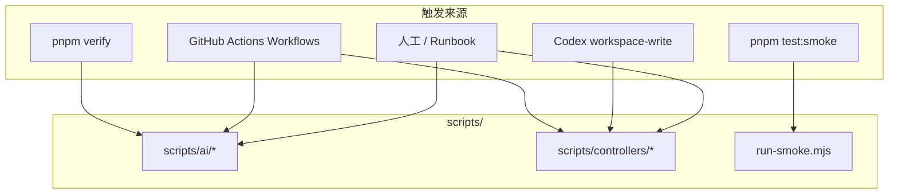

# Scripts 说明

本目录包含 SignalPatch 自动化链路的**确定性脚本**：策略校验、Prompt 渲染、外部写操作控制器。Workflow 何时跑哪个 Job 见 [`.github/workflows/README.md`](../.github/workflows/README.md)；本文档说明 **Job 里调用了哪些脚本、各自做什么、何时触发**。

---

## 1. 目录分工

| 路径                                     | 角色                                           | 外部写凭据                        |
| ---------------------------------------- | ---------------------------------------------- | --------------------------------- |
| [`scripts/ai/`](ai/)                     | 策略与 Prompt 工具（校验、渲染、风险计算）     | **不持有**                        |
| [`scripts/controllers/`](controllers/)   | 持凭据的控制器（GitHub / Supabase / 本地队列） | 按 Job 需要                       |
| [`scripts/run-smoke.mjs`](run-smoke.mjs) | Playwright Smoke Test 入口                     | 仅 Smoke 期间写 Supabase 合成数据 |

**Codex 边界**

- Workflow 通过 `render-prompt.mjs` 等间接驱动模型；Codex Job 本身不调用 controller。
- 唯一允许 Codex 在 `workspace-write` 下**直接执行**的 controller 是 [`enqueue-conversation-issue.mjs`](controllers/enqueue-conversation-issue.mjs)：先检查本机 `gh` 的仓库 Issue 权限，有权限就直接发布，无权限才写本地队列。见 [AGENTS.md](../AGENTS.md)。



---

## 2. 文件作用清单

共 **24 个文件**（19 个可执行 CLI + 5 个库模块）。

### 2.1 根目录

| 文件                             | 类型 | 作用                                                                                                                                           |
| -------------------------------- | ---- | ---------------------------------------------------------------------------------------------------------------------------------------------- |
| [`run-smoke.mjs`](run-smoke.mjs) | CLI  | 解析 `--base-url`（或 `PLAYWRIGHT_BASE_URL`），用项目锁定的 Playwright CLI 运行 Smoke Test；测试写入的 Tracking ID 供 `cleanup-smoke.mjs` 清理 |

### 2.2 `scripts/ai/`（11 个 CLI + 1 个库）

| 文件                                                    | 类型   | 作用                                                                                                               |
| ------------------------------------------------------- | ------ | ------------------------------------------------------------------------------------------------------------------ |
| [`bundle-schema.mjs`](ai/bundle-schema.mjs)             | CLI    | 递归内联 JSON Schema 中与目标 `$id` 匹配的 `$ref`，生成 Codex CLI 可用的单文件 output-schema                       |
| [`render-prompt.mjs`](ai/render-prompt.mjs)             | CLI    | 按 `--stage`（intake / build / review / repair）组装 Prompt：`AGENTS.md` + Skill + 阶段参考 + Contract / 证据      |
| [`validate-json.mjs`](ai/validate-json.mjs)             | CLI    | 用 Ajv 校验 JSON 是否符合指定 Schema（Intake 输出、Delivery 输出、Issue Contract 等）                              |
| [`validate-diff.mjs`](ai/validate-diff.mjs)             | CLI    | 检查相对基准 ref 的 git diff：路径是否在 Contract `allowedPaths`、是否触碰保护路径、实际风险是否高于 Contract 声明 |
| [`validate-sql.mjs`](ai/validate-sql.mjs)               | CLI    | 确认 signalpatch Schema 迁移包含必需表、RLS、安全函数与匿名 RPC；拒绝在 public 建业务表或向 anon 整库授权          |
| [`validate-workflows.mjs`](ai/validate-workflows.mjs)   | CLI    | 校验 `.github/workflows/*.yml` 的 YAML 结构与安全规则（Codex 凭据隔离、Action pin SHA、禁止 broad permissions 等） |
| [`evaluate-risk.mjs`](ai/evaluate-risk.mjs)             | CLI    | 根据路径列表文件与 [`.ai/policy.yaml`](../.ai/policy.yaml) 计算最终风险等级（只能上调，不能降级）                  |
| [`check-repair-budget.mjs`](ai/check-repair-budget.mjs) | CLI    | 检查 Repair 尝试编号是否在 1–3、是否重复 Failure Fingerprint、是否有有效修改                                       |
| [`failure-fingerprint.mjs`](ai/failure-fingerprint.mjs) | CLI    | 从 stdin 读取失败日志，规范化后输出 SHA256 指纹与截断摘要                                                          |
| [`classify-failure.mjs`](ai/classify-failure.mjs)       | CLI    | 将失败日志分为 `infrastructure`（Runner/网络等）或 `application`（业务/测试失败）                                  |
| [`lib/policy.mjs`](ai/lib/policy.mjs)                   | **库** | 加载 policy YAML；glob 转正则；`requiredRisk`、`policyViolations`、`matchesAny`                                    |

### 2.3 `scripts/controllers/`（8 个 CLI + 3 个库）

| 文件                                                                             | 类型   | 作用                                                                                                   |
| -------------------------------------------------------------------------------- | ------ | ------------------------------------------------------------------------------------------------------ |
| [`intake-collect.mjs`](controllers/intake-collect.mjs)                           | CLI    | 从 Supabase 原子认领一条 `PENDING` Feedback；写出脱敏 `evidence.json` 与控制器 `state.json`            |
| [`intake-publish.mjs`](controllers/intake-publish.mjs)                           | CLI    | 创建 raw Issue；`NEEDS_EVIDENCE` 保留 raw，`SPEC_READY` 原地晋升 processed；重复时评论并关闭           |
| [`prepare-issue.mjs`](controllers/prepare-issue.mjs)                             | CLI    | 从 processed GitHub Issue 提取 `signalpatch-contract` 标记块；写出 `contract.json` 与最小 `issue.json` |
| [`enqueue-conversation-issue.mjs`](controllers/enqueue-conversation-issue.mjs)   | CLI    | 校验已确认 Contract；`gh` 有权限时直接发布，否则原子写入本地 `pending/` 队列（`.tmp` → rename）        |
| [`publish-conversation-issues.mjs`](controllers/publish-conversation-issues.mjs) | CLI    | 消费本地队列：校验 Request、创建 raw Issue、精确去重并晋升 processed                                   |
| [`record-run.mjs`](controllers/record-run.mjs)                                   | CLI    | 幂等写入 Supabase `automation_runs`；按阶段更新 Problem 的 Repair Status                               |
| [`final-comment.mjs`](controllers/final-comment.mjs)                             | CLI    | 生成 Production 验收通过 Issue 评论（PR、Commit、Preview/Production URL、各 Acceptance Criterion）     |
| [`cleanup-smoke.mjs`](controllers/cleanup-smoke.mjs)                             | CLI    | 按 tracking ID 列表文件，删除 Supabase 中标记为 synthetic 的 Feedback                                  |
| [`lib/http.mjs`](controllers/lib/http.mjs)                                       | **库** | 带 30s 超时的 `fetch` JSON 封装；脱敏 HTTP 错误；批量校验环境变量                                      |
| [`lib/conversation-issue.mjs`](controllers/lib/conversation-issue.mjs)           | **库** | Issue Contract Schema 校验；对话来源显式确认引用；Request/Issue Body 生成                              |
| [`lib/issue-lifecycle.mjs`](controllers/lib/issue-lifecycle.mjs)                 | **库** | raw/processed 标签、Problem 指纹、Issue 精确去重和重复关闭                                             |
| [`lib/run-status.mjs`](controllers/lib/run-status.mjs)                           | **库** | Automation Run 阶段（preview / production 等）到面向用户的 Repair Status 映射                          |

---

## 3. 触发时机

### 3.1 主表：脚本 → 触发来源

| 脚本                              | 触发来源                              | 具体时机                                                                                 | 调用方 / 入口                                         |
| --------------------------------- | ------------------------------------- | ---------------------------------------------------------------------------------------- | ----------------------------------------------------- |
| `validate-sql.mjs`                | `pnpm verify`                         | 本地开发、PR Gate `verify` Job（经 `pnpm verify` 链）                                    | `pnpm validate:sql`                                   |
| `validate-workflows.mjs`          | `pnpm verify`                         | 同上                                                                                     | `pnpm validate:workflows`                             |
| `run-smoke.mjs`                   | `pnpm test:smoke`                     | PR Gate `preview-smoke`；PR Outcome `finalize` Production Smoke；本地                    | `pnpm test:smoke -- --base-url=...`                   |
| `intake-collect.mjs`              | Feedback Intake Workflow              | `collect` Job                                                                            | GitHub Actions                                        |
| `bundle-schema.mjs`               | Feedback Intake Workflow              | `qualify` Job，Codex 调用前                                                              | GitHub Actions                                        |
| `render-prompt.mjs`               | 多个 Workflow                         | Intake / Builder / Reviewer / Repair（`--stage` 不同）                                   | Feedback Intake、Issue Delivery、PR Gate、PR Outcome  |
| `validate-json.mjs`               | 多个 Workflow                         | Codex 输出后、Contract 提取后                                                            | 同上                                                  |
| `intake-publish.mjs`              | Feedback Intake Workflow              | `publish` Job                                                                            | GitHub Actions                                        |
| `enqueue-conversation-issue.mjs`  | Codex（AGENTS.md 授权）               | Issue Intake 确认 Contract 后，先尝试 `gh` 直接发布，无权限时本地 `workspace-write` 入队 | Codex CLI / 开发者手动                                |
| `publish-conversation-issues.mjs` | Publish Conversation Issues Workflow  | cron 每 5 分钟 / `workflow_dispatch`                                                     | GitHub Actions；亦可本地见 [README.md](../README.md)  |
| `prepare-issue.mjs`               | Issue Delivery / PR Gate / PR Outcome | `prepare` 或 `trust` Job                                                                 | GitHub Actions                                        |
| `validate-diff.mjs`               | Issue Delivery / PR Outcome           | Builder/Repair 生成 patch 后；publish 应用 patch 前                                      | GitHub Actions                                        |
| `check-repair-budget.mjs`         | PR Outcome Workflow                   | `repair` Job，调用 Codex 前                                                              | GitHub Actions                                        |
| `failure-fingerprint.mjs`         | PR Outcome Workflow                   | `collect-failure` Job                                                                    | GitHub Actions                                        |
| `classify-failure.mjs`            | PR Outcome Workflow                   | `collect-failure` Job                                                                    | GitHub Actions                                        |
| `record-run.mjs`                  | Issue Delivery / PR Gate / PR Outcome | build 成功、preview 成功、repair 成功、production 成功或失败                             | GitHub Actions                                        |
| `final-comment.mjs`               | PR Outcome Workflow                   | `finalize` Job，Production Smoke 通过后                                                  | GitHub Actions                                        |
| `cleanup-smoke.mjs`               | PR Outcome / Runbook                  | Production Smoke 后；运维人工清理                                                        | GitHub Actions；[docs/runbook.md](../docs/runbook.md) |
| `evaluate-risk.mjs`               | **仅人工 CLI**                        | 调试路径与风险规则                                                                       | 维护者本地，无 Workflow 引用                          |
| `lib/policy.mjs`                  | 模块 import                           | `validate-diff`、`intake-publish`、`publish-conversation-issues`、`evaluate-risk` 等     | —                                                     |
| `lib/http.mjs`                    | 模块 import                           | 所有需 Supabase/GitHub HTTP 的 controller                                                | —                                                     |
| `lib/conversation-issue.mjs`      | 模块 import                           | `enqueue-*`、`publish-conversation-issues`                                               | —                                                     |
| `lib/run-status.mjs`              | 模块 import                           | `record-run.mjs`                                                                         | —                                                     |

### 3.2 按 Workflow 聚合（Workflow → Job → 脚本）

| Workflow                        | Job                  | 调用的 scripts                                                                                                                         |
| ------------------------------- | -------------------- | -------------------------------------------------------------------------------------------------------------------------------------- |
| **Feedback Intake**             | `collect`            | `intake-collect.mjs`                                                                                                                   |
| **Feedback Intake**             | `qualify`            | `bundle-schema.mjs`, `render-prompt.mjs`, `validate-json.mjs`                                                                          |
| **Feedback Intake**             | `publish`            | `intake-publish.mjs`                                                                                                                   |
| **Publish Conversation Issues** | `publish`            | `publish-conversation-issues.mjs` — 详见 [publish-conversation-issues.yml.md](../.github/workflows/publish-conversation-issues.yml.md) |
| **Issue Delivery**              | `prepare`            | `prepare-issue.mjs`, `validate-json.mjs` — 详见 [issue-delivery.yml.md](../.github/workflows/issue-delivery.yml.md)                    |
| **Issue Delivery**              | `build`              | `render-prompt.mjs`, `validate-json.mjs`, `validate-diff.mjs`                                                                          |
| **Issue Delivery**              | `analyze-r3`         | `render-prompt.mjs`, `validate-json.mjs`                                                                                               |
| **Issue Delivery**              | `publish`            | `validate-diff.mjs`, `record-run.mjs`                                                                                                  |
| **PR Gate**                     | `trust`              | `prepare-issue.mjs` — 详见 [pr-gate.yml.md](../.github/workflows/pr-gate.yml.md)                                                       |
| **PR Gate**                     | `independent-review` | `render-prompt.mjs`, `validate-json.mjs`                                                                                               |
| **PR Gate**                     | `preview-smoke`      | `record-run.mjs`, `run-smoke.mjs`（经 `pnpm test:smoke`）                                                                              |
| **PR Outcome**                  | `trust`              | `prepare-issue.mjs` — 详见 [pr-outcome.yml.md](../.github/workflows/pr-outcome.yml.md)                                                 |
| **PR Outcome**                  | `collect-failure`    | `failure-fingerprint.mjs`, `classify-failure.mjs`                                                                                      |
| **PR Outcome**                  | `repair`             | `check-repair-budget.mjs`, `render-prompt.mjs`, `validate-json.mjs`, `validate-diff.mjs`                                               |
| **PR Outcome**                  | `publish-repair`     | `validate-diff.mjs`, `record-run.mjs`                                                                                                  |
| **PR Outcome**                  | `finalize`           | `record-run.mjs`, `cleanup-smoke.mjs`, `final-comment.mjs`, `run-smoke.mjs`（经 `pnpm test:smoke`）                                    |

### 3.3 pnpm 命令映射

| package.json 命令         | 实际脚本                 | 说明                                                                         |
| ------------------------- | ------------------------ | ---------------------------------------------------------------------------- |
| `pnpm verify`             | 链式执行                 | 含 `validate:sql`、`validate:workflows` 及 format/lint/typecheck/test        |
| `pnpm validate:sql`       | `validate-sql.mjs`       | 默认校验 `supabase/migrations/20260713074941_initial_signalpatch_schema.sql` |
| `pnpm validate:workflows` | `validate-workflows.mjs` | 校验全部 `.github/workflows/*.yml`                                           |
| `pnpm test:smoke`         | `run-smoke.mjs`          | 默认 base URL `http://127.0.0.1:3000`                                        |

---

## 4. 补充说明

### 4.1 凭据边界

| 脚本 / 组                                                                                                  | 典型环境变量                                                |
| ---------------------------------------------------------------------------------------------------------- | ----------------------------------------------------------- |
| `intake-collect.mjs`, `intake-publish.mjs`, `record-run.mjs`, `cleanup-smoke.mjs`                          | `SUPABASE_URL`, `SUPABASE_SERVICE_ROLE_KEY`                 |
| `intake-publish.mjs`, `prepare-issue.mjs`, `publish-conversation-issues.mjs`, `record-run.mjs`（部分步骤） | `GH_TOKEN`（GitHub App Installation Token）                 |
| `run-smoke.mjs`（测试期间）                                                                                | 可选 Supabase（Smoke 写入 synthetic Feedback）              |
| `enqueue-conversation-issue.mjs`                                                                           | 本机 `gh` 登录上下文；可选 `SIGNALPATCH_CONVERSATION_QUEUE` |
| `scripts/ai/*`                                                                                             | **无** GitHub / Supabase / Vercel 写凭据                    |

Codex Job 内禁止出现上述写凭据；由 [validate-workflows.mjs](ai/validate-workflows.mjs) 在 `pnpm verify` 中强制检查。

### 4.2 本地诊断示例

```bash
# 计算一组路径的最低风险等级
git diff --name-only HEAD~1 | node scripts/ai/evaluate-risk.mjs R0 /dev/stdin

# 校验 Workflow 安全规则
pnpm validate:workflows

# 手动发布对话队列（需 GH_TOKEN，见仓库 README）
node scripts/controllers/publish-conversation-issues.mjs
```

### 4.3 库模块

`lib/*.mjs` 不提供 CLI 入口，仅被同目录或上层脚本 `import`。修改 policy 加载或 HTTP 行为时，需同步检查所有引用方（尤其 `validate-diff.mjs` 与 `intake-publish.mjs`）。

---

## 5. 相关文档

| 文档                                                                    | 说明                                   |
| ----------------------------------------------------------------------- | -------------------------------------- |
| [`.github/workflows/README.md`](../.github/workflows/README.md)         | 五个 Workflow 的 Job、触发器与 PR 检查 |
| [`AGENTS.md`](../AGENTS.md)                                             | Codex 硬约束与 enqueue 授权            |
| [`.ai/policy.yaml`](../.ai/policy.yaml)                                 | 风险规则、Repair 次数与 Codex Sandbox  |
| [`docs/setup.md`](../docs/setup.md)                                     | `main` 写入策略、Runner、Secrets 配置  |
| [`docs/runbook.md`](../docs/runbook.md)                                 | 运维与 `cleanup-smoke.mjs` 人工用法    |
| [`docs/codex-manual-operations.md`](../docs/codex-manual-operations.md) | 手动诊断 Intake/Delivery/Repair        |
